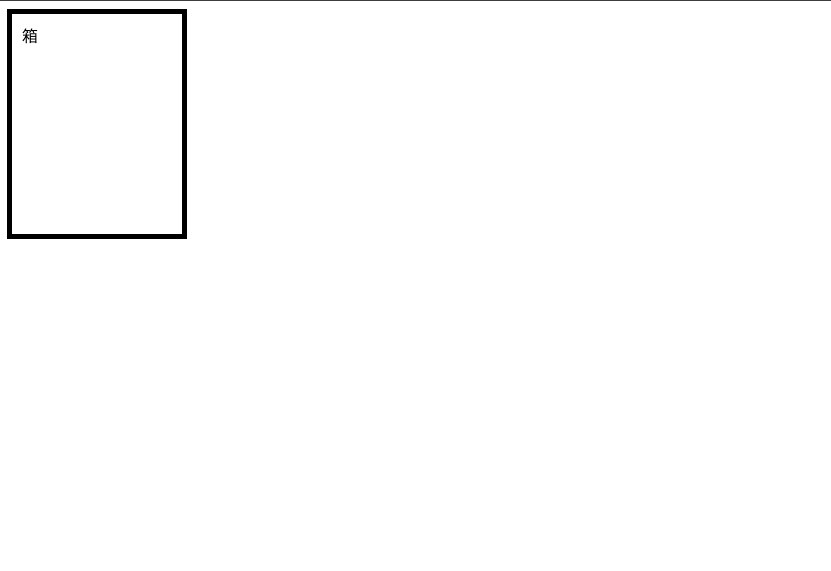
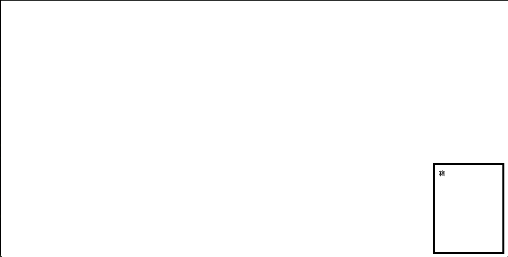
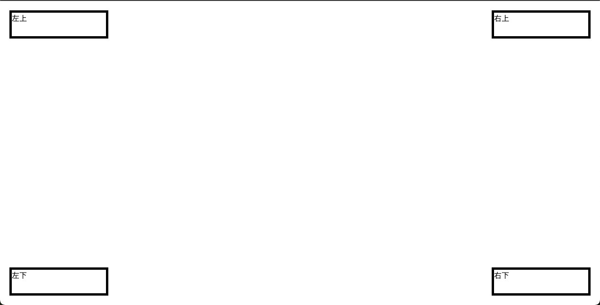
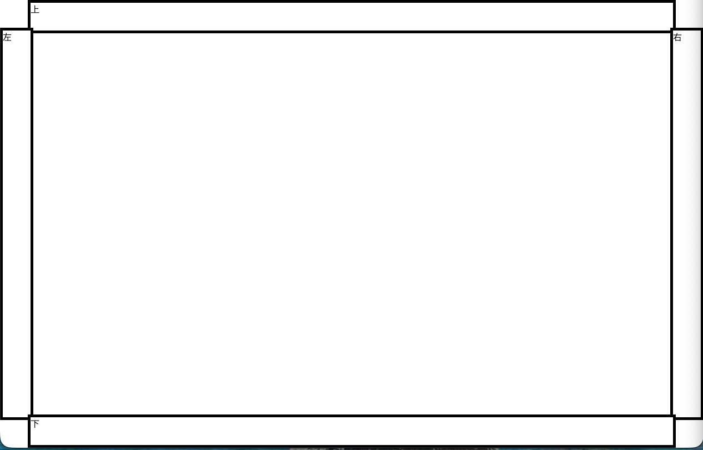
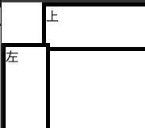
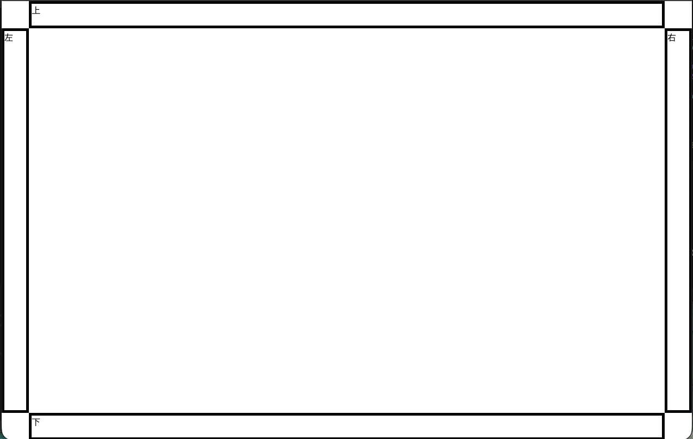

# HTML/CSS の基本

この節では今回のゲームを作るために必要な HTML と CSS の基礎を学びます。

この節で作るプログラムを置くためのディレクトリを作ってください。

```
./
└── practice
    └── html-css
```

# 四角の表示

`practice/html-css/1` というディレクトリを作り、次のようにファイルを作成してください。

```
./
└── practice
    └── html-css
        └── 1
            ├── index.html
            └── style.css
```

## `index.html`

```html
<html>
  <head>
    <link rel="stylesheet" href="./style.css">
  </head>
  <body>
    <div>
      <div class="box">箱</div>
    </div>
  </body>
</html>
```

## `style.css`

```css
.box {
  width: 150px;
  height: 200px;
  border: solid 5px black;
  background: white;
  padding: 10px;
}

```

## 動作確認

次の画像のように線がついた四角形が表示される



---

# 絶対配置

`practice/html-css/1` を引き続き使います。

```
./
└── practice
    └── html-css
        └── 1
            ├── index.html
            └── style.css
```

## `style.css` の変更

`.box` に次の項目を追加してください。


- `right: 10px`
- `bottom: 10px`

```css
.box {
  position: absolute;
  width: 150px;
  height: 200px;
  border: solid 5px black;
  background: white;
  padding: 10px;

  right: 10px;
  bottom: 10px;
}
```

## 動作確認

次の画像のように線がついた四角形が表示されます。
ウィンドウの大きさを変更しても右下に表示されることを確認してください。



---

# 絶対配置の練習 1


`practice/html-css/2` を新しく作ります。

```
./
└── practice
    └── html-css
        └── 2
            ├── index.html
            └── style.css
```

## `index.html`

それぞれの `class` に基づいた要素を画面の過度に表示します。

```html
<html>
  <head>
    <link rel="stylesheet" href="./style.css">
  </head>
  <body>
    <div>
      <div class="top-right">右上</div>
      <div class="top-left">左上</div>
      <div class="bottom-right">右下</div>
      <div class="bottom-left">左下</div>
    </div>
  </body>
</html>
```

## `style.css`

```css
.top-left {
  position: absolute;
  top: 20px;
  left: 20px;
  height: 50px;
  width: 200px;
  border: solid 5px black;
  background: white;
}

.top-right {
  position: absolute;
  top: 20px;
  right: 20px;
  height: 50px;
  width: 200px;
  border: solid 5px black;
  background: white;
}

.bottom-left {
  position: absolute;
  bottom: 20px;
  left: 20px;
  height: 50px;
  width: 200px;
  border: solid 5px black;
  background: white;
}

.bottom-right {
  position: absolute;
  bottom: 20px;
  right: 20px;
  height: 50px;
  width: 200px;
  border: solid 5px black;
  background: white;
}

```

## 動作確認

それぞれの要素が画面の過度に表示されることが確認できます。

画面の大きさを変えたときもそれぞれが角に表示されることを確認してください。



---

# 絶対配置の練習 2

`practice/html-css/3` を新しく作ります。

```
./
└── practice
    └── html-css
        └── 3
            ├── index.html
            └── style.css
```

## `index.html`

- 4つの要素を画面の上下左右に配置します
- `<div>` 要素の中にそれぞれ「上」「下」「左」「右」と表示してください

```html
<html>
  <head>
    <link rel="stylesheet" href="./style.css">
  </head>
  <body>
    <div>
      <div class="top">上</div>
      <div class="right">右</div>
      <div class="left">左</div>
      <div class="bottom">下</div>
    </div>
  </body>
</html>
```

## `style.css`

- それぞれの要素を絶対配置にします
- 画面の端から50pxの位置に表示します

```css
.top {
  position: absolute;
  top: 0;
  left: 50px;
  right: 50px;
  height: 50px;
  background: white;
  border: solid 5px black;
}

.right {
  position: absolute;
  top: 50px;
  right: 0;
  bottom: 50px;
  width: 50px;
  background: white;
  border: solid 5px black;
}

.left {
  position: absolute;
  width: 50px;
  top: 50px;
  left: 0px;
  bottom: 50px;
  background: white;
  border: solid 5px black;
}

.bottom {
  position: absolute;
  bottom: 0;
  left: 50px;
  right: 50px;
  height: 50px;
  background: white;
  border: solid 5px black;
}
```

## 動作確認

次のように上下左右に配置されます



次の箇所が重なっていることを確認します。



## `box-sizing`

box-sizing プロパティを使って、要素の幅と高さの計算方法を変更します。

box-sizing については以下のドキュメントを参照してください。
https://developer.mozilla.org/ja/docs/Web/CSS/Reference/Properties/box-sizing

## `style.css`　 の変更

それぞれの要素に `box-sizing: border-box;` を追加してください。

```css
.top {
  box-sizing: border-box;
  position: absolute;
  top: 0;
  left: 50px;
  right: 50px;
  height: 50px;
  background: white;
  border: solid 5px black;
}

.right {
  box-sizing: border-box;
  position: absolute;
  top: 50px;
  right: 0;
  bottom: 50px;
  width: 50px;
  background: white;
  border: solid 5px black;
}

.left {
  box-sizing: border-box;
  position: absolute;
  width: 50px;
  top: 50px;
  left: 0px;
  bottom: 50px;
  background: white;
  border: solid 5px black;
}

.bottom {
  box-sizing: border-box;
  position: absolute;
  bottom: 0;
  left: 50px;
  right: 50px;
  height: 50px;
  background: white;
  border: solid 5px black;
}
```

## 動作確認

`box-sizing: border-box;` を追加したことで、要素の幅と高さの計算方法が変わり、重なりがなくなります。



# まとめ

絶対配置を中心にCSSの基礎を学びました。

---

# 次の項

[デバッグ](../2-debug/README.md)
