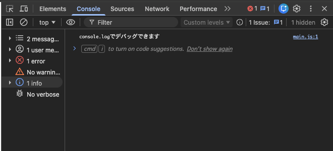
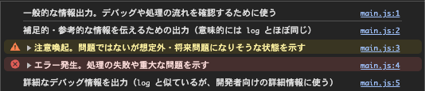
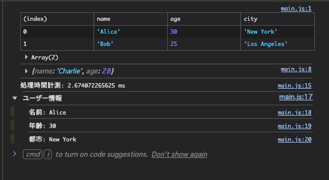
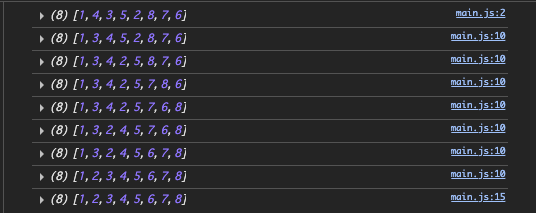
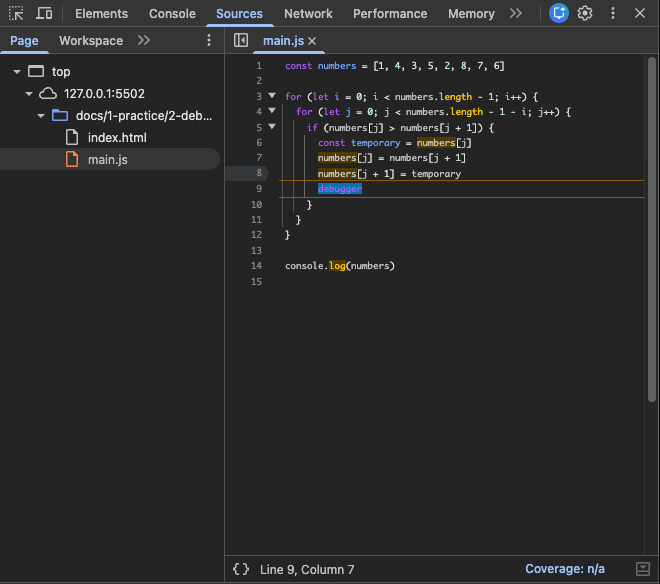
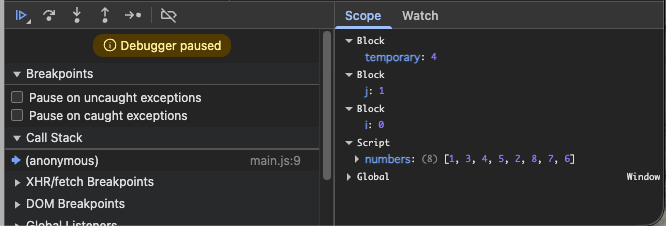
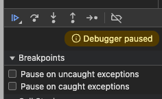

# デバッグ

この節では今回のゲームを作るために必要なデバッグの基礎を学びます。

この節が書くプログラムを配置するディレクトリを作ってください。

```
./
└── practice
    └── debug
```

# ファイルの用意

この節では一つの JavaScript ファイルを変更しながらログの出し方を確認していきます。

```
./
└── practice
    └── debug
        ├── index.html
        └── main.js
```

## `index.html`

```html
<html>
  <body>
    <script src="./main.js"></script>
  </body>
</html>

```

## `main.js`

```js
console.log("console.logでデバッグできます")

```

## 動作確認

ブラウザで `index.html` を開き、デベロッパーツールのコンソールタブを確認してください。



実装例: [examples/1](./examples/1)

### デベロッパーツールの開き方

ブラウザとOSによって異なります。次のリンクを参照してください。

- [Google Chrome でデベロッパーツールを開く方法](https://developer.chrome.com/docs/devtools/open?hl=ja)
- [Firefox でデベロッパーツールを開く方法](https://developer.mozilla.org/ja/docs/Learn_web_development/Howto/Tools_and_setup/What_are_browser_developer_tools)

# 他のレベルのログ

JavaScript では他にもいくつかのレベルのログを出力することができます。

## `main.js` を次のように変更してください。

```js
console.log("一般的な情報出力。デバッグや処理の流れを確認するために使う")
console.info("補足的・参考的な情報を伝えるための出力（意味的には log とほぼ同じ）")
console.warn("注意喚起。問題ではないが想定外・将来問題になりそうな状態を示す")
console.error("エラー発生。処理の失敗や重大な問題を示す")
console.debug("詳細なデバッグ情報を出力（log と似ているが、開発者向けの詳細情報に使う）")
```

## 動作確認

次のように表示されます。



実装例: [examples/2](./examples/2)

#　いろんなログの出し方

他にも次のようなログの出し方があります。

## `main.js`

```js
console.table([
  { name: "Alice", age: 30, city: "New York" },
  { name: "Bob", age: 25, city: "Los Angeles" },
])

const name = "Charlie"
const age = 28
console.log({ name, age })

console.time("処理時間計測")
// 何らかの処理
for (let i = 0; i < 1e6; i++) {
  Math.sqrt(i)
}
console.timeEnd("処理時間計測")

console.group("ユーザー情報")
console.log("名前: Alice")
console.log("年齢: 30")
console.log("都市: New York")
console.groupEnd("ユーザー情報")
```

## 動作確認

次のように表示されます。



実装例: [examples/3](./examples/3)

# 複雑なロジックを追いかける

数値を並び替えるロジックを行うときに途中の状態を確認したい場合があります。

## `main.js`

次の状態で実行すると最終結果だけが表示されます。この状態だと途中で何が起きているか分かりません。

```js
const numbers = [1, 4, 3, 5, 2, 8, 7, 6]

for (let i = 0; i < numbers.length - 1; i++) {
  for (let j = 0; j < numbers.length - 1 - i; j++) {
    if (numbers[j] > numbers[j + 1]) {
      const temporary = numbers[j]
      numbers[j] = numbers[j + 1]
      numbers[j + 1] = temporary
    }
  }
}

console.log(numbers)
```

次のようにログを足してみましょう

```js
const numbers = [1, 4, 3, 5, 2, 8, 7, 6]
console.log(numbers)

for (let i = 0; i < numbers.length - 1; i++) {
  for (let j = 0; j < numbers.length - 1 - i; j++) {
    if (numbers[j] > numbers[j + 1]) {
      const temporary = numbers[j]
      numbers[j] = numbers[j + 1]
      numbers[j + 1] = temporary
      console.log(numbers)
    }
  }
}

console.log(numbers)

```

## 動作確認

途中の段階の状態も確認できます。



実装例: [examples/4](./examples/4)

# `debugger` を使ったデバッグ

さらに特定の状態のときに処理を一時停止して状態を確認したい場合があります。

その時は `debugger` 文を使います。

## `main.js`

```js
const numbers = [1, 4, 3, 5, 2, 8, 7, 6]

for (let i = 0; i < numbers.length - 1; i++) {
  for (let j = 0; j < numbers.length - 1 - i; j++) {
    if (numbers[j] > numbers[j + 1]) {
      const temporary = numbers[j]
      numbers[j] = numbers[j + 1]
      numbers[j + 1] = temporary
      debugger
    }
  }
}

console.log(numbers)
```

## 動作確認

`index.html` を開くとデバッガーが起動し、処理が一時停止します。

次のように debugger を書いた行で処理が止まります。


その状態での変数の中身などを確認できます。


これらのボタンを押すことで処理を進めることができます。


実装例: [examples/5](./examples/5)

---

# まとめ

Webブラウザを使ったデバッグについて学びました。

---

# 次の項

[ダイアログの実装](../3-dialog/README.md)
