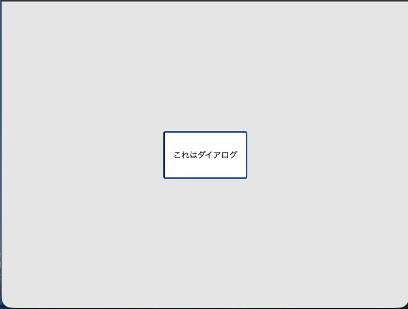

# ダイアログ

この節ではHTMLの標準的な機能を使ってダイアログを実装する方法を学びます。

```
./
└── practice
    └── dialog
```

# ファイルの用意

この節では一つの JavaScript ファイルを変更しながらログの出し方を確認していきます。

```
./
└── practice
    └── dialog
        ├── index.html
        └── main.js
```

## `index.html`

```html
<html>
  <body>
    <dialog>
      <p>これはダイアログ</p>
    </dialog>
    <script src="./main.js"></script>
  </body>
</html>

```

## `main.js`

```js
// 何も書かない

```

## 動作確認

ブラウザで `index.html` を開いてください。

次のように何も表示されません。


# ダイアログを開く

## `index.html`

```html
<html>
  <body>
    <dialog id="dialog">
      <p>これはダイアログ</p>
    </dialog>
    <script src="./main.js"></script>
  </body>
</html>

```

## `main.js`

```js
const dialog = document.getElementById("dialog");
dialog.showModal();
```

`document.getElementById("dialog")` は HTML 内の id 属性が "dialog" の要素を取得します。

`dialog.showModal()` は その要素をモーダルダイアログとして表示します。

画面が表示されたときに `main.js` の内容が表示されるため、ダイアログが表示されます。

## 動作確認

ブラウザで `index.html` を開いてください。



# ボタンを押してダイアログを開く

## `index.html`

```html
<html>
  <body>
    <button id="openButton">開く</button>
    <dialog id="dialog">
      <p>これはダイアログ</p>
    </dialog>
    <script src="./main.js"></script>
  </body>
</html>

```

- `<button>開く</button>` を追加して、ダイアログを開くためのボタンを作成します。
- `id="openButton"` を追加して、このボタンを JavaScript から取得できるようにします。

## `main.js`

```js
const dialog = document.getElementById("dialog")
const openButton = document.getElementById("openButton")

openButton.addEventListener("click", () => {
  dialog.showModal()
})
```

- `openButton` を取得して、クリックされたときにダイアログを表示するようにします。
- `addEventListener` は指定したイベントが発生したときに指定した関数を実行します。
- `click` イベントが発生したときにダイアログを表示するようになります。

## 動作確認

ブラウザで `index.html` を開いてください。

ボタンを押すことでダイアログが表示されます。


# ダイアログを閉じる

次はボタンを押すことでダイアログを閉じるようにします。

## `index.html`

```html
<html>
  <body>
    <button id="openButton">開く</button>
    <dialog id="dialog">
      <p>これはダイアログ</p>
      <button id="closeButton">閉じる</button>
    </dialog>
    <script src="./main.js"></script>
  </body>
</html>

```

- `<button id="closeButton">閉じる</button>` を追加して、ダイアログを閉じるためのボタンを作成します。

## `main.js`

```js
const dialog = document.getElementById("dialog")
const openButton = document.getElementById("openButton")
const closeButton = document.getElementById("closeButton")

openButton.addEventListener("click", () => {
  dialog.showModal()
})

closeButton.addEventListener("click", () => {
  dialog.close()
})

```

- `closeButton` を取得して、クリックされたときにダイアログを閉じるようにします。
- `dialog.close()` は ダイアログを閉じるメソッドです。

## 動作確認

ブラウザで `index.html` を開いてください。

ボタンを押すことでダイアログが表示され、閉じるボタンを押すことでダイアログが閉じます。


# ダイアログで入力した値を受け取る

次はダイアログで入力した値を受け取る方法を学びます。

## `index.html`

```html
<html>
  <body>
    <button id="openButton">開く</button>
    <dialog id="dialog">
      <p>あなたの名前は？</p>
      <input type="text" id="nameInput" />
      <button id="submitButton">確定する</button>
    </dialog>
    <div id="result" hidden>
      あなたの名前は <span id="nameText"></span> です。
    </div>
    <script src="./main.js"></script>
  </body>
</html>
```

- `<input type="text" id="nameInput" />` を追加して、名前を入力するためのテキストボックスを作成します。
- `<button id="submitButton">確定する</button>` を追加して、名前を確定するためのボタンを作成します。
- `<div id="result" hidden>...</div>` を追加して、結果を表示するための要素を作成します。
  - `hidden` 属性を追加して、最初は結果を非表示にします
- `<span id="nameText"></span>` を追加して、名前を表示するための要素を作成します。

## `main.js`

```js
const dialog = document.getElementById("dialog")
const openButton = document.getElementById("openButton")
const namteText = document.getElementById("nameText")
const result = document.getElementById("result")
const nameInput = document.getElementById("nameInput")
const submitButton = document.getElementById("submitButton")

openButton.addEventListener("click", () => {
  dialog.showModal()
})

submitButton.addEventListener("click", () => {
  const name = nameInput.value;
  namteText.textContent = name;
  result.hidden = false;
  dialog.close()
})

```

- `nameInput` と `submitButton` を取得します。
- `submitButton` がクリックされたときに、`nameInput.value` で入力された名前を取得します。
- `nameText.textContent` に名前を設定して、結果を表示します。
- `result.hidden = false` で結果の要素を表示します。
- 最後にダイアログを閉じます。

## 動作確認

ブラウザで `index.html` を開いてください。

名前を入力して確定ボタンを押すと、ダイアログが閉じて結果が表示されます。


---

# まとめ

HTML の標準的なダイアログ機能を使って、ダイアログの表示・非表示や入力値の取得を行う方法を学びました。

# 次の項

[setTimeout](../4-set-timeout/README.md)
