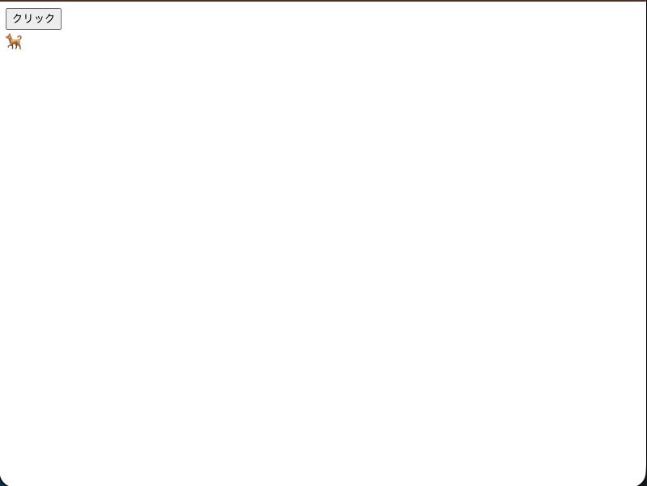
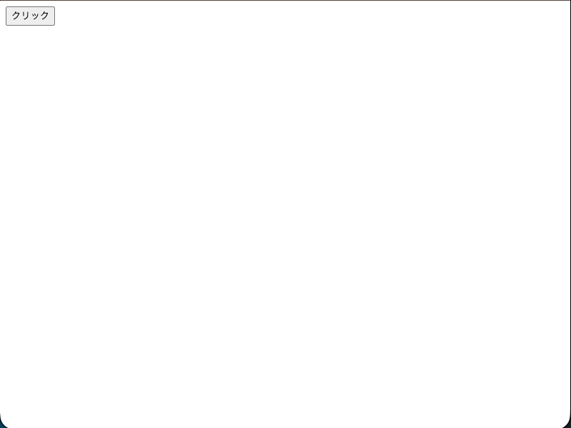
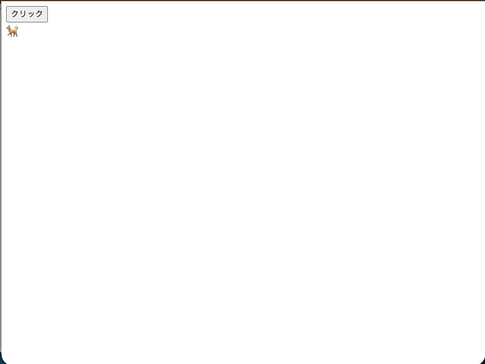
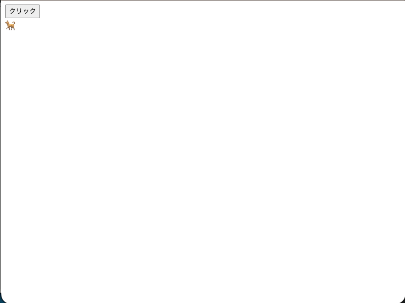

# setTimeout

この節でJavaScriptの標準APIである `setTimeout` を学びます。

プログラムを配置するためのディレクトリを作成します。

```
./
└── practice
    └── set-timeout
```

# ファイルの用意

まずは 1 というディレクトリを作成してその中に `index.html` と `main.js` を作成します。

```
./
└── practice
    └── set-timeout
        └── 1
            ├── index.html
            └── main.js
```

## `index.html`

```html
<html>
  <body>
    <button>クリック</button>
    <div>🐕️</div>
  </body>
</html>

```

## `main.js`

```js
// 何も書かない

```

## 動作確認

ボタンと犬の絵文字が表示されます。
ボタンを押しても何も起こりません。



# 犬を表示する

## `index.html`

```html
<html>
  <body>
    <button id="button">クリック</button>
    <div id="dog" hidden>🐕️</div>
    <script src="main.js"></script>
  </body>
</html>

```

- `id="dog"` に `hidden` 属性を追加して、最初は犬の絵文字を非表示にします。

## `main.js`

```js
const button = document.getElementById("button")
const dog = document.getElementById("dog")

button.addEventListener("click", () => {
  dog.hidden = false
})
```

- `document.getElementById("button")` でボタン要素を取得します。
- `document.getElementById("dog")` で犬の絵文字の要素を取得します。
- ボタンがクリックされたときに、犬の絵文字の `hidden` 属性を `false` にして表示します。

## 動作確認

ブラウザで `index.html` を開いてください。

ボタンをクリックすると即座に犬の絵文字が表示されます。



# 時間を開けて犬を表示する

次に、ボタンを押してから 1秒後に犬の絵文字が表示されるようにします。

## `main.js`

```js
const button = document.getElementById("button")
const dog = document.getElementById("dog")

button.addEventListener("click", () => {
  setTimeout(() => {
    dog.hidden = false
  }, 1000)
})
```

- `1000` ミリ秒は 1 秒を表します。
- `setTimeout` は指定した時間が経過した後に指定した関数を実行します。
- これにより、ボタンがクリックされてから 1 秒後に犬の絵文字が表示されるようになります。

## 動作確認

ブラウザで `index.html` を開いてください。
ボタンをクリックしてから 1 秒後に犬の絵文字が表示されます。


# 犬が吠える

さらに setTimout の理解を深めるために犬が吠えるアニメーションを追加します。

## `index.html`

```html
<html>
  <body>
    <button id="button">クリック</button>
    <div>
      <span id="barking"></span>
      <span id="dog">🐕️</span>
    </div>
    <script src="main.js"></script>
  </body>
</html>

```

- `<span id="barking"></span>` を追加して、犬の吠える様子を表示する要素を作成します。
  - ここには最初は何も表示されません。
  - ボタンを押してから絵文字が表示されるようにします。

## `main.js`

```js
const button = document.getElementById("button")
const barking = document.getElementById("barking")

button.addEventListener("click", () => {
  barking.textContent = "💥"
  setTimeout(() => {
    barking.textContent = "💥💥"
  }, 500)
  setTimeout(() => {
    barking.textContent = "💥💥💥"
  }, 1500)
  setTimeout(() => {
    barking.textContent = "💥💥💥💥"
  }, 2000)
})

```

- `barking.textContent` に "💥" を設定して、最初の吠える様子を表示します。
- 吠える様子を段階的に変化させます。
  - 0 ミリ秒後に "💥"
  - 500 ミリ秒後に "💥💥"
  - 1500 ミリ秒後に "💥💥💥"
  - 2000 ミリ秒後に "💥💥💥💥"

## 動作確認

ブラウザで `index.html` を開いてください。
ボタンをクリックすると犬が吠えるアニメーションが表示されます。



#　効率的な書き方

現在の実装方法だと絵文字の数が増えるためにコードが冗長になってしまいます。

## `main.js`

```js
const button = document.getElementById("button")
const barking = document.getElementById("barking")

button.addEventListener("click", () => {
  for (let i = 1; i <= 4; i++) {
      setTimeout(() => {
        barking.textContent = "💥".repeat(i)
      }, i * 500)
  }
})

```

- `for` ループを使用して、吠える様子の更新を効率的に行います。
- `i` を 1 から 4 まで増加させ、各段階で `setTimeout` を設定します。
- `barking.textContent = "💥".repeat(i)` で "💥" を `i` 回繰り返す

|i|絵文字|実行タイミング|
|-|-|-|
|1|💥|1 * 500 = 500 ミリ秒後|
|2|💥💥|2 * 500 = 1000 ミリ秒後|
|3|💥💥💥|3 * 500 = 1500 ミリ秒後|
|4|💥💥💥💥|4 * 500 = 2000 ミリ秒後|

## 動作確認

ブラウザで `index.html` を開いてください。
ボタンをクリックすると犬が吠えるアニメーションが表示されます。



# 文字の長さに応じた実装

絵文字以外も表示できるように実装しましょう。

## 文字列から文字を抜き出す

一般的な文字列の場合は `slice` メソッドを使用して部分文字列を取得します。

```js
const str = "Hello, World!"
const part = str.slice(0, 5) // "Hello"
```

ただし絵文字などの場合は、1文字が複数のコードポイントで構成されていることがあるため次のようになることがあります。

```js
const str = "💥🍖💥🐈️💥"
str.split("") // ["�", "�", "�", "�", "�", "�", "�", "�", "�", "�"]

```

そのため `Array.from` を使用して文字の配列を取得します。

```js
const str = "🍖💥🐈️"
const characters = Array.from(str) // ["🍖", "💥", "🐈️"]
```


## `main.js`

```js
const button = document.getElementById("button")
const barking = document.getElementById("barking")

button.addEventListener("click", () => {
  const barkingContent = "💥🍖💥🐈️💥"
  const characters = Array.from(barkingContent)

  for (let i = 1; i <= barkingContent.length; i++) {
      setTimeout(() => {
        const content = characters.slice(0, i).join("")
        barking.textContent = content
      }, i * 500)
  }
})


```

- `barkingContent` に表示したい文字列を設定します。
- `Array.from(barkingContent)` で文字の配列を取得します。
- `for` ループで文字列の長さに応じて `setTimeout` を設定します。
- `characters.slice(0, i).join("")` で最初の `i` 文字を結合して表示します。

## 動作確認

ブラウザで `index.html` を開いてください。
ボタンをクリックすると犬が吠えるアニメーションが表示されます。


# 文字を表示する

絵文字でなく文字を表示することができます。


## `main.js`

```js
const button = document.getElementById("button")
const barking = document.getElementById("barking")

button.addEventListener("click", () => {
  const barkingContent = "わんわんわんわん"
  const characters = Array.from(barkingContent)

  for (let i = 1; i <= characters.length; i++) {
      setTimeout(() => {
        barking.textContent = characters.slice(0, i).join("")
      }, i * 500)
  }
})

```

## 動作確認

ブラウザで `index.html` を開いてください。
ボタンをクリックすると犬が吠えるアニメーションが表示されます。


---

# まとめ

この節では `setTimeout` を使用して時間を開けて処理を実行する方法を学びました。
setTimeout を使用することで、非同期的に処理を実行することができます。

# 次の項

[非同期処理](../5-async/README.md)
