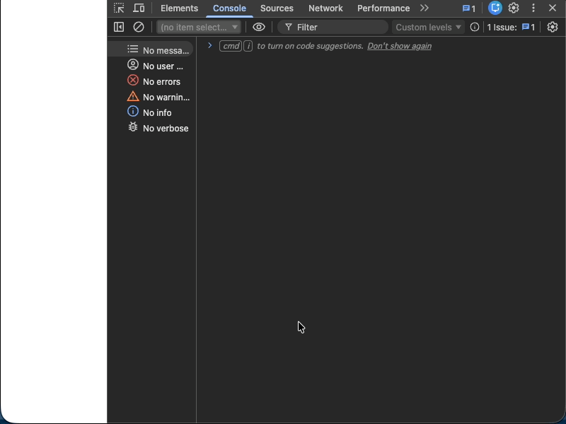
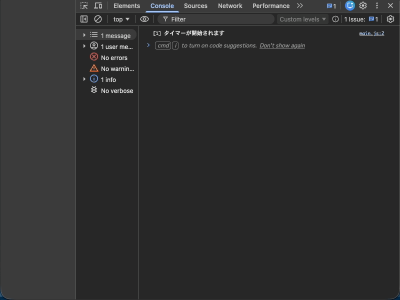
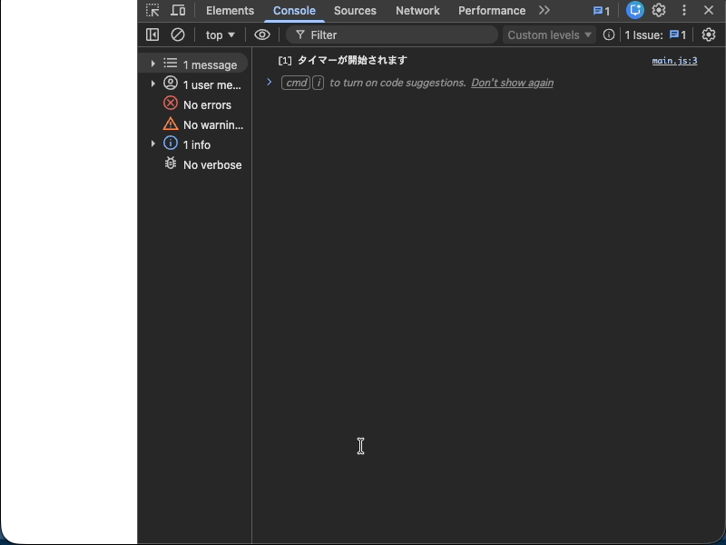
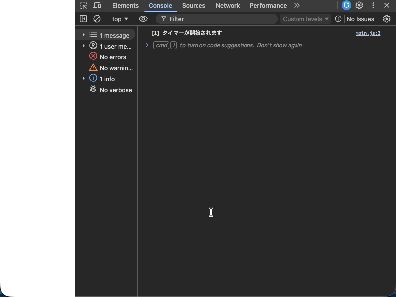

# 非同期処理

この節ではJavaScriptの非同期処理について学びます。

プログラムを配置するためのディレクトリを作成します。

```
./
└── practice
    └── async
```

# 非同期処理の基本

非同期処理は、処理が完了するまで待たずに次の処理を実行する仕組みです。
`setTimeout` を使用して、遅延した処理を実行します。

`practice/async/1` というディレクトリを作り、次のようにファイルを作成してください。

```
./
└── practice
    └── async
        └── 1
            ├── index.html
            └── main.js
```

## `index.html`

```html
<html>
  <body>
    <button id="greetingButton">挨拶する</button>
    <div id="result"></div>
    <script src="main.js"></script>
  </body>
</html>
```

## `main.js`

```js
const greetingButton = document.getElementById("greetingButton")
const result = document.getElementById("result")

greetingButton.addEventListener("click", () => {
  setTimeout(() => {
    const greeting = document.createElement("div")
    greeting.textContent = `こんにちは, たろう!`
    result.appendChild(greeting)
  }, 1000)
})
```

- `setTimeout` を使用して、1秒後に挨拶を表示します。
- `document.createElement` で新しい要素を作成し、`appendChild` で結果に追加します。

## 動作確認

ブラウザで `index.html` を開いてください。

ボタンをクリックすると1秒後に「こんにちは, たろう!」が表示されます。


---

# 関数化

遅延して挨拶を表示する処理を関数にまとめます。

`practice/async/1` を引き続き使います。

```
./
└── practice
    └── async
        └── 1
            ├── index.html
            └── main.js
```

## `main.js` の変更

次のように `greetingWithDelay` 関数を追加してください。

```js
const greetingButton = document.getElementById("greetingButton")
const result = document.getElementById("result")

function greetingWithDelay(name, delay) {
  setTimeout(() => {
    const greeting = document.createElement("div")
    greeting.textContent = `こんにちは, ${name}!`
    result.appendChild(greeting)
  }, delay)
}

greetingButton.addEventListener("click", () => {
  greetingWithDelay("たろう", 1000)
})
```

変更した箇所：
- `greetingWithDelay` という関数を作成し、名前と遅延時間を引数として受け取ります。
- この関数を使用することで、異なる名前と遅延時間で挨拶を表示できます。

## 動作確認

ブラウザで `index.html` を開いてください。

ボタンをクリックすると1秒後に「こんにちは, たろう!」が表示されます。


---

# 複数の非同期処理

複数の非同期処理を実行します。

`practice/async/1` を引き続き使います。

```
./
└── practice
    └── async
        └── 1
            ├── index.html
            └── main.js
```

## `main.js` の変更

`greetingWithDelay` の呼び出しを2つに増やしてください。

```js
const greetingButton = document.getElementById("greetingButton")
const result = document.getElementById("result")

function greetingWithDelay(name, delay) {
  setTimeout(() => {
    const greeting = document.createElement("div")
    greeting.textContent = `こんにちは, ${name}!`
    result.appendChild(greeting)
  }, delay)
}

greetingButton.addEventListener("click", () => {
  greetingWithDelay("たろう", 1000)
  greetingWithDelay("じろう", 2000)
})
```

変更した箇所：
- 2つの `greetingWithDelay` を呼び出します。
- 1秒後に「たろう」、2秒後に「じろう」が表示されます。

## 動作確認

ブラウザで `index.html` を開いてください。

ボタンをクリックすると、1秒後に「こんにちは, たろう!」、2秒後に「こんにちは, じろう!」が表示されます。


---

# さらに多くの非同期処理

さらに多くの非同期処理を実行します。

`practice/async/1` を引き続き使います。

```
./
└── practice
    └── async
        └── 1
            ├── index.html
            └── main.js
```

## `main.js` の変更

`greetingWithDelay` の呼び出しを5つに増やしてください。

```js
const greetingButton = document.getElementById("greetingButton")
const result = document.getElementById("result")

function greetingWithDelay(name, delay) {
  setTimeout(() => {
    const greeting = document.createElement("div")
    greeting.textContent = `こんにちは, ${name}!`
    result.appendChild(greeting)
  }, delay)
}

greetingButton.addEventListener("click", () => {
  greetingWithDelay("たろう", 1000)
  greetingWithDelay("じろう", 2000)
  greetingWithDelay("さぶろう", 3000)
  greetingWithDelay("しろう", 4000)
  greetingWithDelay("ごろう", 5000)
})
```

変更した箇所：
- 5つの `greetingWithDelay` を呼び出します。
- 1秒ごとに順番に挨拶が表示されます。

ここでは順番に表示することを期待するのでプログラムを書くときにそれが何番目かによって遅延時間を変えています。

さぶろうへの挨拶がなくなったときに、しろうとごろうへの挨拶もずれてしまうことに注意してください。

例:
```js
  greetingWithDelay("たろう", 1000)
  greetingWithDelay("じろう", 2000)
  // さぶろうへの挨拶がなくなった
  greetingWithDelay("しろう", 3000) // 4000 -> 3000
  greetingWithDelay("ごろう", 4000) // 5000 -> 4000
```

## 動作確認

ブラウザで `index.html` を開いてください。

ボタンをクリックすると、1秒ごとに順番に挨拶が表示されます。


---

# async/await

前のセクションの課題を解決するために、`async/await` を使用します。

`async/await` を使用することで、前の処理が終わってから次の処理を実行することができます。

`practice/async/1` を引き続き使います。

```
./
└── practice
    └── async
        └── 1
            ├── index.html
            └── main.js
```

## `main.js` の変更

`greetingWithDelay` 関数を Promise を返すように変更し、イベントリスナーを `async/await` を使って書き直してください。

```js
const greetingButton = document.getElementById("greetingButton")
const result = document.getElementById("result")

function greetingWithDelay(name, delay) {
  return new Promise((resolve) => {
    setTimeout(() => {
      const greeting = document.createElement("div")
      greeting.textContent = `こんにちは, ${name}!`
      result.appendChild(greeting)
      resolve()
    }, delay)
  })
}

greetingButton.addEventListener("click", async () => {
  await greetingWithDelay("たろう", 1000)
  await greetingWithDelay("じろう", 1000)
  await greetingWithDelay("さぶろう", 1000)
  await greetingWithDelay("しろう", 1000)
  await greetingWithDelay("ごろう", 1000)
})
```

変更した箇所：
- `greetingWithDelay` 関数が `Promise` を返すようにしました。
- イベントリスナーの関数に `async` キーワードを付けることで、その関数内で `await` を使用できます。
- `await` は Promise が完了するまで待ちます。
- これにより、前の処理が終わってから次の処理を実行できます。
- 遅延時間をすべて 1000 ミリ秒に統一できるため、順番を変更しても遅延時間を変更する必要がありません。

順番を入れ替えたり、挨拶を追加・削除したりしても問題なく動作します。

例:
```js
  await greetingWithDelay("じろう", 1000)
  await greetingWithDelay("たろう", 1000)
  // さぶろうへの挨拶がなくなった
  await greetingWithDelay("しろう", 1000)
  await greetingWithDelay("ごろう", 1000)
```

## 動作確認

ブラウザで `index.html` を開いてください。

ボタンをクリックすると、1秒ごとに順番に挨拶が表示されます。


---

# Promise の基礎

`async/await` の内部で使われている Promise について、基礎から学びます。

`practice/async/2` というディレクトリを作り、次のようにファイルを作成してください。

```
./
└── practice
    └── async
        └── 2
            ├── index.html
            └── main.js
```

## `index.html`

```html
<html>
  <body>
    <script src="main.js"></script>
  </body>
</html>
```

## `main.js`

```js
new Promise(() => {
  console.log("[1] Promiseの処理が実行されます")
})
```

- `new Promise()` で Promise を作成します。
- Promise のコンストラクタに渡した関数は、Promise が作成されると同時に実行されます。

## 動作確認

ブラウザで `index.html` を開き、デベロッパーツールのコンソールを確認してください。

`[1] Promiseの処理が実行されます` と表示されます。


---

# Promise の完了

Promise が完了したことを通知する方法を学びます。

`practice/async/2` を引き続き使います。

```
./
└── practice
    └── async
        └── 2
            ├── index.html
            └── main.js
```

## `main.js` の変更

`resolve` を呼び出すことで Promise が完了したことを通知し、`then` で完了後の処理を実行します。

```js
const promise = new Promise((resolve) => {
  console.log("[1] Promiseの処理が実行されます")
  resolve()
})

promise.then(() => {
  console.log("[2] Promiseの処理が完了しました")
})
```

変更した箇所：
- Promise のコンストラクタの引数に `resolve` を追加しました。
- `resolve()` を呼び出すことで、Promise が完了したことを通知します。
- `then` メソッドで、Promise が完了した後に実行する処理を登録します。

## 動作確認

ブラウザで `index.html` を開き、デベロッパーツールのコンソールを確認してください。

次の順番でログが表示されます：
1. `[1] Promiseの処理が実行されます`
2. `[2] Promiseの処理が完了しました`


---

# Promise と setTimeout

Promise と `setTimeout` を組み合わせて、非同期処理を実装します。

`practice/async/2` を引き続き使います。

```
./
└── practice
    └── async
        └── 2
            ├── index.html
            └── main.js
```

## `main.js` の変更

`setTimeout` を使用して、1秒後に Promise を完了させます。

```js
const promise = new Promise((resolve) => {
  console.log("[1] タイマーが開始されます")
  setTimeout(() => {
    console.log("[2] タイマーが終了しました")
    resolve()
  }, 1000)
})

promise.then(() => {
  console.log("[3] Promiseの処理が完了しました")
})
```

変更した箇所：
- `setTimeout` を使用して、1秒後に `resolve()` を呼び出します。
- タイマーが終了してから Promise が完了します。

## 動作確認

ブラウザで `index.html` を開き、デベロッパーツールのコンソールを確認してください。

次の順番でログが表示されます：
1. `[1] タイマーが開始されます` （すぐに表示）
2. `[2] タイマーが終了しました` （1秒後）
3. `[3] Promiseの処理が完了しました` （1秒後）



---

# Promise で値を返す

Promise で値を返す方法を学びます。

`practice/async/2` を引き続き使います。

```
./
└── practice
    └── async
        └── 2
            ├── index.html
            └── main.js
```

## `main.js` の変更

`resolve` に値を渡すことで、Promise の完了時に値を返すことができます。

```js
const promise = new Promise((resolve) => {
  console.log("[1] タイマーが開始されます")
  setTimeout(() => {
    console.log("[2] タイマーが終了しました")
    resolve(new Date())
  }, 1000)
})

promise.then((date) => {
  console.log("[3] Promiseの処理が完了しました")
  console.log(`[4] 処理が完了した日時: ${date.toISOString()}`)
})
```

変更した箇所：
- `resolve(new Date())` で現在の日時を返します。
- `then` の引数として渡された関数で、`date` として値を受け取ります。

## 動作確認

ブラウザで `index.html` を開き、デベロッパーツールのコンソールを確認してください。

次の順番でログが表示されます：
1. `[1] タイマーが開始されます` （すぐに表示）
2. `[2] タイマーが終了しました` （1秒後）
3. `[3] Promiseの処理が完了しました` （1秒後）
4. `[4] 処理が完了した日時: ...` （1秒後）



---

# async/await で Promise を扱う

Promise を `async/await` を使って扱う方法を学びます。

`practice/async/2` を引き続き使います。

```
./
└── practice
    └── async
        └── 2
            ├── index.html
            └── main.js
```

## `main.js` の変更

`async/await` を使用して、Promise の完了を待ちます。

```js
async function main () {
  const promise = new Promise((resolve) => {
    console.log("[1] タイマーが開始されます")
    setTimeout(() => {
      console.log("[2] タイマーが終了しました")
      resolve(new Date())
    }, 1000)
  })

  const date = await promise
  console.log("[3] Promiseの処理が完了しました")
  console.log(`[4] 処理が完了した日時: ${date.toISOString()}`)
}

main()
```

変更した箇所：
- `async function main()` で非同期関数を定義します。
- `await promise` で Promise の完了を待ちます。
- `then` を使わずに、同期的なコードのように書けます。

## 動作確認

ブラウザで `index.html` を開き、デベロッパーツールのコンソールを確認してください。

前のセクションと同じ順番でログが表示されますが、コードがより読みやすくなっています。



---

# Promise を返す関数

Promise を返す関数を作成して、再利用可能にします。

`practice/async/2` を引き続き使います。

```
./
└── practice
    └── async
        └── 2
            ├── index.html
            └── main.js
```

## `main.js` の変更

Promise を返す関数を定義します。

```js
function startTimer () {
  return new Promise((resolve) => {
    console.log("[1] タイマーが開始されます")
    setTimeout(() => {
      console.log("[2] タイマーが終了しました")
      resolve(new Date())
    }, 1000)
  })
}

async function main () {
  const promise = startTimer()

  const date = await promise
  console.log("[3] Promiseの処理が完了しました")
  console.log(`[4] 処理が完了した日時: ${date.toISOString()}`)
}

main()
```

変更した箇所：
- `startTimer` 関数を作成し、Promise を返すようにしました。
- この関数を呼び出すことで、タイマーを開始できます。

## 動作確認

ブラウザで `index.html` を開き、デベロッパーツールのコンソールを確認してください。

前のセクションと同じ動作をしますが、タイマー処理が関数として再利用可能になりました。



---

# Promise を返す関数の簡潔な使い方

Promise を返す関数を、より簡潔に使用します。

`practice/async/2` を引き続き使います。

```
./
└── practice
    └── async
        └── 2
            ├── index.html
            └── main.js
```

## `main.js` の変更

変数に代入せずに、直接 `await` します。

```js
function startTimer () {
  return new Promise((resolve) => {
    console.log("[1] タイマーが開始されます")
    setTimeout(() => {
      console.log("[2] タイマーが終了しました")
      resolve(new Date())
    }, 1000)
  })
}

async function main () {
  const date = await startTimer()
  console.log("[3] Promiseの処理が完了しました")
  console.log(`[4] 処理が完了した日時: ${date.toISOString()}`)
}

main()
```

変更した箇所：
- `const promise = startTimer()` と `await promise` を、`await startTimer()` にまとめました。
- より簡潔なコードになりました。

## 動作確認

ブラウザで `index.html` を開き、デベロッパーツールのコンソールを確認してください。

前のセクションと同じ動作をします。


---

# ダイアログで非同期処理

ダイアログを使用した非同期処理を実装します。

`practice/async/3` を新しく作ります。

```
./
└── practice
    └── async
        └── 3
            ├── index.html
            └── main.js
```

## `index.html`

```html
<html>
  <body>
    <button id="openButton">開く</button>
    <dialog id="dialog">
      <p>あなたの名前は？</p>
      <input type="text" id="nameInput" />
      <button id="submitButton">確定する</button>
    </dialog>
    <div id="result" hidden>
      あなたの名前は <span id="nameText"></span> です。
    </div>
    <script src="./main.js"></script>
  </body>
</html>
```

## `main.js`

```js
const dialog = document.getElementById("dialog")
const openButton = document.getElementById("openButton")
const nameText = document.getElementById("nameText")
const result = document.getElementById("result")
const nameInput = document.getElementById("nameInput")
const submitButton = document.getElementById("submitButton")

function openNameDialog() {
  dialog.showModal()

  submitButton.addEventListener("click", () => {
    const name = nameInput.value;
    result.hidden = false;
    nameText.textContent = name;
    dialog.close()
  })
}

openButton.addEventListener("click", () => {
  openNameDialog()
})
```

- ダイアログを開いて名前を入力し、確定ボタンを押すと結果が表示されます。
- ただし、この実装では入力した値を非同期的に取得できていません。

## 動作確認

ブラウザで `index.html` を開いてください。

ボタンをクリックしてダイアログを開き、名前を入力して確定すると結果が表示されます。


---

# Promise を使ったダイアログ

Promise を使用してダイアログの入力値を非同期的に取得します。

`practice/async/3` を引き続き使います。

```
./
└── practice
    └── async
        └── 3
            ├── index.html
            └── main.js
```

## `main.js` の変更

`openNameDialog` 関数が Promise を返すように変更し、`async/await` を使って値を取得します。

```js
const dialog = document.getElementById("dialog")
const openButton = document.getElementById("openButton")
const nameText = document.getElementById("nameText")
const result = document.getElementById("result")
const nameInput = document.getElementById("nameInput")
const submitButton = document.getElementById("submitButton")

function openNameDialog() {
  return new Promise((resolve) => {
    dialog.showModal()

    submitButton.addEventListener("click", () => {
      const name = nameInput.value;
      dialog.close()

      resolve(name)
    })
  })
}

openButton.addEventListener("click", async () => {
  const name = await openNameDialog()
  result.hidden = false;
  nameText.textContent = name;
})
```

変更した箇所：
- `openNameDialog` 関数が `Promise` を返すようにしました。
- 確定ボタンがクリックされたときに `resolve(name)` で名前を返します。
- `openButton` のイベントリスナーに `async` キーワードを付けて、`await` を使用してダイアログが閉じるのを待ってから結果を表示します。
- この実装により、ダイアログの入力値を非同期的に取得できます。

## 動作確認

ブラウザで `index.html` を開いてください。

ボタンをクリックしてダイアログを開き、名前を入力して確定すると結果が表示されます。


---

# まとめ

この節では非同期処理について学びました。

- `setTimeout` を使用した基本的な非同期処理
- Promise を使用した非同期処理の連鎖
- `async/await` を使用した読みやすい非同期処理
- ダイアログと組み合わせた実践的な非同期処理

非同期処理は、ユーザーインターフェースを応答性の高いものにするために重要な技術です。

# 次の項

次の節に進んでください。
