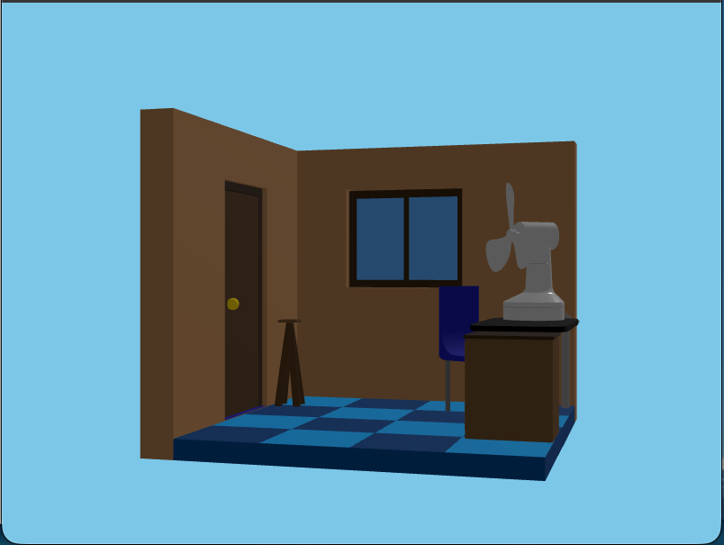
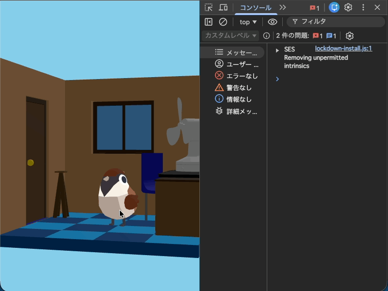

# 3DCG の操作

この節では Three.js を使って 3DCG を描画するとても簡単な例を紹介します。

例としてすでに作っているプログラムを読み込んで走査することを体験して、ブラウザ上で 3DCG を操作するイメージを掴んでください。

# 準備

##　アバターを表示するプログラムのダウンロード

次のリンクからファイルをダウンロードしてください。

- [assets/js/aveterView.zip](assets/js/aveterView.zip)
- [assets/glb/animals.glb](assets/glb/animals.glb)
- [assets/glb/fan.glb](assets/glb/fan.glb)
- [assets/glb/room.glb](assets/glb/room.glb)

### aveterView.zip の展開

ダウンロードした aveterView.zip を展開してください。

次のようなファイルが入っています。

```
./
├── config.js
├── index.js
└── objects
    ├── Animals.js
    ├── factory.js
    ├── Fan.js
    └── Room.js
```

## ディレクトリの用意

プログラムを配置するためのディレクトリを作成します。

```
./
└── practice
    └── aveterView
        ├── assets
        │   ├── css
        │   │   └── style.css
        │   ├── glb
        │   │   ├── animals.glb
        │   │   ├── fan.glb
        │   │   └── room.glb
        │   └── js
        │       ├── aveterView
        │       │   ├── config.js
        │       │   ├── index.js
        │       │   └── objects
        │       │       ├── Animals.js
        │       │       ├── factory.js
        │       │       ├── Fan.js
        │       │       └── Room.js
        │       └── main.js
        └── index.html
```

次のファイルは新たに作ります

- index.html
- assets/css/style.css
- assets/js/main.js

次のファイルはダウンロードしたものを配置します

- assets/js/aveterView 以下に aveterView.zip の展開したファイルを配置
- assets/glb 以下に ダウンロードした glb ファイルを配置

# CGの表示

## `index.html`

```html
<html>
  <head>
    <link rel="stylesheet" href="./assets/css/style.css">
  </head>
  <body>
    <div id="avater"></div>
    <script type="importmap">
      {
        "imports": {
          "three": "https://cdn.jsdelivr.net/npm/three@0.160.0/build/three.module.js",
          "three/addons/": "https://cdn.jsdelivr.net/npm/three@0.160.0/examples/jsm/"
        }
      }
    </script>
    <script type="module" src="./assets/js/main.js"></script>
  </body>
</html>

```

### CSS の読み込み

```html
<link rel="stylesheet" href="./assets/css/style.css">
```

### 利用するモジュールの指定

ここではWeb上に公開されているライブラリを `import` 文で利用できるように指定しています。

```html
<script type="importmap">
  {
    "imports": {
      "three": "https://cdn.jsdelivr.net/npm/three@0.160.0/build/three.module.js",
      "three/addons/": "https://cdn.jsdelivr.net/npm/three@0.160.0/examples/jsm/"
    }
  }
</script>
```

詳しい仕様は [`<script type="importmap">`](https://developer.mozilla.org/ja/docs/Web/HTML/Reference/Elements/script/type/importmap) を参照してください。

### メインスクリプトの読み込み

```html
<script type="module" src="./assets/js/main.js"></script>
```

- `type="module"` と指定することで、JavaScript モジュールとして読み込みます。

### 表示領域

```html
<div id="avater"></div>
```

3DCG の表示領域を指定しています。

## `assets/css/style.css`

```css
body {
  margin: 0;
}

#avater {
  width: 100%;
  height: 100%;
}
```

- `body` の余白をなくします。
- `#avater` のサイズを画面いっぱいにします。

## `assets/js/main.js`

```js
import AvaterView from './aveterView/index.js'

const container = document.getElementById('avater')

new AvaterView({
  element: container,
  roomGlbUrl: './assets/glb/room.glb',
  fanGlbUrl: './assets/glb/fan.glb',
  animalsGlbUrl: './assets/glb/animals.glb',
})

```

- `aveterView/index.js` を読み込み、`AvaterView` クラスを利用しています。
- `#avater` 要素を取得し、`AvaterView` クラスのインスタンスを生成しています。
- 3Dモデルの glb ファイルの URLを指定しています。

## 動作確認

`index.html` をブラウザで開いてください。



実装例: [examples/1](./examples/1)

# 動物を表示する

次にこの部屋に動物を表示させます。

## `main.js`

```js
import AvaterView from './aveterView/index.js'

const container = document.getElementById('avater')

const view = new AvaterView({
  element: container,
  roomGlbUrl: './assets/glb/room.glb',
  fanGlbUrl: './assets/glb/fan.glb',
  animalsGlbUrl: './assets/glb/animals.glb',
})

view.addEventListener('load', () => {
  view.changeAnimalMotion('idle')
})
```

- `AvaterView` クラスのインスタンスを `view` 変数に代入しています。
- `load` イベントを監視し、動物のモーションを `idle` に変更しています。

3DCG の用意ができると自動的に `load` イベントが発火します。
AvaterViewクラスの changeAnimalMotion メソッドを使って動物のモーションを変更しています。

## 動作確認

`index.html` をブラウザで開いてください。
動物が表示されます。


実装例: [examples/2](./examples/2)

# 動物がクリックされたときの制御

次に動物がクリックされたときのイベントが発火したときにログを出しましょう。

## `main.js`

```js
import AvaterView from './aveterView/index.js'

const container = document.getElementById('avater')

const view = new AvaterView({
  element: container,
  roomGlbUrl: './assets/glb/room.glb',
  fanGlbUrl: './assets/glb/fan.glb',
  animalsGlbUrl: './assets/glb/animals.glb',
})

view.addEventListener('load', () => {
  view.changeAnimalMotion('idle')
})

view.addEventListener('animal-click', () => {
  console.log('動物がクリックされました')
})

```

- `animal-click` イベントを監視し、動物がクリックされたときにメッセージをコンソールに表示しています。
- `animal-click` イベントは動物がクリックされたときに発火します。

## 動作確認

`index.html` をブラウザで開いてください。
動物をクリックするとコンソールにメッセージが表示されます。



実装例: [examples/3](./examples/3)


# 動物のモーションを変更する

次に動物がクリックされたときにモーションを変更しましょう。

## `main.js`

```js

import AvaterView from './aveterView/index.js'

const container = document.getElementById('avater')

const view = new AvaterView({
  element: container,
  roomGlbUrl: './assets/glb/room.glb',
  fanGlbUrl: './assets/glb/fan.glb',
  animalsGlbUrl: './assets/glb/animals.glb',
})

view.addEventListener('load', () => {
  view.changeAnimalMotion('idle')
})

view.addEventListener('animal-click', () => {
  view.changeAnimalMotion('attack')
})

```

- `animal-click` イベントが発火したときに、動物のモーションを `attack` に変更しています。

他にも次のようなモーションが利用できます。

- `'idle'`
- `'attack'`
- `'rolling'`
- `'confused'`
- `'damaged'`
- `'shifty'`

## 動作確認

`index.html` をブラウザで開いてください。
動物をクリックすると、動物が攻撃モーションを行います。

実装例: [examples/4](./examples/4)

---

# Three.js を使ったプログラミング

この節では Three.js を使ったプログラミングの詳細については解説していません。
自分で好きなCGを描くためには様々なツールの使い方や Three.js のプログラミング方法を学ぶ必要があります。

## Three.js

Three.js は WebGL を簡単に扱うための JavaScript ライブラリです。

https://threejs.org/

## GLB ファイル

GLB ファイルは 3D モデルのデータフォーマットの一つです。
3D モデルのデータを効率的に格納でき、WebGL での利用に適しています。
更に、アニメーションやマテリアル情報も含めることができます。

また、Web上で無料で使えるGLBファイルも配布されています。

https://sketchfab.com では多くのGLBファイルが公開されています。その中には無料のものあります。

今回使った動物のGLBファイルは以下にあります。
https://sketchfab.com/3d-models/quirky-series-free-animals-pack-19e91ef86cd0448f9cbb5d6c538dade2

---

# まとめ

この節では Three.js を使って 3DCG を描画するとても簡単な例を紹介しました。

---

# 次の項

第1章が終わったら、[第2章: UI構築](../../2-ui/README.md) に進みましょう。
