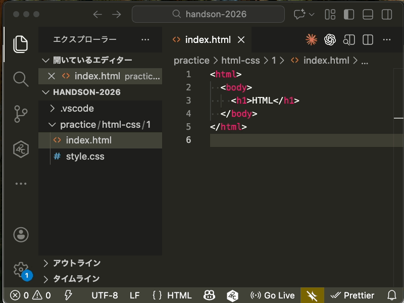
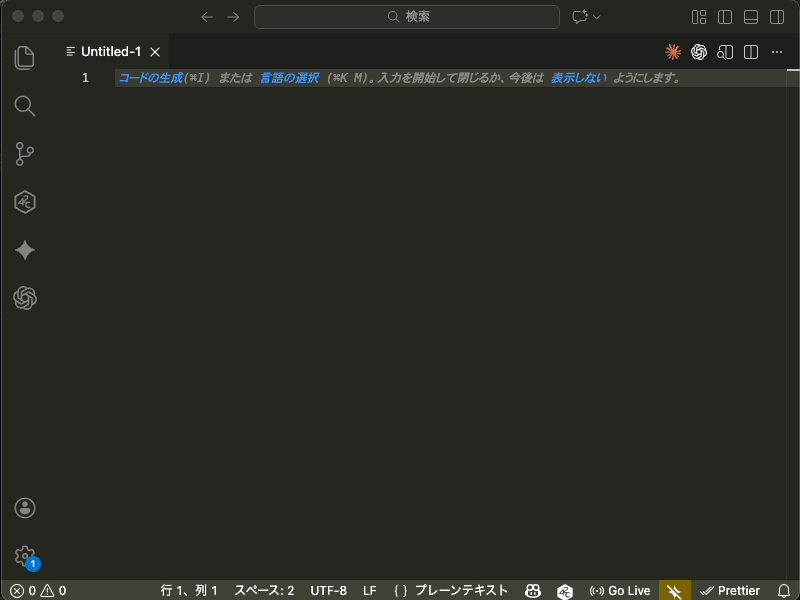

# 第1章: 基礎練習

## この章について

この章ではシミュレーションゲームを作るために必要な技術を学びます。

## 学習内容

この章では、以下のことを学びます:

- HTML と CSS の基本（ページの構造とデザイン）
- JavaScript のデバッグ方法（エラーを見つける方法）
- ダイアログの作り方（入力画面の表示）
- setTimeout の使い方（時間を扱う処理）
- 非同期処理（async/await）の基本
- 3DCG の操作（Three.js を使った基本）

## 環境構築

このハンズオンでは次の環境を使って開発を行います。

普段から使っているエディタやブラウザがあればそれを使っても構いませんが、ここでは推奨環境を紹介します。

### エディタ

- VS Code (Visual Studio Code) がインストールされていること
  - ダウンロードリンク: https://code.visualstudio.com/
- Live Server 拡張機能がインストールされていること
  - ダウンロードリンク: https://marketplace.visualstudio.com/items?itemName=ritwickdey.LiveServer



### ブラウザ

- Google Chrome
    - ダウンロードリンク: https://www.google.com/chrome/

---

## ディレクトリについて

まず `handson-2026` という名前のディレクトリ(フォルダ)を作成してください。
その中に `practice` という名前のディレクトリを作成してください。

次のような構造になっていると正しくつくることができています。

```
./
└── handson-2026
    └── practice
```

## エディタで開く

VSCode を起動して左側に表示されるエクスプローラペインの中から「フォルダーを開く」を選択し、先程作成したディレクトリを選択してください。
エディタ上に先程作成した、`handson-2026`を開くことができます。

今後の作業はすべてこのディレクトリの中で行います。



## 章の構成

この章は以下の6つの節で構成されています。順番に進めてください。

1. [HTML/CSS の基本](1-html-css/README.md)
2. [JavaScript のデバッグ](2-debug/README.md)
3. [ダイアログの作成](3-dialog/README.md)
4. [setTimeout の使い方](4-set-timeout/README.md)
5. [非同期処理の基本](5-async/README.md)
6. [3DCG の操作](6-avater-view/README.md)

---

## 次の章

第1章が終わったら、[第2章: UI構築](../2-ui/README.md) に進みましょう。

第2章では、この章で学んだことを活用して、実際のアプリケーションを作っていきます。
