# 1. ビュー作成

この節では、シミュレーションゲームのUIを段階的に構築していきます。

# ファイルの準備

1章の `handson-2026/practice/6-aveterView` ディレクトリの内容を `handson-2026/app` ディレクトリにコピーしてください。

`app` ディレクトリの中が次のようになります。

```
./
├── assets
│   ├── css
│   │   ├── avater.css
│   │   └── style.css
│   ├── glb
│   │   ├── animals.glb
│   │   ├── fan.glb
│   │   └── room.glb
│   └── js
│       ├── aveterView
│       │   ├── config.js
│       │   ├── index.js
│       │   └── objects
│       │       ├── Animals.js
│       │       ├── factory.js
│       │       ├── Fan.js
│       │       └── Room.js
│       └── main.js
└── index.html
```

# 主要なファイルの確認

## `index.html`

```html
<html>
  <head>
    <link rel="stylesheet" href="./assets/css/style.css">
  </head>
  <body>
    <div id="avater"></div>
    <script type="importmap">
      {
        "imports": {
          "three": "https://cdn.jsdelivr.net/npm/three@0.160.0/build/three.module.js",
          "three/addons/": "https://cdn.jsdelivr.net/npm/three@0.160.0/examples/jsm/"
        }
      }
    </script>
    <script type="module" src="./assets/js/main.js"></script>
  </body>
</html>

```

## `main.js`

```js
import AvaterView from './aveterView/index.js'

const container = document.getElementById('avater')

const view = new AvaterView({
  element: container,
  roomGlbUrl: './assets/glb/room.glb',
  fanGlbUrl: './assets/glb/fan.glb',
  animalsGlbUrl: './assets/glb/animals.glb',
})

view.addEventListener('load', () => {
  view.changeAnimalMotion('idle')
})

view.addEventListener('animal-click', () => {
  view.changeAnimalMotion('attack')
})

```

# ファイルの整理

これから複数の機能を作っていきます。まずはファイルを整理して作業する対象が分かりやすいようにしましょう。

## 目標

次のような構成にします

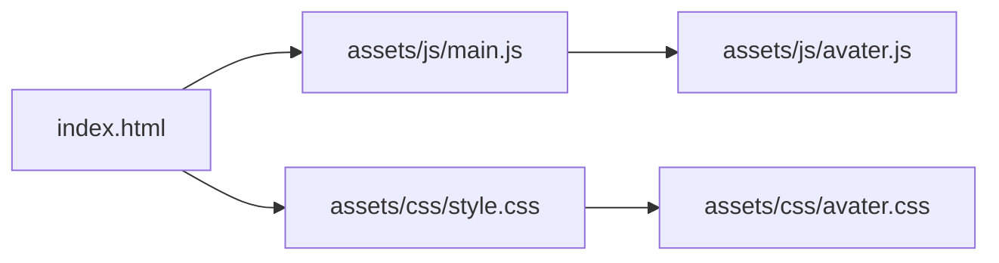

## `avater.js` の作成

`app/assets/js/` ディレクトリの中に `avater.js` という名前のファイルを作成してください。

`main.js` の内容を `avater.js` に移動し、次のように書き換えてください。
一部削除しています。

```js
import AvaterView from './aveterView/index.js'

const container = document.getElementById('avater')

export const view = new AvaterView({
  element: container,
  roomGlbUrl: './assets/glb/room.glb',
  fanGlbUrl: './assets/glb/fan.glb',
  animalsGlbUrl: './assets/glb/animals.glb',
})

view.addEventListener('load', () => {
  view.changeAnimalMotion('idle')
})

```

## `main.js` の修正

作成した `avater.js` を `main.js` で読み込むように修正してください。

```js
import './avater.js'
```

## `avater.css` の作成

```css
#avater {
  width: 100%;
  height: 100%;
}

```


## style.css の修正

作成した `avater.css` を `style.css` で読み込むように修正してください。

```css
@import url('./avater.css');

body {
  margin: 0;
}
```

## 最終的なディレクトリ構造

```
├── assets
│   ├── css
│   │   ├── avater.css <- 作成
│   │   └── style.css <- 修正
│   ├── glb
│   │   ├── animals.glb
│   │   ├── fan.glb
│   │   └── room.glb
│   └── js
│       ├── aveterView
│       │   ├── config.js
│       │   ├── index.js
│       │   └── objects
│       │       ├── Animals.js
│       │       ├── factory.js
│       │       ├── Fan.js
│       │       └── Room.js
│       ├── avater.js <- 作成
│       └── main.js <- 修正
└── index.html
```

## 動作確認

ブラウザで `index.html` を開き、3Dキャラクターが表示されることを確認してください。


#　メニューの作成

次にメニューを作ります。

## 目標

次のような構成にします

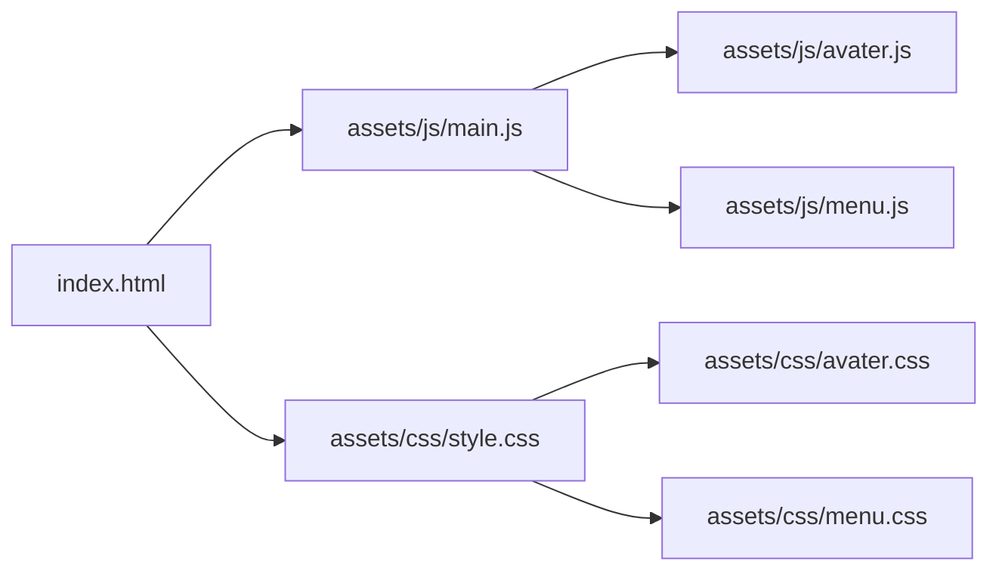

## `index.html`

次のHTMLを `<body>` の直下に追加してください。
```html
<div id="menu">
  <button id="teachButton">教える</button>
  <button id="talkButton">話す</button>
</div>
```

次のようなHTMLになります。

```html
<html>
  <head>
    <link rel="stylesheet" href="./assets/css/style.css">
  </head>
  <body>
    <div id="menu">
      <button id="teachButton">教える</button>
      <button id="talkButton">話す</button>
    </div>
    <div id="avater"></div>
    <script type="importmap">
      {
        "imports": {
          "three": "https://cdn.jsdelivr.net/npm/three@0.160.0/build/three.module.js",
          "three/addons/": "https://cdn.jsdelivr.net/npm/three@0.160.0/examples/jsm/"
        }
      }
    </script>
    <script type="module" src="./assets/js/main.js"></script>
  </body>
</html>

```

## `menu.css`

`assets/css/` ディレクトリの中に `menu.css` という名前のファイルを作成し、次の内容を記述してください。

```css
#menu {
  position: absolute;
  top: 20px;
  left: 20px;
  z-index: 10;
  background: white;
  border: solid 5px black;

  button {
    border: none;
    background: none;
    font-size: 32px;
    padding: 10px;
    width: 200px;
    display: block;
    cursor: pointer;

    &:hover, &:active {
      background: snow;
    }
  }
}
```

## style.css の修正

`style.css` に `menu.css` を読み込む記述を追加してください。

```css
@import url('./avater.css');
@import url('./menu.css');

body {
  margin: 0;
}
```

## 動作確認

ブラウザで `index.html` を開き、メニューが表示されることを確認してください。


# メニューの操作

動物がクリックされたらメニューが表示されるようにします。

##　 `index.html`

まずはメニューを非表示します。

`<div id="menu">` に `hidden` 属性を追加してください。

```html
    <div id="menu" hidden>
      <button id="teachButton">教える</button>
      <button id="talkButton">話す</button>
    </div>
```

ブラウザでメニューが表示されなくなることを確認できます。

## `menu.js`

`assets/js/` ディレクトリの中に `menu.js` という名前のファイルを作成し、次の内容を記述してください。

```js
const root = document.getElementById('menu')
export const teachButton = document.getElementById('teachButton')
export const talkButton = document.getElementById('talkButton')

export function open () {
  root.hidden = false;
}

export function close () {
  root.hidden = true;
}

```

ここでは 4つの要素をエクスポートしています。

- `teachButton` - 「教える」ボタン要素
- `talkButton` - 「話す」ボタン要素
- `open` 関数 - メニューを表示する関数
- `close` 関数 - メニューを非表示にする関数

## `main.js`

作成した `menu.js` を読み込むように修正してください。
```js
import * as menu from './menu.js'
```

動物がクリックされたらメニューを開くようにします。
```js
avater.view.addEventListener('animal-click', () => {
  menu.open()
})
```
この段階で動物をクリックするとメニューが表示されるようになります。


更にメニューが操作されたときの処理を追加します。
ログの表示とメニューが閉じるようにします。
```js
menu.talkButton.addEventListener('click', () => {
  console.log('動物と話す')
  menu.close()
})

menu.teachButton.addEventListener('click', () => {
  console.log('動物に教える')
  menu.close()
})
```

最終的な `main.js` は次のようになります。

```js
import * as avater from './avater.js'
import * as menu from './menu.js'

avater.view.addEventListener('animal-click', () => {
  menu.open()
})

menu.talkButton.addEventListener('click', () => {
  console.log('動物と話す')
  menu.close()
})

menu.teachButton.addEventListener('click', () => {
  console.log('動物に教える')
  menu.close()
})

```

## 動作確認

ブラウザで `index.html` を開き、動物をクリックしてメニューが表示されることを確認してください。
「教える」「話す」ボタンをクリックするとコンソールにメッセージが表示され、メニューが閉じることを確認してください。


# 言葉を入力するダイアログ

言葉を入力するダイアログを作成します。

## 目標

次のような構成にします

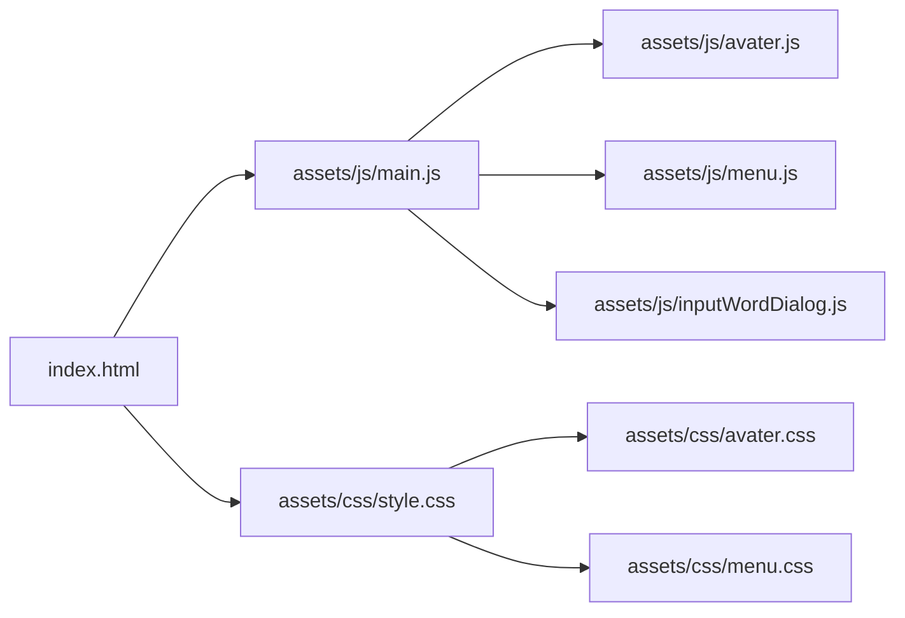

## `index.html`

`<body>` の直下に次のHTMLを追加してください。

```html
<dialog id="inputWordDialog">
  <label for="wordInput">言葉を入力してください:</label>
  <input type="text" id="wordInput" name="word" required>
  <div>
    <button id="cancelInputWordButton">キャンセル</button>
    <button id="submitInputWordButton">確定する</button>
  </div>
</dialog>
```

最終的なHTMLは次のようになります。

```html
<html>
  <head>
    <link rel="stylesheet" href="./assets/css/style.css">
  </head>
  <body>
    <div id="menu" hidden>
      <button id="teachButton">教える</button>
      <button id="talkButton">話す</button>
    </div>
    <div id="avater"></div>
    <dialog id="inputWordDialog">
      <label for="wordInput">言葉を入力してください:</label>
      <input type="text" id="wordInput" name="word" required>
      <div>
        <button id="cancelInputWordButton">キャンセル</button>
        <button id="submitInputWordButton">確定する</button>
      </div>
    </dialog>
    <script type="importmap">
      {
        "imports": {
          "three": "https://cdn.jsdelivr.net/npm/three@0.160.0/build/three.module.js",
          "three/addons/": "https://cdn.jsdelivr.net/npm/three@0.160.0/examples/jsm/"
        }
      }
    </script>
    <script type="module" src="./assets/js/main.js"></script>
  </body>
</html>

```

## `inputWordDialog.js`

`assets/js/` ディレクトリの中に `inputWordDialog.js` という名前のファイルを作成し、次の内容を記述してください。

```js
const dialog = document.getElementById('inputWordDialog')
const submitButton = document.getElementById('submitInputWordButton')
const cancelButton = document.getElementById('cancelInputWordButton')
const input = document.getElementById('wordInput')

export async function open () {
  dialog.showModal()
  input.value = "";

  return new Promise((resolve) => {
    cancelButton.addEventListener('click', () => {
      dialog.close()
      resolve(null)
    })

    submitButton.addEventListener('click', () => {
      dialog.close()
      resolve(input.value)
    })
  })
}

```

## `main.js`

作成した `inputWordDialog.js` を読み込むように修正してください。

```js
import * as inputWordDialog from './inputWordDialog.js'
```

「教える」ボタンがクリックされたときにダイアログを開くように修正してください。

`content` には入力された言葉が格納されます。
`content` の値がない場合はキャンセルされたことを意味します。

```js
menu.teachButton.addEventListener('click', async () => {
  console.log('動物に教える')
  menu.close()

  const content = await inputWordDialog.open()
  if (!content) {
    console.log('言葉の入力がキャンセルされました')
    return
  }
  console.log(`動物に「${content}」を教えました`)
})

```

全体の `main.js` は次のようになります。

```js
import * as avater from './avater.js'
import * as menu from './menu.js'
import * as inputWordDialog from './inputWordDialog.js'

avater.view.addEventListener('animal-click', () => {
  menu.open()
})

menu.talkButton.addEventListener('click', () => {
  console.log('動物と話す')
  menu.close()
})

menu.teachButton.addEventListener('click', async () => {
  console.log('動物に教える')
  menu.close()

  const content = await inputWordDialog.open()
  if (!content) {
    console.log('言葉の入力がキャンセルされました')
    return
  }
  console.log(`動物に「${content}」を教えました`)
})

```

## 動作確認

次のように動作することを確認してください。

入力された内容がコンソールに表示されます。

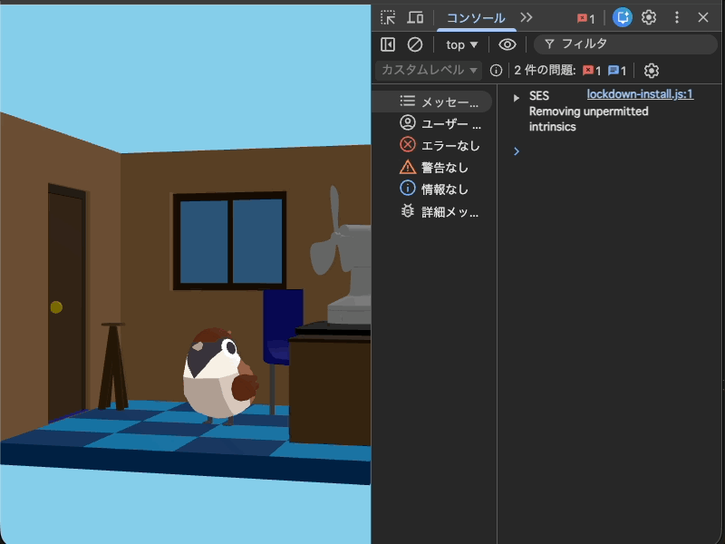

# 言葉の分類を選ぶ

言葉の分類を選ぶダイアログを作成します。

## 目標

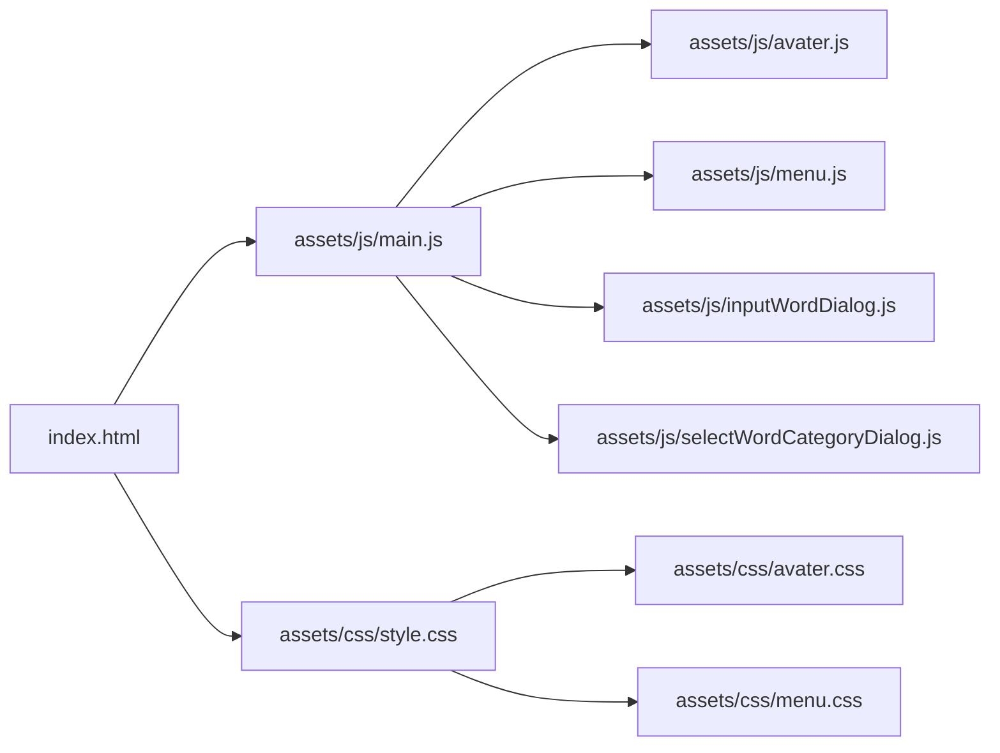

## `index.html`

`<body>` の直下に次のHTMLを追加してください。

```html
<dialog id="selectWordCategoryDialog">
  <p>分野を選んでください:</p>
  <div id="selectWordCategoryList">
    <button value="あいさつ">あいさつ</button>
    <button value="食べ物">食べ物</button>
    <button value="必殺技">必殺技</button>
    <button value="場所">場所</button>
  </div>
</dialog>
```

最終的なHTMLは次のようになります。

```html
<html>
  <head>
    <link rel="stylesheet" href="./assets/css/style.css">
  </head>
  <body>
    <div id="menu" hidden>
      <button id="teachButton">教える</button>
      <button id="talkButton">話す</button>
    </div>
    <div id="avater"></div>
    <dialog id="inputWordDialog">
      <label for="wordInput">言葉を入力してください:</label>
      <input type="text" id="wordInput" name="word" required>
      <div>
        <button id="cancelInputWordButton">キャンセル</button>
        <button id="submitInputWordButton">確定する</button>
      </div>
    </dialog>
    <dialog id="selectWordCategoryDialog">
      <p>分野を選んでください:</p>
      <div id="selectWordCategoryList">
        <button value="あいさつ">あいさつ</button>
        <button value="食べ物">食べ物</button>
        <button value="必殺技">必殺技</button>
        <button value="場所">場所</button>
      </div>
    </dialog>
    <script type="importmap">
      {
        "imports": {
          "three": "https://cdn.jsdelivr.net/npm/three@0.160.0/build/three.module.js",
          "three/addons/": "https://cdn.jsdelivr.net/npm/three@0.160.0/examples/jsm/"
        }
      }
    </script>
    <script type="module" src="./assets/js/main.js"></script>
  </body>
</html>

```

## `selectWordCategoryDialog.js`

`assets/js/` ディレクトリの中に `selectWordCategoryDialog.js` という名前のファイルを作成し、次の内容を記述してください。

```js
const dialog = document.getElementById('selectWordCategoryDialog')
const buttons = document.querySelectorAll('#selectWordCategoryList button')

export async function open () {
  dialog.showModal()

  return new Promise((resolve) => {
    buttons.forEach((button) => {
      button.addEventListener('click', () => {
        dialog.close()
        resolve(button.value)
      })
    })
  })
}

```

ボタンがクリックされたときに、ボタンが持つ `value` の内容が返されるようになっています。

`querySelectorAll` を使って、4つのボタン要素を取得しています。CSSのセレクタで複数の要素を取得する方法です。今回は `#selectWordCategoryList button` で、`id` が `selectWordCategoryList` の要素の中にある `button` 要素を全て取得しています。

対象となるのは次の要素
```html
<button value="あいさつ">あいさつ</button>
<button value="食べ物">食べ物</button>
<button value="必殺技">必殺技</button>
<button value="場所">場所</button>
```

詳しくは [Document: querySelectorAll() メソッド](https://developer.mozilla.org/ja/docs/Web/API/Document/querySelectorAll) を参照してください。

## `main.js`

作成した `selectWordCategoryDialog.js` を読み込むように修正してください。
```js
import * as selectCategoryDialog from './selectWordCategoryDialog.js'
```

「教える」ボタンがクリックされたときに、言葉の入力ダイアログの後に分類選択ダイアログを開くように修正してください。
```js
const wordCategory = await selectWordCategoryDialog.open()
console.log(`選ばれた分野: ${wordCategory}`)
```

最終的には次のようになります。

```js
import * as avater from './avater.js'
import * as menu from './menu.js'
import * as inputWordDialog from './inputWordDialog.js'
import * as selectWordCategoryDialog from './selectWordCategoryDialog.js'

avater.view.addEventListener('animal-click', () => {
  menu.open()
})

menu.talkButton.addEventListener('click', () => {
  console.log('動物と話す')
  menu.close()
})

menu.teachButton.addEventListener('click', async () => {
  console.log('動物に教える')
  menu.close()

  const content = await inputWordDialog.open()
  if (!content) {
    console.log('言葉の入力がキャンセルされました')
    return
  }
  console.log(`動物に「${content}」を教えました`)

  const wordCategory = await selectWordCategoryDialog.open()
  console.log(`選ばれた分野: ${wordCategory}`)
})

```

## 動作確認

ブラウザで `index.html` を開き、動物をクリックしてメニューを表示します。
「教える」ボタンをクリックして言葉を入力し、確定ボタンをクリックします。
続いて表示される分類選択ダイアログで分類ボタンをクリックします。
選択された分類がコンソールに表示されることを確認してください

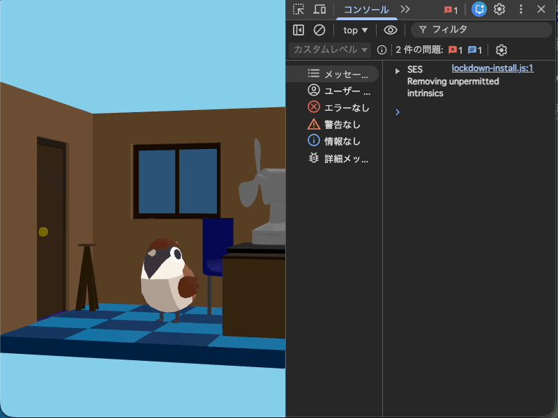

# 単語の分類を動的に変える

単語の分類を後からでも変更しやすいように、`selectWordCategoryDialog.js` を修正します。

## `selectWordCategoryDialog.js` の修正

以下のコードを追加
```js
const categoryList = document.getElementById('selectWordCategoryList')
```

`open()` の関数が `categories` という引数を受け取るように修正します。

ここでは次のような `categories` を期待します。
```js
const categories = [
  'あいさつ',
  '食べ物',
  '必殺技',
  '場所'
]
```

`open` が呼び出された直後は `#categoryList` の中を空にしたうえで、`categories` の内容を元にボタン要素を動的に作成して追加するように修正します。

```js
export async function open (categories) {
  dialog.showModal()

  categoryList.innerHTML = '';

  return new Promise((resolve) => {
    categories.forEach((category) => {
      const button = document.createElement('button')
      button.value = category;
      button.textContent = category;

      button.addEventListener('click', () => {
        dialog.close()
        resolve(button.value)
      })

      categoryList.appendChild(button)
    })
  })
}

```

`document.createElement('button')` は `<button>` を作成します。

最終的な `selectWordCategoryDialog.js` は次のようになります。

```js
const dialog = document.getElementById('selectWordCategoryDialog')
const categoryList = document.getElementById('selectWordCategoryList')

export async function open (categories) {
  dialog.showModal()

  categoryList.innerHTML = '';

  return new Promise((resolve) => {
    categories.forEach((category) => {
      const button = document.createElement('button')
      button.value = category;
      button.textContent = category;

      button.addEventListener('click', () => {
        dialog.close()
        resolve(button.value)
      })

      categoryList.appendChild(button)
    })
  })
}

```

## `main.js` の修正

`open` 関数の呼び出し時に、分類の配列を渡すように修正します。
こうすることで、将来的に分類を追加したり変更したりするのが簡単になります。

```js
const wordCategory = await selectWordCategoryDialog.open([
  'あいさつ',
  '食べ物',
  '必殺技',
  '場所'
])
console.log(`選ばれた分野: ${wordCategory}`)
```

最終的な `main.js` は次のようになります。

```js
import * as avater from './avater.js'
import * as menu from './menu.js'
import * as inputWordDialog from './inputWordDialog.js'
import * as selectWordCategoryDialog from './selectWordCategoryDialog.js'

avater.view.addEventListener('animal-click', () => {
  menu.open()
})

menu.talkButton.addEventListener('click', () => {
  console.log('動物と話す')
  menu.close()
})

menu.teachButton.addEventListener('click', async () => {
  console.log('動物に教える')
  menu.close()

  const content = await inputWordDialog.open()
  if (!content) {
    console.log('言葉の入力がキャンセルされました')
    return
  }
  console.log(`動物に「${content}」を教えました`)

  const wordCategory = await selectWordCategoryDialog.open([
    'あいさつ',
    '食べ物',
    '必殺技',
    '場所'
  ])
  console.log(`選ばれた分野: ${wordCategory}`)
})

```

## `index.html` の修正

分野を選ぶダイアログを以下のように変更する

```html
  <dialog id="selectWordCategoryDialog">
    <p>分野を選んでください:</p>
    <div id="selectWordCategoryList"></div>
  </dialog>
```

最終的な　HTMLは次のようになります。

```html
<html>
  <head>
    <link rel="stylesheet" href="./assets/css/style.css">
  </head>
  <body>
    <div id="menu" hidden>
      <button id="teachButton">教える</button>
      <button id="talkButton">話す</button>
    </div>
    <div id="avater"></div>
    <dialog id="inputWordDialog">
      <label for="wordInput">言葉を入力してください:</label>
      <input type="text" id="wordInput" name="word" required>
      <div>
        <button id="cancelInputWordButton">キャンセル</button>
        <button id="submitInputWordButton">確定する</button>
      </div>
    </dialog>
    <dialog id="selectWordCategoryDialog">
      <p>分野を選んでください:</p>
      <div id="selectWordCategoryList"></div>
    </dialog>
    <script type="importmap">
      {
        "imports": {
          "three": "https://cdn.jsdelivr.net/npm/three@0.160.0/build/three.module.js",
          "three/addons/": "https://cdn.jsdelivr.net/npm/three@0.160.0/examples/jsm/"
        }
      }
    </script>
    <script type="module" src="./assets/js/main.js"></script>
  </body>
</html>
```

## 動作確認

前の節と同様に動作することを確認してください。

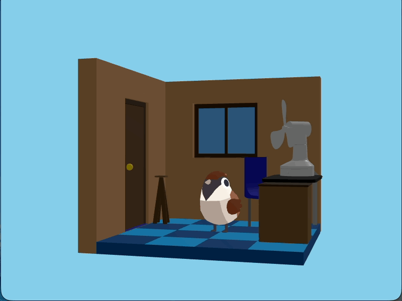

# セリフを表示する

セリフを表示するビューを作成します。

## 目標

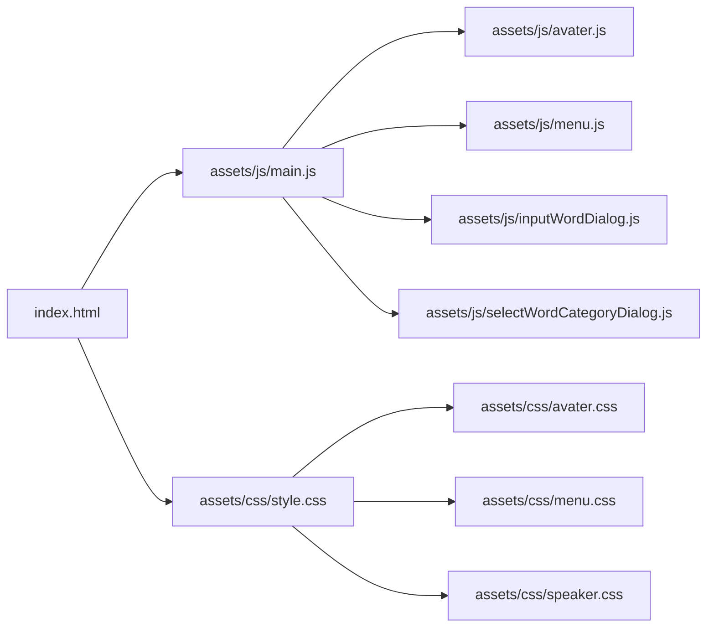

## `index.html`

`<body>` の直下に次のHTMLを追加してください。

```html
<div id="speaker">
  <p></p>
</div>

```

## `speaker.css`

`assets/css/` ディレクトリの中に `speaker.css` という名前のファイルを作成し、次の内容を記述してください。

```css
#speaker {
  position: absolute;
  bottom: 20px;
  left: 20px;
  right: 20px;
  z-index: 10;
  background: white;
  border: solid 5px black;

  p {
    padding: 20px;
    min-height: 40px;
    font-size: 40px;
    margin: 0;
  }
}

```

## style.css の修正

次のインポートを追加してください。

```css
@import url('./speaker.css');
```

最終的な `style.css` は次のようになります。

```css
@import url('./avater.css');
@import url('./menu.css');
@import url('./speaker.css');

body {
  margin: 0;
}

```

## 動作確認

この段階ではセリフは表示されませんが、ブラウザで `index.html` を開き、セリフの領域だけが表示されるのを確認して下さい。


# セリフの表示

次はセリフを表示する機能を実装します。

## 目標

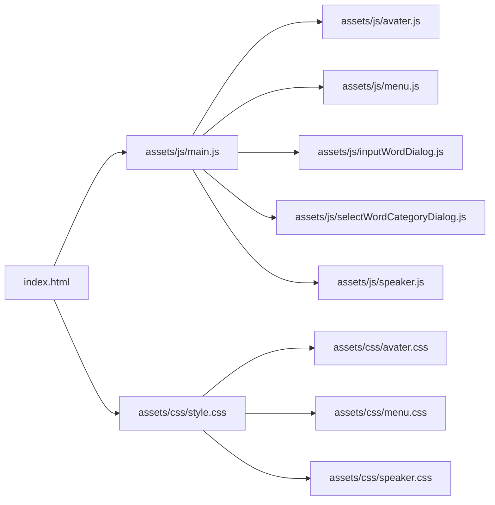

## `index.html`

`#speaker` の中身を次のように修正してください。

```html
<div id="speaker" hidden>
  <p id="speakerContent"></p>
</div>
```

最終的なHTMLは次のようになります。

```html
<html>
  <head>
    <link rel="stylesheet" href="./assets/css/style.css">
  </head>
  <body>
    <div id="menu" hidden>
      <button id="teachButton">教える</button>
      <button id="talkButton">話す</button>
    </div>
    <div id="avater"></div>
    <div id="speaker" hidden>
      <p id="speakerContent"></p>
    </div>
    <dialog id="inputWordDialog">
      <label for="wordInput">言葉を入力してください:</label>
      <input type="text" id="wordInput" name="word" required>
      <div>
        <button id="cancelInputWordButton">キャンセル</button>
        <button id="submitInputWordButton">確定する</button>
      </div>
    </dialog>
    <dialog id="selectWordCategoryDialog">
      <p>分野を選んでください:</p>
      <div id="selectWordCategoryList"></div>
    </dialog>
    <script type="importmap">
      {
        "imports": {
          "three": "https://cdn.jsdelivr.net/npm/three@0.160.0/build/three.module.js",
          "three/addons/": "https://cdn.jsdelivr.net/npm/three@0.160.0/examples/jsm/"
        }
      }
    </script>
    <script type="module" src="./assets/js/main.js"></script>
  </body>
</html>

```

## `speaker.js`

`assets/js/` ディレクトリの中に `speaker.js` という名前のファイルを作成し、次の内容を記述してください。

```js
const root = document.getElementById('speaker')
const contentText = document.getElementById('speakerContent')

export function start (content) {
  contentText.textContent = content
  root.hidden = false;
}

```

## `main.js`

作成した `speaker.js` を読み込むように修正してください。

```js
import * as speaker from './speaker.js'
```

`console.log` で表示していた箇所を `speaker.start` を使ってセリフを表示するように修正してください。

```js
menu.teachButton.addEventListener('click', async () => {
  console.log('動物に教える')
  menu.close()

  const content = await inputWordDialog.open()
  if (content) {
    speaker.start(`「${content}」を教えました`)
  } else {
    speaker.start('言葉の入力がキャンセルされました')
  }

  const wordCategory = await selectWordCategoryDialog.open([
    'あいさつ',
    '食べ物',
    '必殺技',
    '場所'
  ])
  speaker.start(`「${wordCategory}」の分野を選びました`)
})
```

最終的な `main.js` は次のようになります。

```js
import * as avater from './avater.js'
import * as menu from './menu.js'
import * as inputWordDialog from './inputWordDialog.js'
import * as selectWordCategoryDialog from './selectWordCategoryDialog.js'
import * as speaker from './speaker.js'

avater.view.addEventListener('animal-click', () => {
  menu.open()
})

menu.talkButton.addEventListener('click', () => {
  console.log('動物と話す')
  menu.close()
})

menu.teachButton.addEventListener('click', async () => {
  console.log('動物に教える')
  menu.close()

  const content = await inputWordDialog.open()
  if (content) {
    speaker.start(`「${content}」を教えました`)
  } else {
    speaker.start('言葉の入力がキャンセルされました')
  }

  const wordCategory = await selectWordCategoryDialog.open([
    'あいさつ',
    '食べ物',
    '必殺技',
    '場所'
  ])
  speaker.start(`「${wordCategory}」の分野を選びました`)
})

```

## 動作確認

ブラウザで `index.html` を開き、動物をクリックしてメニューを表示します。

「教える」ボタンをクリックして言葉を入力し、確定ボタンをクリックします。
続いて表示される分類選択ダイアログで分類ボタンをクリックします。
セリフが表示されることを確認してください。

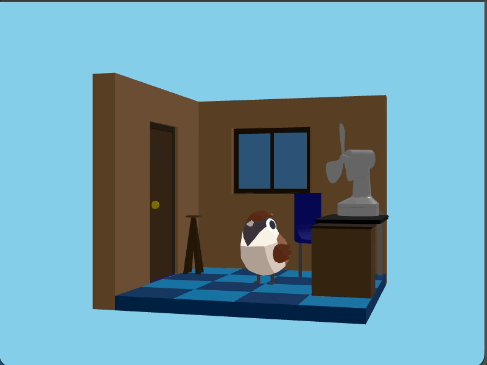

# セリフを位置文字ずつ表示する

一度に表示されるセリフの文字を１文字ずつ表示するようにします。

## `speaker.js` の修正

```js
const root = document.getElementById('speaker')
const contentText = document.getElementById('speakerContent')

export async function start (content) {
  contentText.textContent = content
  root.hidden = false;

  return new Promise((resolve) => {
    const characters = Array.from(content)

    for (let i = 0; i < characters.length; i++) {
      const isLast = i === characters.length - 1
      const duration = i * 100
      setTimeout(() => {
        const targetCharacters = characters.slice(0, i + 1)
        contentText.textContent = targetCharacters.join('')
      }, duration)

      if (isLast) {
        setTimeout(() => {
          root.hidden = true;
          resolve()
        }, duration)
      }
    }
  })
}

```

`i` は何文字目を表示しているかを示す変数です。それの文字の数に100を掛けたものを `duration` として使っています。
```js
const duration = i * 100
```

仮に「こんにちは」と表示する場合は以下のようになります。

|`i`|経過秒数 = `duration`|表示内容|
|---|------------------|--------|
|0  |0ms               |こ      |
|1  |100ms            |こん    |
|2  |200ms            |こんに  |
|3  |300ms            |こんにち|
|4  |400ms            |こんにちは|


次の箇所は `Promise` を解決する部分です。
最後の文字が表示されたときに `Promise` を解決するようにしています。
```js
  if (isLast) {
    setTimeout(() => {
      root.hidden = true;
      resolve()
    }, duration)
  }
```

## `main.js` の修正

`await` を使ってセリフの表示が終わるのを待つように修正します。
そのため `speaker.start` を呼ぶ関数は `async` 関数にする必要があります。

```js
menu.teachButton.addEventListener('click', async () => {

```

単語を入力された後のセリフ表示部分を次のように修正します。`await` を追加しています。
```js
if (!content) {
  await speaker.start('言葉の入力がキャンセルされました')
  return
}
await speaker.start(`「${content}」を教えました`)
```

単語の分類を選択された後のセリフ表示部分も次のように修正します。`await` を追加しています。
```js
await speaker.start(`「${wordCategory}」の分野を選びました`)
```

最終的な `main.js` は次のようになります。

```js
import * as avater from './avater.js'
import * as menu from './menu.js'
import * as inputWordDialog from './inputWordDialog.js'
import * as selectWordCategoryDialog from './selectWordCategoryDialog.js'
import * as speaker from './speaker.js'

avater.view.addEventListener('animal-click', () => {
  menu.open()
})

menu.talkButton.addEventListener('click', () => {
  console.log('動物と話す')
  menu.close()
})

menu.teachButton.addEventListener('click', async () => {
  console.log('動物に教える')
  menu.close()

  const content = await inputWordDialog.open()
  if (!content) {
    await speaker.start('言葉の入力がキャンセルされました')
    return
  }
  await speaker.start(`「${content}」を教えました`)

  const wordCategory = await selectWordCategoryDialog.open([
    'あいさつ',
    '食べ物',
    '必殺技',
    '場所'
  ])
  await speaker.start(`「${wordCategory}」の分野を選びました`)
})

```

## 動作確認

ブラウザで `index.html` を開き、動物をクリックしてメニューを表示します。

「教える」ボタンをクリックして言葉を入力し、確定ボタンをクリックします。
続いて表示される分類選択ダイアログで分類ボタンをクリックします。
セリフが1文字ずつ表示されることを確認してください。

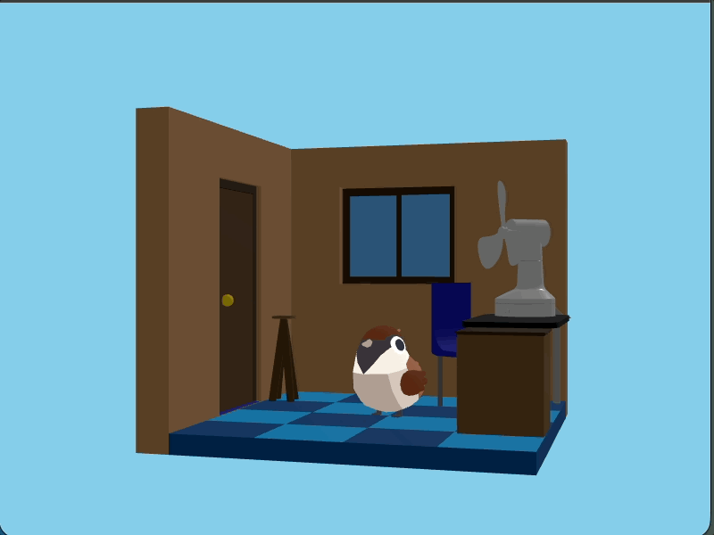

#　セリフの表示のあとの待機時間の追加

現時点では最後の文字が表示されると同時にセリフが消えてしまいます。

すべてのセリフが表示されてから1秒間待機してからセリフが消えるように修正します。

## `speaker.js` の修正

解決されるタイミングを次のように修正します。

```js
if (isLast) {
  setTimeout(() => {
    root.hidden = true;
    resolve()
  }, duration + 1000)
}
```

最終的な `speaker.js` は次のようになります。

```js
const root = document.getElementById('speaker')
const contentText = document.getElementById('speakerContent')

export async function start (content) {
  contentText.textContent = content
  root.hidden = false;

  return new Promise((resolve) => {
    for (let i = 0; i < content.length; i++) {
      const isLast = i === content.length - 1
      const duration = i * 100
      setTimeout(() => {
        contentText.textContent = content.slice(0, i + 1)
      }, duration)

      if (isLast) {
        setTimeout(() => {
          root.hidden = true;
          resolve()
        }, duration + 1000)
      }
    }
  })
}

```

## 動作確認

台詞のあとに1秒間待機してからセリフが消えることを確認してください。


---

# まとめ

ここまででゲームを作るために必要な表示に関わるパーツを作ってきました。

このあと、このパーツを組み合わせてロジックを持ったゲームにしていきます。

# 次の項

[ロジック実装](../2-logic/)
