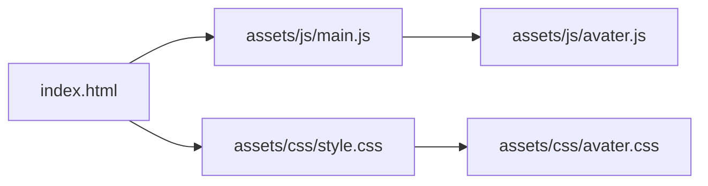
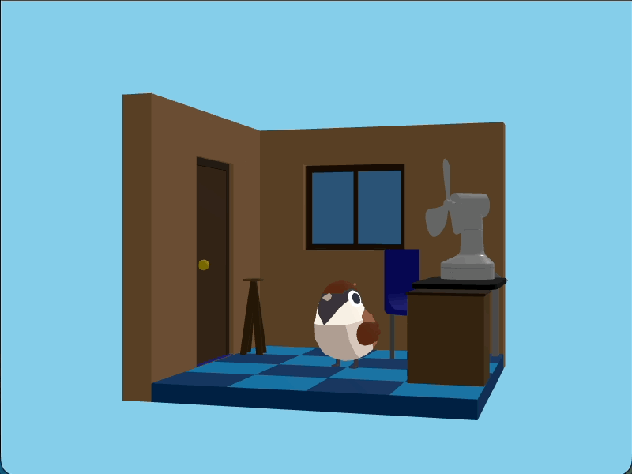
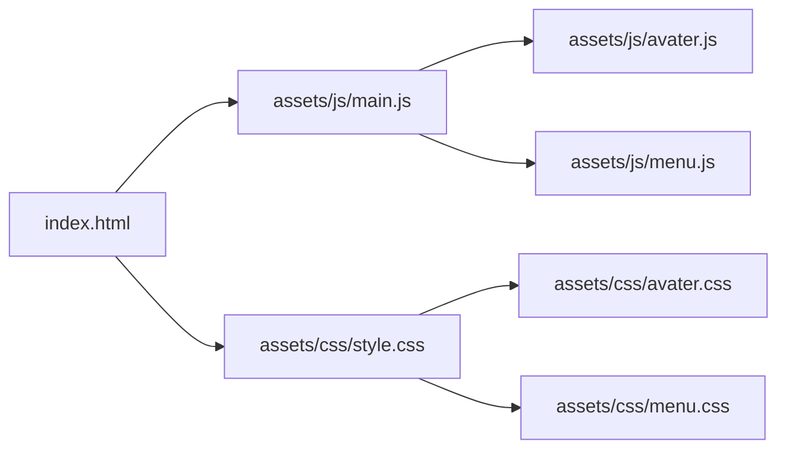
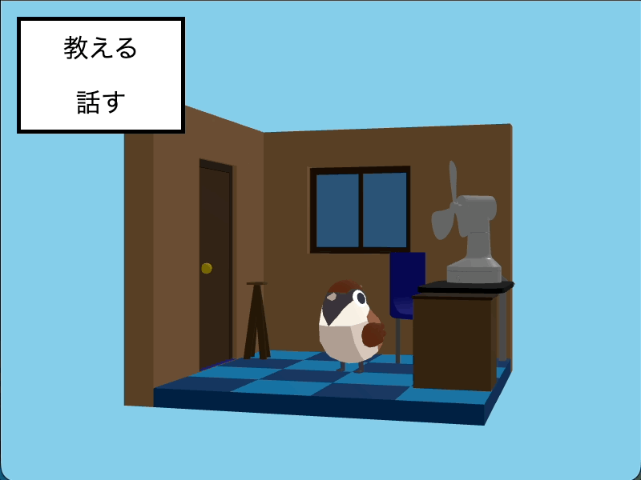
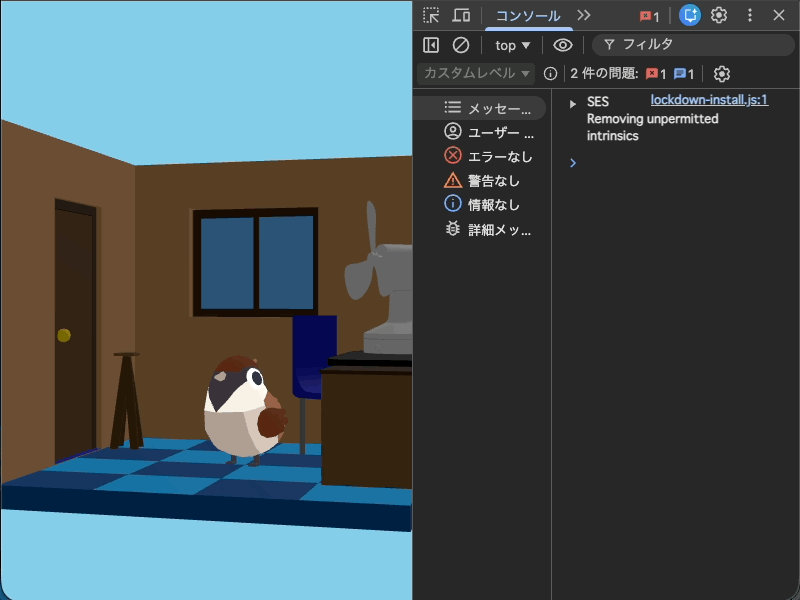

# 1. ビュー作成

この節では、シミュレーションゲームのUIを段階的に構築していきます。

# ファイルの準備

1章の `handson-2026/practice/6-aveterView` ディレクトリの内容を `handson-2026/app` ディレクトリにコピーしてください。

`app` ディレクトリの中が次のようになります。

```
./
├── assets
│   ├── css
│   │   ├── avater.css
│   │   └── style.css
│   ├── glb
│   │   ├── animals.glb
│   │   ├── fan.glb
│   │   └── room.glb
│   └── js
│       ├── aveterView
│       │   ├── config.js
│       │   ├── index.js
│       │   └── objects
│       │       ├── Animals.js
│       │       ├── factory.js
│       │       ├── Fan.js
│       │       └── Room.js
│       └── main.js
└── index.html
```

# 主要なファイルの確認

## `index.html`

```html
<html>
  <head>
    <link rel="stylesheet" href="./assets/css/style.css">
  </head>
  <body>
    <div id="avater"></div>
    <script type="importmap">
      {
        "imports": {
          "three": "https://cdn.jsdelivr.net/npm/three@0.160.0/build/three.module.js",
          "three/addons/": "https://cdn.jsdelivr.net/npm/three@0.160.0/examples/jsm/"
        }
      }
    </script>
    <script type="module" src="./assets/js/main.js"></script>
  </body>
</html>

```

## `main.js`

```js
import AvaterView from './aveterView/index.js'

const container = document.getElementById('avater')

const view = new AvaterView({
  element: container,
  roomGlbUrl: './assets/glb/room.glb',
  fanGlbUrl: './assets/glb/fan.glb',
  animalsGlbUrl: './assets/glb/animals.glb',
})

view.addEventListener('load', () => {
  view.changeAnimalMotion('idle')
})

view.addEventListener('animal-click', () => {
  view.changeAnimalMotion('attack')
})

```

# ファイルの整理

これから複数の機能を作っていきます。まずはファイルを整理して作業する対象が分かりやすいようにしましょう。

## 目標

次のような構成にします



## `avater.js` の作成

`app/assets/js/` ディレクトリの中に `avater.js` という名前のファイルを作成してください。

`main.js` の内容を `avater.js` に移動し、次のように書き換えてください。
一部削除しています。

```js
import AvaterView from './aveterView/index.js'

const container = document.getElementById('avater')

export const view = new AvaterView({
  element: container,
  roomGlbUrl: './assets/glb/room.glb',
  fanGlbUrl: './assets/glb/fan.glb',
  animalsGlbUrl: './assets/glb/animals.glb',
})

view.addEventListener('load', () => {
  view.changeAnimalMotion('idle')
})

```

## `main.js` の修正

作成した `avater.js` を `main.js` で読み込むように修正してください。

```js
import './avater.js'
```

## `avater.css` の作成

```css
#avater {
  width: 100%;
  height: 100%;
}

```


## style.css の修正

作成した `avater.css` を `style.css` で読み込むように修正してください。

```css
@import url('./avater.css');

body {
  margin: 0;
}
```

## 最終的なディレクトリ構造

```
├── assets
│   ├── css
│   │   ├── avater.css <- 作成
│   │   └── style.css <- 修正
│   ├── glb
│   │   ├── animals.glb
│   │   ├── fan.glb
│   │   └── room.glb
│   └── js
│       ├── aveterView
│       │   ├── config.js
│       │   ├── index.js
│       │   └── objects
│       │       ├── Animals.js
│       │       ├── factory.js
│       │       ├── Fan.js
│       │       └── Room.js
│       ├── avater.js <- 作成
│       └── main.js <- 修正
└── index.html
```

## 動作確認

ブラウザで `index.html` を開き、3Dキャラクターが表示されることを確認してください。



#　メニューの作成

次にメニューを作ります。

## 目標

次のような構成にします



## `index.html`

次のHTMLを `<body>` の直下に追加してください。
```html
<div id="menu">
  <button id="teachButton">教える</button>
  <button id="talkButton">話す</button>
</div>
```

次のようなHTMLになります。

```html
<html>
  <head>
    <link rel="stylesheet" href="./assets/css/style.css">
  </head>
  <body>
    <div id="menu">
      <button id="teachButton">教える</button>
      <button id="talkButton">話す</button>
    </div>
    <div id="avater"></div>
    <script type="importmap">
      {
        "imports": {
          "three": "https://cdn.jsdelivr.net/npm/three@0.160.0/build/three.module.js",
          "three/addons/": "https://cdn.jsdelivr.net/npm/three@0.160.0/examples/jsm/"
        }
      }
    </script>
    <script type="module" src="./assets/js/main.js"></script>
  </body>
</html>

```

## `menu.css`

`assets/css/` ディレクトリの中に `menu.css` という名前のファイルを作成し、次の内容を記述してください。

```css
#menu {
  position: absolute;
  top: 20px;
  left: 20px;
  z-index: 10;
  background: white;
  border: solid 5px black;

  button {
    border: none;
    background: none;
    font-size: 32px;
    padding: 10px;
    width: 200px;
    display: block;
    cursor: pointer;

    &:hover, &:active {
      background: snow;
    }
  }
}
```

## style.css の修正

`style.css` に `menu.css` を読み込む記述を追加してください。

```css
@import url('./avater.css');
@import url('./menu.css');

body {
  margin: 0;
}
```

## 動作確認

ブラウザで `index.html` を開き、メニューが表示されることを確認してください。



# メニューの操作

動物がクリックされたらメニューが表示されるようにします。

##　 `index.html`

まずはメニューを非表示します。

`<div id="menu">` に `hidden` 属性を追加してください。

```html
    <div id="menu" hidden>
      <button id="teachButton">教える</button>
      <button id="talkButton">話す</button>
    </div>
```

ブラウザでメニューが表示されなくなることを確認できます。

## `menu.js`

`assets/js/` ディレクトリの中に `menu.js` という名前のファイルを作成し、次の内容を記述してください。

```js
const root = document.getElementById('menu')
export const teachButton = document.getElementById('teachButton')
export const talkButton = document.getElementById('talkButton')

export function open () {
  root.hidden = false;
}

export function close () {
  root.hidden = true;
}

```

ここでは 4つの要素をエクスポートしています。

- `teachButton` - 「教える」ボタン要素
- `talkButton` - 「話す」ボタン要素
- `open` 関数 - メニューを表示する関数
- `close` 関数 - メニューを非表示にする関数

## `main.js`

作成した `menu.js` を読み込むように修正してください。
```js
import * as menu from './menu.js'
```

動物がクリックされたらメニューを開くようにします。
```js
avater.view.addEventListener('animal-click', () => {
  menu.open()
})
```
この段階で動物をクリックするとメニューが表示されるようになります。


更にメニューが操作されたときの処理を追加します。
ログの表示とメニューが閉じるようにします。
```js
menu.talkButton.addEventListener('click', () => {
  console.log('動物と話す')
  menu.close()
})

menu.teachButton.addEventListener('click', () => {
  console.log('動物に教える')
  menu.close()
})
```

最終的な `main.js` は次のようになります。

```js
import * as avater from './avater.js'
import * as menu from './menu.js'

avater.view.addEventListener('animal-click', () => {
  menu.open()
})

menu.talkButton.addEventListener('click', () => {
  console.log('動物と話す')
  menu.close()
})

menu.teachButton.addEventListener('click', () => {
  console.log('動物に教える')
  menu.close()
})

```

## 動作確認

ブラウザで `index.html` を開き、動物をクリックしてメニューが表示されることを確認してください。
「教える」「話す」ボタンをクリックするとコンソールにメッセージが表示され、メニューが閉じることを確認してください。



# 言葉を入力するダイアログ

言葉を入力するダイアログを作成します。

## `index.html`

`<body>` の直下に次のHTMLを追加してください。

```html
<dialog id="inputWordDialog">
  <label for="wordInput">言葉を入力してください:</label>
  <input type="text" id="wordInput" name="word" required>
  <div>
    <button id="cancelInputWordButton">キャンセル</button>
    <button id="submitInputWordButton">確定する</button>
  </div>
</dialog>
```

最終的なHTMLは次のようになります。

```html
<html>
  <head>
    <link rel="stylesheet" href="./assets/css/style.css">
  </head>
  <body>
    <div id="menu" hidden>
      <button id="teachButton">教える</button>
      <button id="talkButton">話す</button>
    </div>
    <div id="avater"></div>
    <dialog id="inputWordDialog">
      <label for="wordInput">言葉を入力してください:</label>
      <input type="text" id="wordInput" name="word" required>
      <div>
        <button id="cancelInputWordButton">キャンセル</button>
        <button id="submitInputWordButton">確定する</button>
      </div>
    </dialog>
    <script type="importmap">
      {
        "imports": {
          "three": "https://cdn.jsdelivr.net/npm/three@0.160.0/build/three.module.js",
          "three/addons/": "https://cdn.jsdelivr.net/npm/three@0.160.0/examples/jsm/"
        }
      }
    </script>
    <script type="module" src="./assets/js/main.js"></script>
  </body>
</html>

```

## `input-word-dialog.js`
