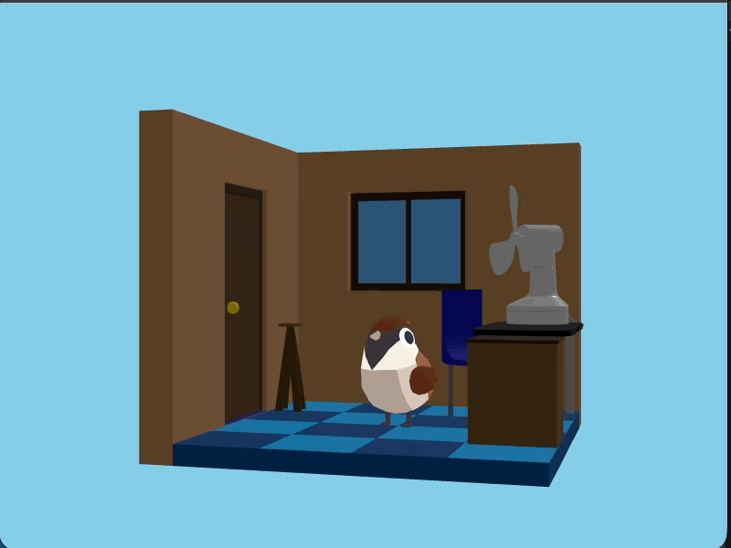
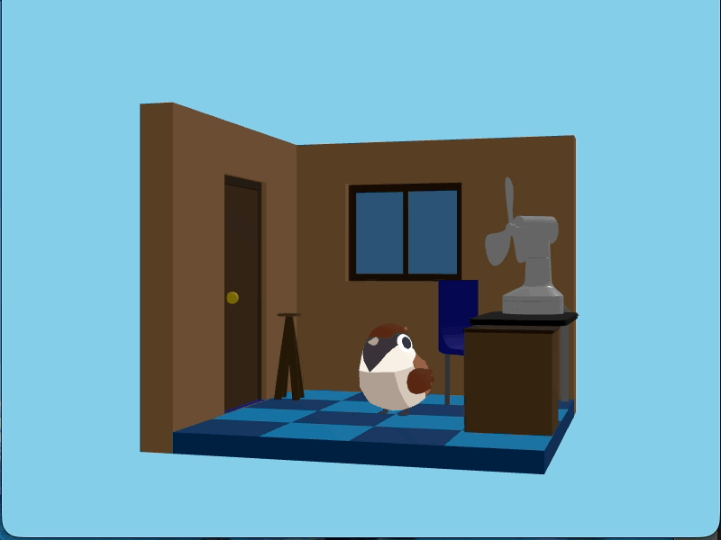
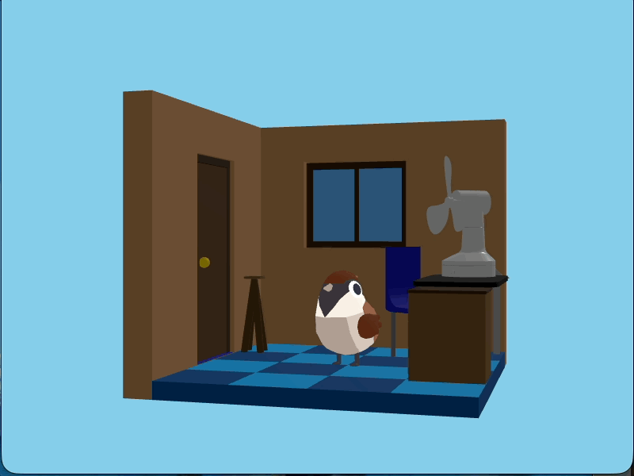
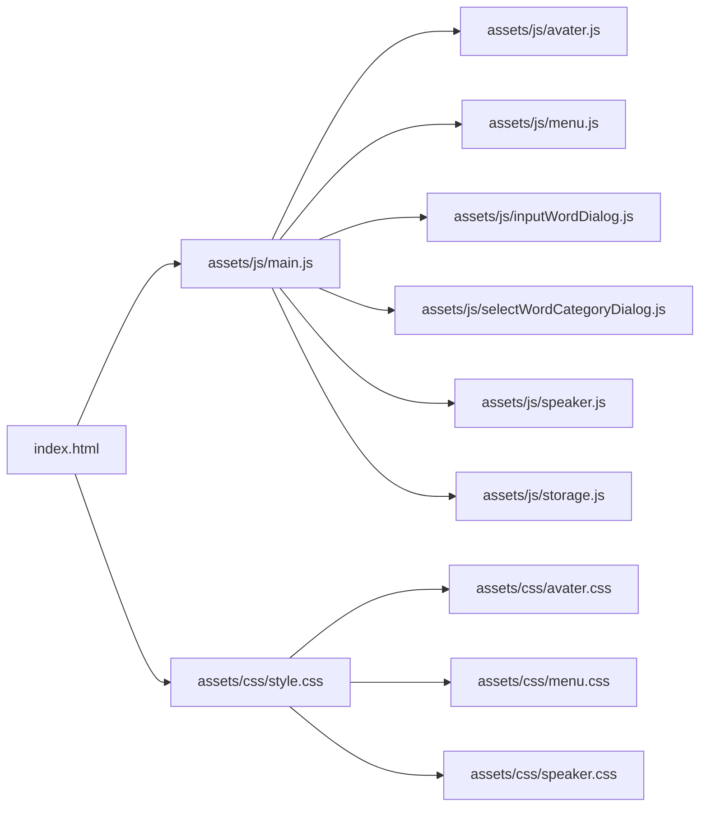

# 2. ロジック実装

この節では、前節で作成したUIに動作を追加していきます。JavaScriptで各UI要素を制御し、完全に動作するアプリケーションを完成させます。

# 現在の確認

`app` ディレクトリの構成は以下のようになっているはずです。

```
./app
├── assets
│   ├── css
│   │   ├── avater.css
│   │   ├── menu.css
│   │   ├── speaker.css
│   │   └── style.css
│   ├── glb
│   │   ├── animals.glb
│   │   ├── fan.glb
│   │   └── room.glb
│   └── js
│       ├── avater.js
│       ├── aveterView
│       │   ├── config.js
│       │   ├── index.js
│       │   └── objects
│       │       ├── Animals.js
│       │       ├── Fan.js
│       │       ├── Room.js
│       │       └── factory.js
│       ├── inputWordDialog.js
│       ├── main.js
│       ├── menu.js
│       ├── selectWordCategoryDialog.js
│       └── speaker.js
└── index.html
```

# 単語を保持する

入力された単語をプログラム上で保持するようにしましょう。

## `main.js`

次のコードを `main.js` に追加してください。

保存される単語は次のような構造のデータにします。
```json
{
  content: '単語の内容',
  category: '単語のカテゴリ'
}
```

具体的には
```json
{
  content: 'りんご',
  category: '食べ物'
}
```

上で示したようなオブジェクトを配列に追加していきます。
トップレベルで単語を保持する配列を宣言します。
```js
const words = []

```

単語を教えている処理の中で `words` 配列に単語オブジェクトを追加します。
デバッグのためにコンソールに `words` 配列の内容を出力します。
```js
words.push({ content, category: wordCategory })
console.log({ words })
```

最終的な `main.js` のコードは以下のようになります。

```js
import * as avater from './avater.js'
import * as menu from './menu.js'
import * as inputWordDialog from './inputWordDialog.js'
import * as selectWordCategoryDialog from './selectWordCategoryDialog.js'
import * as speaker from './speaker.js'

const words = []

avater.view.addEventListener('animal-click', () => {
  menu.open()
})

menu.talkButton.addEventListener('click', () => {
  console.log('動物と話す')
  menu.close()
})

menu.teachButton.addEventListener('click', async () => {
  console.log('動物に教える')
  menu.close()

  const content = await inputWordDialog.open()
  if (!content) {
    await speaker.start('言葉の入力がキャンセルされました')
    return
  }
  await speaker.start(`「${content}」を教えました`)

  const wordCategory = await selectWordCategoryDialog.open([
    'あいさつ',
    '食べ物',
    '必殺技',
    '場所'
  ])

  await speaker.start(`「${wordCategory}」の分野を選びました`)

  words.push({ content, category: wordCategory })
  console.log({ words })
})

```

- `const words = []` を書いている位置に注意してください。
- 単語を教える処理の中で `words.push(...)` を追加しています。

## 動作確認

ブラウザでアプリケーションを起動し、動物に単語を教えてみてください。
コンソールに `words` 配列の内容が表示されるはずです。

# 話す機能

覚えた単語を使って話す機能を実装します。

## `main.js`

ランダムに単語を取り出すコードを `menu.talkButton` のクリックイベント内に追加します。
```js
const word = words[Math.floor(Math.random() * words.length)]
```

`Math.random()` は 0 から 1 未満のランダムな小数を返します。

`Math.random()` に `words.length` を掛けることで、0 から `words.length` 未満のランダムな小数が得られます。
さらに、 `Math.floor()` を使うことで、小数点以下を切り捨てた整数が得られます。

取り出した単語を使って話すコードを追加します。
```js
speaker.start(`${word.content}は${word.category}の言葉です！`)

```

`\` で囲まれた文字列はテンプレートリテラルと呼ばれ、 `${}` の中に変数や式を埋め込むことができます。

```js
const age = 100
const message = `私は${age}歳です`
console.log(message) // 私は100歳です
```

最終的な `main.js` のコードは以下のようになります。

```js
import * as avater from './avater.js'
import * as menu from './menu.js'
import * as inputWordDialog from './inputWordDialog.js'
import * as selectWordCategoryDialog from './selectWordCategoryDialog.js'
import * as speaker from './speaker.js'

const words = []

avater.view.addEventListener('animal-click', () => {
  menu.open()
})

menu.talkButton.addEventListener('click', () => {
  console.log('動物と話す')
  menu.close()

  const word = words[Math.floor(Math.random() * words.length)]
  speaker.start(`${word.content}は${word.category}の言葉です！`)
})

menu.teachButton.addEventListener('click', async () => {
  console.log('動物に教える')
  menu.close()

  const content = await inputWordDialog.open()
  if (!content) {
    await speaker.start('言葉の入力がキャンセルされました')
  }
  await speaker.start(`「${content}」を教えました`)

  const wordCategory = await selectWordCategoryDialog.open([
    'あいさつ',
    '食べ物',
    '必殺技',
    '場所'
  ])

  await speaker.start(`「${wordCategory}」の分野を選びました`)

  words.push({ content, category: wordCategory })
  console.log({ words })
})

```

## 動作確認

単語を教えてから動物と話してみてください。 教えた単語が使われているはずです。



単語を教えた後にブラウザを再読込してください。教えた単語は消えてしまいます。
そのため話す処理はエラーになります。

```
Uncaught TypeError: Cannot read properties of undefined (reading 'content')
    at HTMLButtonElement.<anonymous> (main.js:18:25)
```


# 話すテンプレート

話すときに使うテンプレートを複数用意して、ランダムに選ぶようにしましょう。

## `main.js` の整理

### 単語の分類の整理

ロジックの構成に集中しやすくするために単語の分類を配列に入れます

```js
const categories = ['あいさつ', '食べ物', '必殺技', '場所']
```

さらにこのカテゴリを使う処理を修正します。

```js
const wordCategory = await selectWordCategoryDialog.open(categories)
```

### テンプレートのデータの用意

テンプレートを配列で用意します。
```js
const templates = [
  'おはようからおやすみまで「{言葉}」でお送りしています',
  '第一声が「{言葉}」？それもう様式美でしょ',
  '今日も元気に「{言葉}」していこうな',
  'とりあえず「{言葉}」って言っとけば場は持つ',
  '{言葉}味、想像したら負けなやつ',
  '公式がやりそうでやらない「{言葉}」味',
  '見た目はアレだけど味は普通の「{言葉}」',
  'SNSで炎上しそうな「{言葉}」フード',
  '必殺技「{言葉}」発動！（なお効果は未確認）',
  '相手は「{言葉}」を理解できなかった',
  '伝説の技「{言葉}」※再現性なし',
  '強そうに見えるだけの必殺技「{言葉}」',
  'だいたいみんな一度は通る「{言葉}」',
  '地図に載ってないけど有名な「{言葉}」',
  '行くとだいたい迷う「{言葉}」',
  'なぜか語られがちな場所「{言葉}」'
]
```

### テンプレートの取得

```js
const template = templates[Math.floor(Math.random() * templates.length)]
```

### テンプレートからの文章生成

```js
const word = words[Math.floor(Math.random() * words.length)]
const template = templates[Math.floor(Math.random() * templates.length)]
const message = template.replace('{言葉}', word.content)
```

replace メソッドは文字列の一部を置換します。

```js
const str = '私は{age}歳です'
const result = str.replace('{age}', 100)
console.log(result) // 私は100歳です
```
のように文字列から特定の部分を置換できます。

### `main.js`

最終的な `main.js` のコードは以下のようになります。

```js
import * as avater from './avater.js'
import * as menu from './menu.js'
import * as inputWordDialog from './inputWordDialog.js'
import * as selectWordCategoryDialog from './selectWordCategoryDialog.js'
import * as speaker from './speaker.js'

const words = []

const categories = ['あいさつ', '食べ物', '必殺技', '場所']

const templates = [
  'おはようからおやすみまで「{言葉}」でお送りしています',
  '第一声が「{言葉}」？それもう様式美でしょ',
  '今日も元気に「{言葉}」していこうな',
  'とりあえず「{言葉}」って言っとけば場は持つ',
  '{言葉}味、想像したら負けなやつ',
  '公式がやりそうでやらない「{言葉}」味',
  '見た目はアレだけど味は普通の「{言葉}」',
  'SNSで炎上しそうな「{言葉}」フード',
  '必殺技「{言葉}」発動！（なお効果は未確認）',
  '相手は「{言葉}」を理解できなかった',
  '伝説の技「{言葉}」※再現性なし',
  '強そうに見えるだけの必殺技「{言葉}」',
  'だいたいみんな一度は通る「{言葉}」',
  '地図に載ってないけど有名な「{言葉}」',
  '行くとだいたい迷う「{言葉}」',
  'なぜか語られがちな場所「{言葉}」'
]

avater.view.addEventListener('animal-click', () => {
  menu.open()
})

menu.talkButton.addEventListener('click', () => {
  console.log('動物と話す')
  menu.close()

  const word = words[Math.floor(Math.random() * words.length)]
  const template = templates[Math.floor(Math.random() * templates.length)]
  const message = template.replace('{言葉}', word.content)

  speaker.start(message)
})

menu.teachButton.addEventListener('click', async () => {
  console.log('動物に教える')
  menu.close()

  const content = await inputWordDialog.open()
  if (!content) {
    await speaker.start('言葉の入力がキャンセルされました')
  }
  await speaker.start(`「${content}」を教えました`)

  const wordCategory = await selectWordCategoryDialog.open(categories)

  await speaker.start(`「${wordCategory}」の分野を選びました`)

  words.push({ content, category: wordCategory })
  console.log({ words })
})

```

## 動作確認

ブラウザでアプリケーションを起動し、動物に単語を教えてから話してみてください。 ランダムにテンプレートが選ばれて話されるはずです。



# 分類ごとにテンプレートを指定する

単語とテンプレートがランダムに選ばれるため開発者の意図しない組み合わせになることがあります。
そこでテンプレートに単語の分類ごとに指定できるようにしましょう。

## `main.js`

テンプレートを単に文字列を保つのではなく、単語分類も含めたものにします。
```json
{
  content: 'テンプレートの内容',
  category: 'テンプレートが対応する単語の分類'
}
```

具体的には
```json
{
  content: 'おはようからおやすみまで「{言葉}」でお送りしています',
  category: 'あいさつ'
}
```

テンプレートのデータを修正します。
```js
const templates = [
  { content: 'おはようからおやすみまで「{言葉}」でお送りしています', category: 'あいさつ' },
  { content: '第一声が「{言葉}」？それもう様式美でしょ', category: 'あいさつ' },
  { content: '今日も元気に「{言葉}」していこうな', category: 'あいさつ' },
  { content: 'とりあえず「{言葉}」って言っとけば場は持つ', category: 'あいさつ' },
  { content: '{言葉}味、想像したら負けなやつ', category: '食べ物' },
  { content: '公式がやりそうでやらない「{言葉}」味', category: '食べ物' },
  { content: '見た目はアレだけど味は普通の「{言葉}」', category: '食べ物' },
  { content: 'SNSで炎上しそうな「{言葉}」フード', category: '食べ物' },
  { content: '必殺技「{言葉}」発動！（なお効果は未確認）', category: '必殺技' },
  { content: '相手は「{言葉}」を理解できなかった', category: '必殺技' },
  { content: '伝説の技「{言葉}」※再現性なし', category: '必殺技' },
  { content: '強そうに見えるだけの必殺技「{言葉}」', category: '必殺技' },
  { content: 'だいたいみんな一度は通る「{言葉}」', category: '場所' },
  { content: '地図に載ってないけど有名な「{言葉}」', category: '場所' },
  { content: '行くとだいたい迷う「{言葉}」', category: '場所' },
  { content: 'なぜか語られがちな場所「{言葉}」', category: '場所' },
]
```

次にテンプレートを取り出す処理を修正します。
```js
const categoryTemplates = templates.filter(template => template.category == word.category)
```

filter メソッドは配列の中から条件に合う要素だけを抽出して新しい配列を作成します。

2で渡っときのあまりが0の場合の週次だけを取り出したい場合は次のようにします。
```js
const numbers = [1, 2, 3, 4, 5]
const evenNumbers = numbers.filter(num => num % 2 == 0)
console.log(evenNumbers) // [2, 4]
```

`for` で書いた次のコードと同じ意味になります。
```js
const numbers = [1, 2, 3, 4, 5]
const evenNumbers = []
for (let i = 0; i < numbers.length; i++) {
  const num = numbers[i]
  if (num % 2 == 0) {
    evenNumbers.push(num)
  }
}
console.log(evenNumbers) // [2, 4]
```

データがオブジェクトの場合も同様です。
```js
const people = [
  { name: '太郎', age: 18 },
  { name: '次郎', age: 20 },
  { name: '花子', age: 16 },
]
const adults = people.filter(person => person.age >= 18)
console.log(adults) // [ { name: '太郎', age: 18 }, { name: '次郎', age: 20 } ]
```

`for`で書いた次のコードと同じ意味になります。
```js
const people = [
  { name: '太郎', age: 18 },
  { name: '次郎', age: 20 },
  { name: '花子', age: 16 },
]
const adults = []
for (let i = 0; i < people.length; i++) {
  const person = people[i]
  if (person.age >= 18) {
    adults.push(person)
  }
}
console.log(adults) // [ { name: '太郎', age: 18 }, { name: '次郎', age: 20 } ]
```

テンプレートから文章を生成するコードを修正します。
`template` は文字列ではなくオブジェクトになっているため、 `template.content` を使うようにします。
```js
const message = template.content.replace('{言葉}', word.content)
```

最終的な `main.js` のコードは以下のようになります。

```js
import * as avater from './avater.js'
import * as menu from './menu.js'
import * as inputWordDialog from './inputWordDialog.js'
import * as selectWordCategoryDialog from './selectWordCategoryDialog.js'
import * as speaker from './speaker.js'

const words = []

const categories = ['あいさつ', '食べ物', '必殺技', '場所']

const templates = [
  { content: 'おはようからおやすみまで「{言葉}」でお送りしています', category: 'あいさつ' },
  { content: '第一声が「{言葉}」？それもう様式美でしょ', category: 'あいさつ' },
  { content: '今日も元気に「{言葉}」していこうな', category: 'あいさつ' },
  { content: 'とりあえず「{言葉}」って言っとけば場は持つ', category: 'あいさつ' },
  { content: '{言葉}味、想像したら負けなやつ', category: '食べ物' },
  { content: '公式がやりそうでやらない「{言葉}」味', category: '食べ物' },
  { content: '見た目はアレだけど味は普通の「{言葉}」', category: '食べ物' },
  { content: 'SNSで炎上しそうな「{言葉}」フード', category: '食べ物' },
  { content: '必殺技「{言葉}」発動！（なお効果は未確認）', category: '必殺技' },
  { content: '相手は「{言葉}」を理解できなかった', category: '必殺技' },
  { content: '伝説の技「{言葉}」※再現性なし', category: '必殺技' },
  { content: '強そうに見えるだけの必殺技「{言葉}」', category: '必殺技' },
  { content: 'だいたいみんな一度は通る「{言葉}」', category: '場所' },
  { content: '地図に載ってないけど有名な「{言葉}」', category: '場所' },
  { content: '行くとだいたい迷う「{言葉}」', category: '場所' },
  { content: 'なぜか語られがちな場所「{言葉}」', category: '場所' },
]

avater.view.addEventListener('animal-click', () => {
  menu.open()
})

menu.talkButton.addEventListener('click', () => {
  console.log('動物と話す')
  menu.close()

  const word = words[Math.floor(Math.random() * words.length)]
  const categoryTemplates = templates.filter(template => template.category == word.category)
  const template = categoryTemplates[Math.floor(Math.random() * categoryTemplates.length)]
  const message = template.content.replace('{言葉}', word.content)

  speaker.start(message)
})

menu.teachButton.addEventListener('click', async () => {
  console.log('動物に教える')
  menu.close()

  const content = await inputWordDialog.open()
  if (!content) {
    await speaker.start('言葉の入力がキャンセルされました')
  }
  await speaker.start(`「${content}」を教えました`)

  const wordCategory = await selectWordCategoryDialog.open(categories)

  await speaker.start(`「${wordCategory}」の分野を選びました`)

  words.push({ content, category: wordCategory })
  console.log({ words })
})

```

## 動作確認

ブラウザでアプリケーションを起動し、動物に単語を教えてから話してみてください。 教えた単語の分類に応じたテンプレートが選ばれて話されるはずです。



# テンプレートに動きをつける

動物が話すときにアニメーションを追加して、より魅力的にしましょう。

## `main.js`

`template` のオブジェクトに `action` プロパティを追加します。
```json
{
  content: 'テンプレートの内容',
  category: "テンプレートが対応する単語の分類",
  motion: "話すときのアニメーションの種類"
}
```

具体的には
```json
{
  content: 'とりあえず「{言葉}」って言っとけば場は持つ',
  category: "あいさつ",
  motion: "confused"
}
```

テンプレートのデータを修正します。
```js
const templates = [
  { content: 'おはようからおやすみまで「{言葉}」でお送りしています', category: 'あいさつ', motion: 'idle' },
  { content: '第一声が「{言葉}」？それもう様式美でしょ', category: 'あいさつ', motion: 'shifty' },
  { content: '今日も元気に「{言葉}」していこうな', category: 'あいさつ', motion: 'idle' },
  { content: 'とりあえず「{言葉}」って言っとけば場は持つ', category: 'あいさつ', motion: 'confused' },
  { content: '{言葉}味、想像したら負けなやつ', category: '食べ物', motion: 'confused' },
  { content: '公式がやりそうでやらない「{言葉}」味', category: '食べ物', motion: 'shifty' },
  { content: '見た目はアレだけど味は普通の「{言葉}」', category: '食べ物', motion: 'idle' },
  { content: 'SNSで炎上しそうな「{言葉}」フード', category: '食べ物', motion: 'damaged' },
  { content: '必殺技「{言葉}」発動！（なお効果は未確認）', category: '必殺技', motion: 'attack' },
  { content: '相手は「{言葉}」を理解できなかった', category: '必殺技', motion: 'confused' },
  { content: '伝説の技「{言葉}」※再現性なし', category: '必殺技', motion: 'rolling' },
  { content: '強そうに見えるだけの必殺技「{言葉}」', category: '必殺技', motion: 'shifty' },
  { content: 'だいたいみんな一度は通る「{言葉}」', category: '場所', motion: 'idle' },
  { content: '地図に載ってないけど有名な「{言葉}」', category: '場所', motion: 'shifty' },
  { content: '行くとだいたい迷う「{言葉}」', category: '場所', motion: 'confused' },
  { content: 'なぜか語られがちな場所「{言葉}」', category: '場所', motion: 'rolling' },
]

```

セリフを言う前にアニメーションを再生するコードを追加します。
```js
avater.view.changeAnimalMotion(template.motion)
await speaker.start(message)
avater.view.changeAnimalMotion('idle')
```

最終的な `main.js` のコードは以下のようになります。

```js
import * as avater from './avater.js'
import * as menu from './menu.js'
import * as inputWordDialog from './inputWordDialog.js'
import * as selectWordCategoryDialog from './selectWordCategoryDialog.js'
import * as speaker from './speaker.js'

const words = []

const categories = ['あいさつ', '食べ物', '必殺技', '場所']

const templates = [
  { content: 'おはようからおやすみまで「{言葉}」でお送りしています', category: 'あいさつ', motion: 'idle' },
  { content: '第一声が「{言葉}」？それもう様式美でしょ', category: 'あいさつ', motion: 'shifty' },
  { content: '今日も元気に「{言葉}」していこうな', category: 'あいさつ', motion: 'idle' },
  { content: 'とりあえず「{言葉}」って言っとけば場は持つ', category: 'あいさつ', motion: 'confused' },
  { content: '{言葉}味、想像したら負けなやつ', category: '食べ物', motion: 'confused' },
  { content: '公式がやりそうでやらない「{言葉}」味', category: '食べ物', motion: 'shifty' },
  { content: '見た目はアレだけど味は普通の「{言葉}」', category: '食べ物', motion: 'idle' },
  { content: 'SNSで炎上しそうな「{言葉}」フード', category: '食べ物', motion: 'damaged' },
  { content: '必殺技「{言葉}」発動！（なお効果は未確認）', category: '必殺技', motion: 'attack' },
  { content: '相手は「{言葉}」を理解できなかった', category: '必殺技', motion: 'confused' },
  { content: '伝説の技「{言葉}」※再現性なし', category: '必殺技', motion: 'rolling' },
  { content: '強そうに見えるだけの必殺技「{言葉}」', category: '必殺技', motion: 'shifty' },
  { content: 'だいたいみんな一度は通る「{言葉}」', category: '場所', motion: 'idle' },
  { content: '地図に載ってないけど有名な「{言葉}」', category: '場所', motion: 'shifty' },
  { content: '行くとだいたい迷う「{言葉}」', category: '場所', motion: 'confused' },
  { content: 'なぜか語られがちな場所「{言葉}」', category: '場所', motion: 'rolling' },
]

avater.view.addEventListener('animal-click', () => {
  menu.open()
})

menu.talkButton.addEventListener('click', async () => {
  console.log('動物と話す')
  menu.close()

  const word = words[Math.floor(Math.random() * words.length)]
  const categoryTemplates = templates.filter(template => template.category == word.category)
  const template = categoryTemplates[Math.floor(Math.random() * categoryTemplates.length)]
  const message = template.content.replace('{言葉}', word.content)

  avater.view.changeAnimalMotion(template.motion)
  await speaker.start(message)
  avater.view.changeAnimalMotion('idle')
})

menu.teachButton.addEventListener('click', async () => {
  console.log('動物に教える')
  menu.close()

  const content = await inputWordDialog.open()
  if (!content) {
    await speaker.start('言葉の入力がキャンセルされました')
  }
  await speaker.start(`「${content}」を教えました`)

  const wordCategory = await selectWordCategoryDialog.open(categories)

  await speaker.start(`「${wordCategory}」の分野を選びました`)

  words.push({ content, category: wordCategory })
  console.log({ words })
})

```

## 動作確認

テンプレートからのセリフを話すときに動物がアニメーションするようになったことを確認してください。


# 単語の永続化

覚えた単語をブラウザに保存して、ブラウザを再読込しても消えないようにしましょう。

LocalStorage API を使ってブラウザにデータを保存します。

## 目標



## `storage.js` の作成

### LocalStorage API

LocalStorage はブラウザ上にデータを保存するための仕組みです。

LocalStorage にデータを保存するには `localStorage.setItem(key, value)` メソッドを使います。
`key` はデータの名前、 `value` は保存するデータの値です。

LocalStorage は文字列しか保存できないため、オブジェクトや配列を保存する場合は JSON 形式に変換する必要があります。
JSONは構造を持ったデータを文字列に変換することができるフォーマットです。

`JSON.stringify(value)` メソッドを使うとオブジェクトや配列を JSON 形式の文字列に変換できます。

```js
export function putWords (words) {
  const json = JSON.stringify(words)
  localStorage.setItem('words', json)
}
```

LocalStorage からデータを取得するには `localStorage.getItem(key)` メソッドを使います。
`key` は取得したいデータの名前です。

`JSON.parse(json)` メソッドを使うと JSON 形式の文字列をオブジェクトや配列に変換できます。

```js
export function getWords () {
  const json = localStorage.getItem('words')
  if (!json) {
    return []
  }
  return JSON.parse(json)
}
```

### 最終的な `storage.js` のコード

```js
export function getWords () {
  const json = localStorage.getItem('words')
  if (!json) {
    return []
  }
  return JSON.parse(json)
}

export function putWords (words) {
  const json = JSON.stringify(words)
  localStorage.setItem('words', json)
}

export function getWordCategories () {
  return [
    'あいさつ',
    '食べ物',
    '必殺技',
    '場所'
  ]
}

export function getTemplates () {
  return [
    { content: 'おはようからおやすみまで「{言葉}」でお送りしています', category: 'あいさつ', motion: 'idle' },
    { content: '第一声が「{言葉}」？それもう様式美でしょ', category: 'あいさつ', motion: 'shifty' },
    { content: '今日も元気に「{言葉}」していこうな', category: 'あいさつ', motion: 'idle' },
    { content: 'とりあえず「{言葉}」って言っとけば場は持つ', category: 'あいさつ', motion: 'confused' },
    { content: '{言葉}味、想像したら負けなやつ', category: '食べ物', motion: 'confused' },
    { content: '公式がやりそうでやらない「{言葉}」味', category: '食べ物', motion: 'shifty' },
    { content: '見た目はアレだけど味は普通の「{言葉}」', category: '食べ物', motion: 'idle' },
    { content: 'SNSで炎上しそうな「{言葉}」フード', category: '食べ物', motion: 'damaged' },
    { content: '必殺技「{言葉}」発動！（なお効果は未確認）', category: '必殺技', motion: 'attack' },
    { content: '相手は「{言葉}」を理解できなかった', category: '必殺技', motion: 'confused' },
    { content: '伝説の技「{言葉}」※再現性なし', category: '必殺技', motion: 'rolling' },
    { content: '強そうに見えるだけの必殺技「{言葉}」', category: '必殺技', motion: 'shifty' },
    { content: 'だいたいみんな一度は通る「{言葉}」', category: '場所', motion: 'idle' },
    { content: '地図に載ってないけど有名な「{言葉}」', category: '場所', motion: 'shifty' },
    { content: '行くとだいたい迷う「{言葉}」', category: '場所', motion: 'confused' },
    { content: 'なぜか語られがちな場所「{言葉}」', category: '場所', motion: 'rolling' },
  ]
}
```

## `main.js`

作成した `storage.js` をインポートして、単語の保存と取得に使います。

```js
import * as storage from './storage.js'

const words = storage.getWords()
const categories = storage.getWordCategories()
const templates = storage.getTemplates()
```

words が更新されるたびに保存するようにします。
```js
words.push({ content, category: wordCategory })

storage.putWords(words)
```

最終的な `main.js` のコードは以下のようになります。

```js
import * as avater from './avater.js'
import * as menu from './menu.js'
import * as inputWordDialog from './inputWordDialog.js'
import * as selectWordCategoryDialog from './selectWordCategoryDialog.js'
import * as speaker from './speaker.js'
import * as storage from './storage.js'

const words = storage.getWords()
const categories = storage.getWordCategories()
const templates = storage.getTemplates()

avater.view.addEventListener('animal-click', () => {
  menu.open()
})

menu.talkButton.addEventListener('click', async () => {
  console.log('動物と話す')
  menu.close()

  const word = words[Math.floor(Math.random() * words.length)]
  const categoryTemplates = templates.filter(template => template.category == word.category)
  const template = categoryTemplates[Math.floor(Math.random() * categoryTemplates.length)]
  const message = template.content.replace('{言葉}', word.content)

  avater.view.changeAnimalMotion(template.motion)
  await speaker.start(message)
  avater.view.changeAnimalMotion('idle')
})

menu.teachButton.addEventListener('click', async () => {
  console.log('動物に教える')
  menu.close()

  const content = await inputWordDialog.open()
  if (!content) {
    await speaker.start('言葉の入力がキャンセルされました')
  }
  await speaker.start(`「${content}」を教えました`)

  const wordCategory = await selectWordCategoryDialog.open(categories)

  await speaker.start(`「${wordCategory}」の分野を選びました`)

  words.push({ content, category: wordCategory })

  storage.putWords(words)

  console.log({ words })
})

```

## 動作確認

単語を教えてから画面を再読み込みして、再度動物と話してみてください。 教えた単語が消えずに使われているはずです。


---

# まとめ

覚えた単語を使って話してくれるようになりました。また、ブラウザを再読込しても覚えた単語が消えないようになりました。
これでブラウザで動物と話すアプリケーションの完成です。

# 次の項

[GitHub に公開する](./3-github.md)
