# Vercelデプロイ

この節では、作成したアプリケーションをVercelにデプロイ（公開）します。Vercelは静的サイトやWebアプリケーションを簡単にホスティングできるサービスです。

# Vercel

Vercel はWebアプリケーションのデプロイとホスティングを簡単に行えるプラットフォームです。

GitHub、GitLab、Bitbucketなどのリポジトリと連携し、コードの変更を自動的にデプロイできます。

# Vercelアカウントの作成

https://vercel.com/signup にアクセスし、アカウントを作成します。GitHubアカウントを使用してサインアップすることもできます。

I'm working on personal projects を選択します。

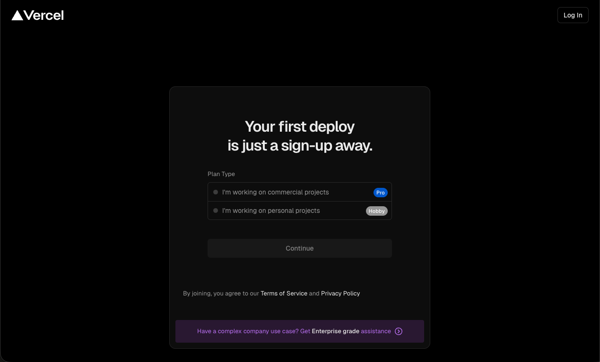

名前を入力します

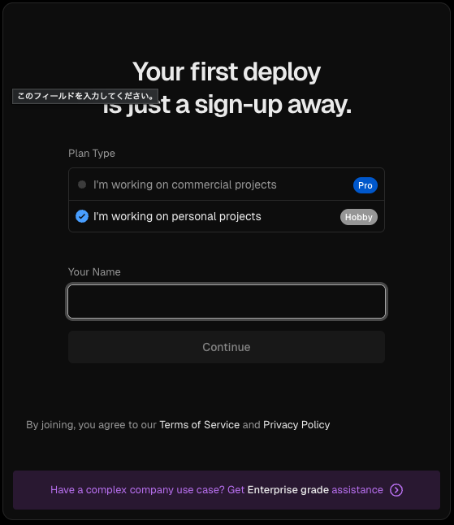

GitHubアカウントでサインアップするとデプロイが簡単になります。

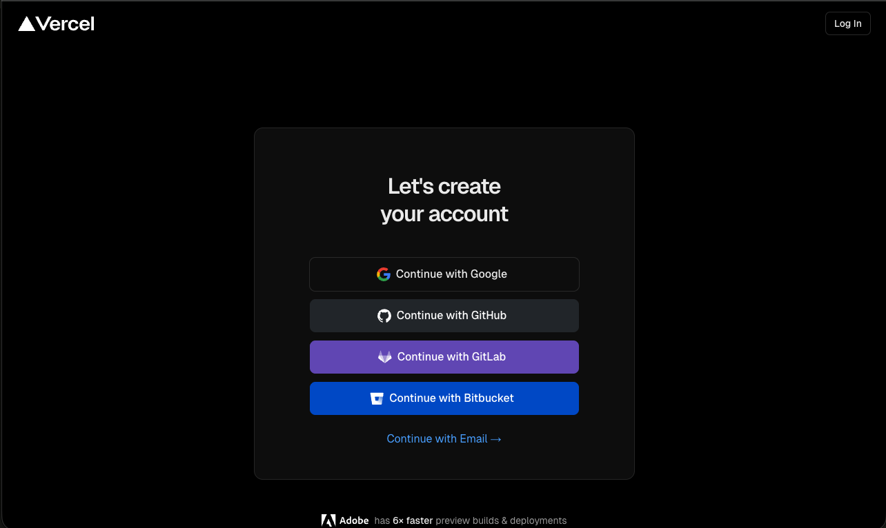

GitHubの認証情報を入力します。

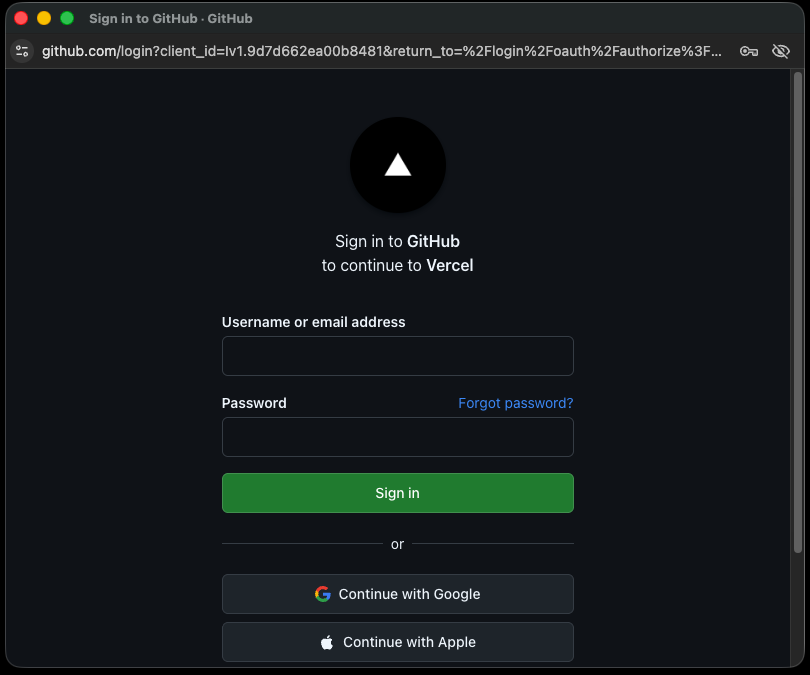

# ダッシュボード

サインアップが成功すると、Vercelのダッシュボードにアクセスできます。

https://vercel.com/dashboard

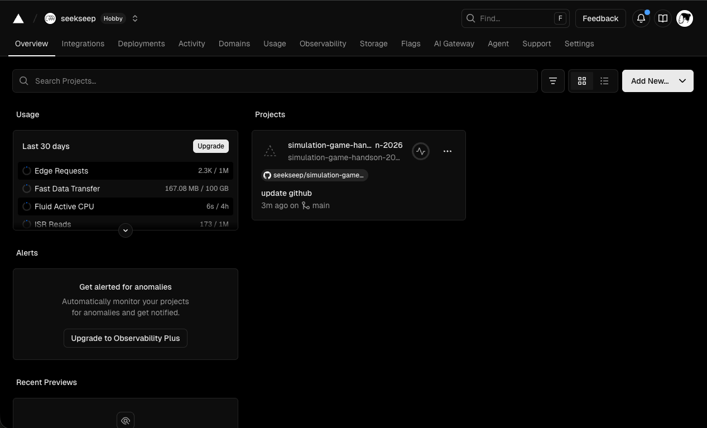

# プロジェクトの作成

ダッシュボードの Add New... ボタンをクリックし、 Project を選択します。

先程作成したGitHubリポジトリを選択します。

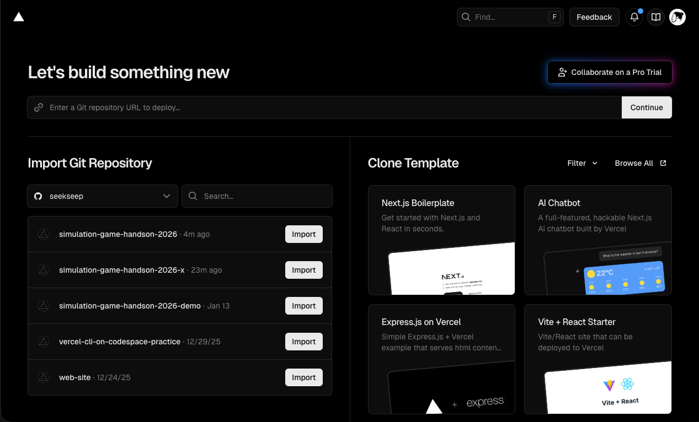

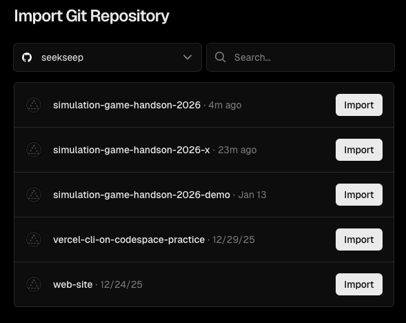

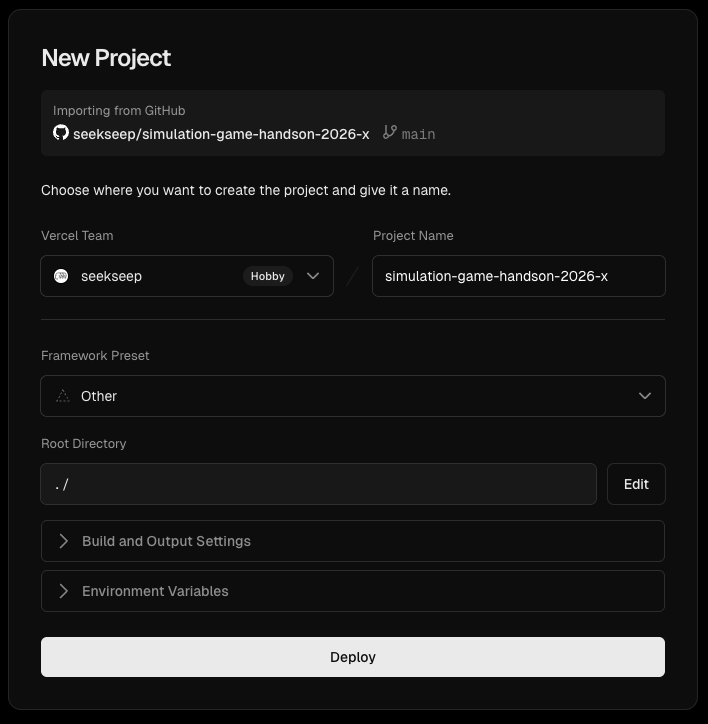

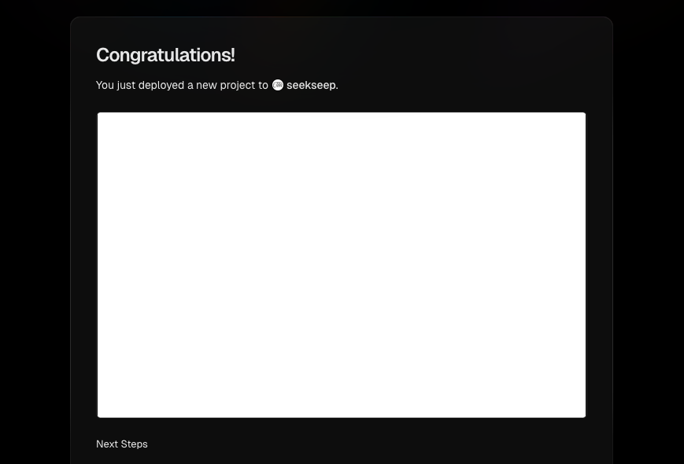
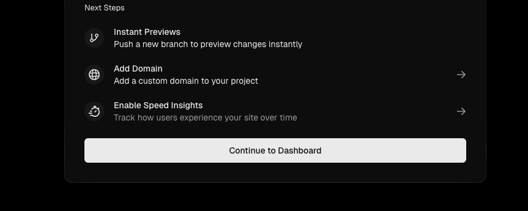

# 作成されたプロジェクト

作成されたプロジェクトの内容が閲覧できます。

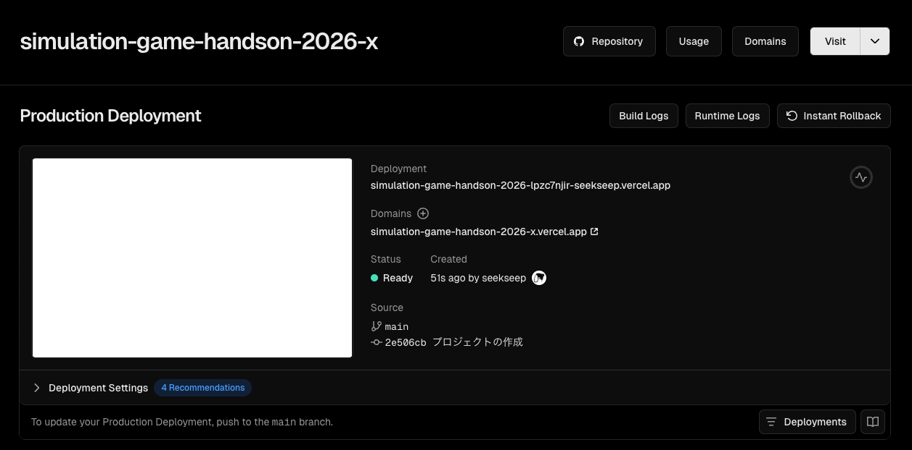

画面上に表示されるDomainsにあるURLをクリックすると、公開されたアプリケーションにアクセスできます。

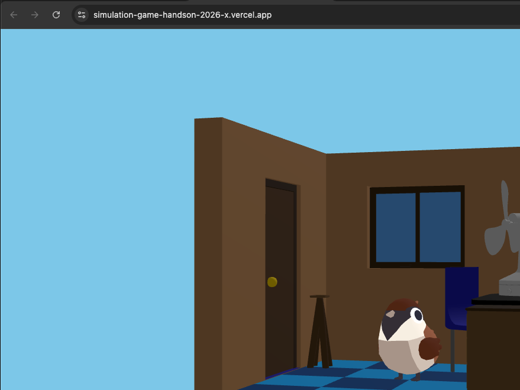

---

# まとめ

Vercelを使用すると、数回のクリックでアプリケーションをデプロイできます。GitHubと連携することで、コードの変更が自動的に反映されるため、開発が非常にスムーズになります。ぜひ活用してみてください。

---

# 次の項

第2章が終わったら、[第3章: API構築](../../3-api/README.md) に進みましょう。
