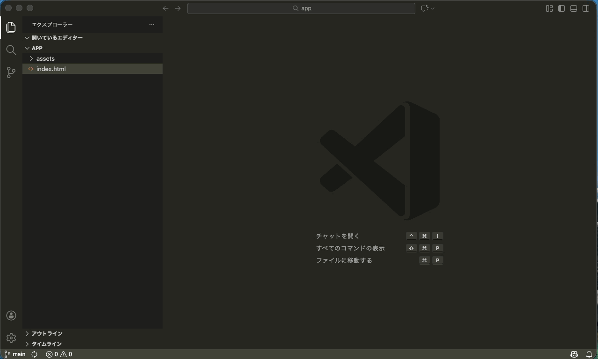
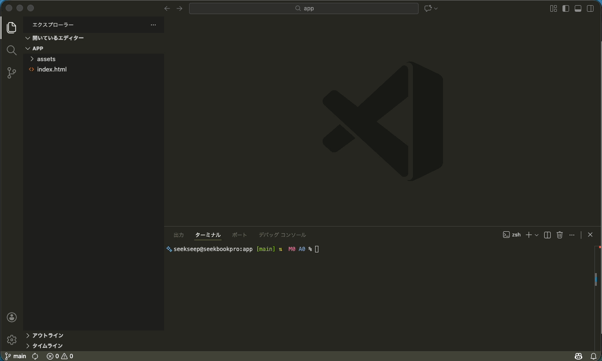
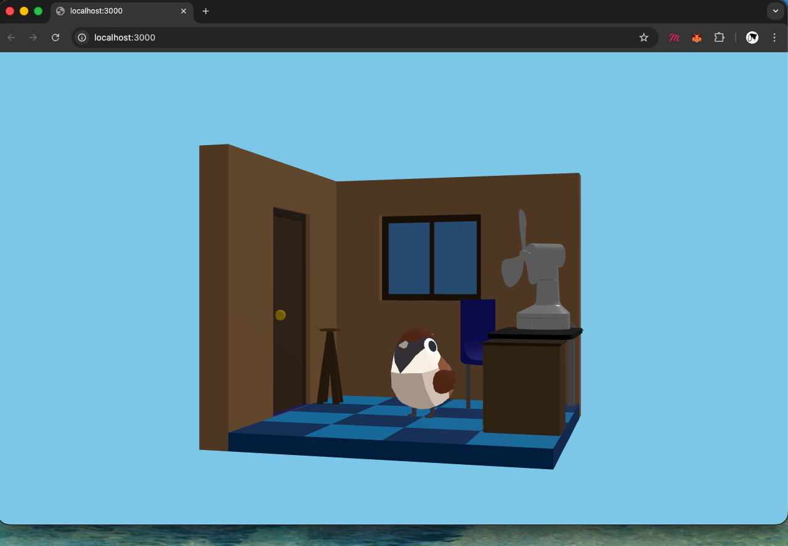
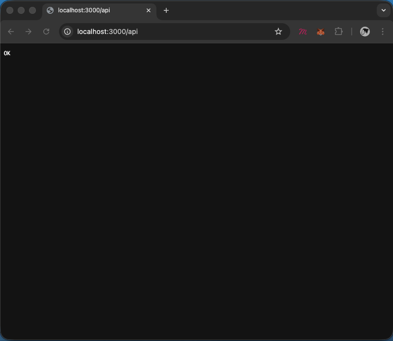
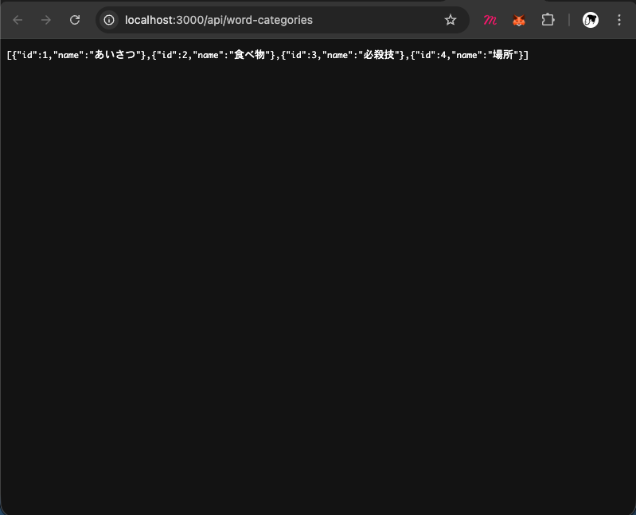
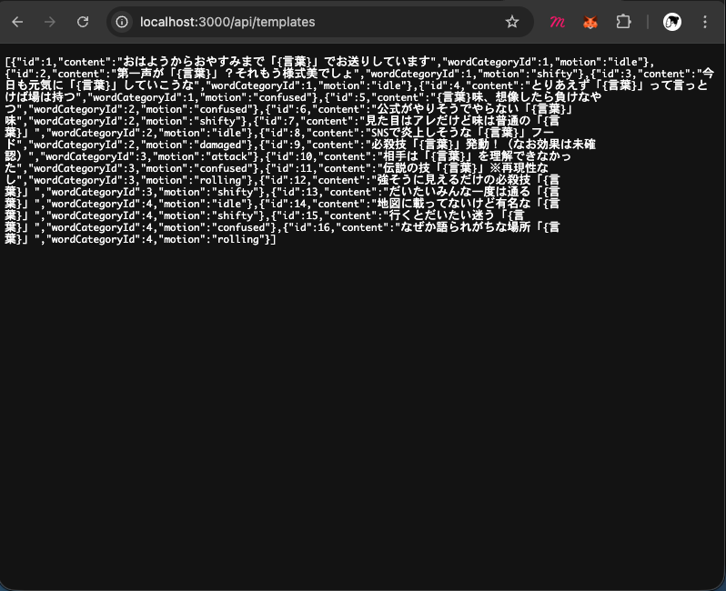
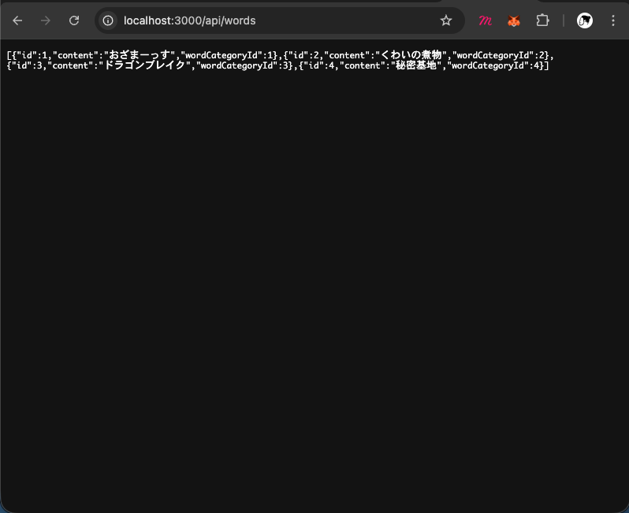
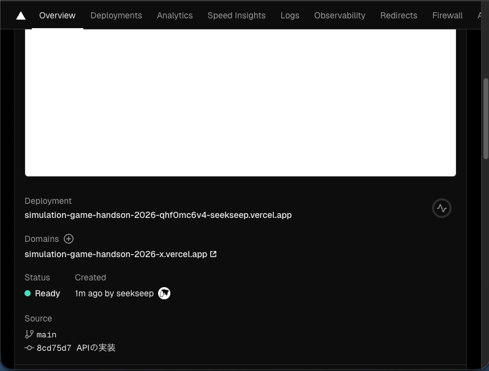

# APIの実装

この節ではAPIの実装方法について説明します。

# `app` ディレクトリ

VSCode でプロジェクトを開き、`app` ディレクトリを確認してください。

VSCode　のエクスプローラーで `app` ディレクトリを展開すると、以下のような構成になっています。

```
├── assets
│   ├── css
│   │   ├── avater.css
│   │   ├── menu.css
│   │   ├── speaker.css
│   │   └── style.css
│   ├── glb
│   │   ├── animals.glb
│   │   ├── fan.glb
│   │   └── room.glb
│   └── js
│       ├── avater.js
│       ├── aveterView
│       │   ├── config.js
│       │   ├── index.js
│       │   └── objects
│       │       ├── Animals.js
│       │       ├── Fan.js
│       │       ├── Room.js
│       │       └── factory.js
│       ├── inputWordDialog.js
│       ├── main.js
│       ├── menu.js
│       ├── selectWordCategoryDialog.js
│       ├── speaker.js
│       └── storage.js
└── index.html
```

# Vercel Dev の実行

## ターミナルの起動

先程の節でインストールした Vercel CLI を使用して、ローカルで API を動作確認しながら実装を進めていきます。

- Ctrl + Shift + P (Windows/Linux) | Command + Shift + P (macOS) を押してコマンドパレットを開きます。
- "ターミナル: 新しいターミナル" と入力して選択し、新しいターミナルを開きます。

または、次の画像の手順に従ってターミナルを開いてください。



## vercel dev のログイン

ターミナルで以下のコマンドを実行して、Vercel Dev を起動します。

```bash
vercel dev
```

初めて起動する場合ログインが要求されます。コマンドラインの指示に従ってログインを完了してください。



## vercel プロジェクトのセットアップ

ログイン後、あるいはすでにログイン済みの場合は、Vercel プロジェクトのセットアップが始まります。

以下の例に従って質問に回答してください。

```sh
vercel dev
Vercel CLI 50.4.5
? Set up and develop “~/Desktop/handson-2026/app”? yes
? Which scope should contain your project? seekseep
? Link to existing project? yes
? Which existing project do you want to link? simulation-game-handson-2026-x
🔗  Linked to seekseep/simulation-game-handson-2026-x (created .vercel and added it to .gitignore)
? Would you like to pull environment variables now? yes
> Downloading `development` Environment Variables for seekseep/simulation-game-handson-2026-x
✅  Created .env.local file and added it to .gitignore [174ms]
> Ready! Available at http://localhost:3000
```


## ローカルサーバーの起動確認

ブラウザで [http://localhost:3000](http://localhost:3000) にアクセスして、アプリケーションが表示されることを確認してください。



# データ構造の整理

データベースにデータを保存するために、データ構造を整理します。

それぞれのひも付きを名称ではなくIDで管理するように変更します。

## データ構造

### WordCategory

```ts
{
  "id": number,
  "name": string
}
```

具体例
```json
{
  "id": 1,
  "name": "あいさつ"
}
```

### Word

```ts
{
  "id": number,
  "content": string,
  "wordCategoryId": number
}
```

具体例
```json
{
  "id": 1,
  "content": "おはよう",
  "wordCategoryId": 1
}
```

### Template

```ts
{
  "id": number,
  "content": string,
  "wordCategoryId": number,
  "motion": string
}
```

具体例
```json
{
  "id": 1,
  "content": "おはようからおやすみまで「{言葉}」でお送りしています",
  "wordCategoryId": 1,
  "motion": "idle"
}
```

## `storage.js`

データ構造の変更に伴って、`storage.js` の内容を修正します。

### WordCategory

```js
export function getWordCategories () {
  return [
    { id: 1, name: 'あいさつ' },
    { id: 2, name: '食べ物' },
    { id: 3, name: '必殺技' },
    { id: 4, name: '場所' },
  ]
}
```

### Template

Template に `id` を追加します。
`category` は `wordCategoryId` に置き換えます。

```js
export function getTemplates () {
  return [
    { id: 1, content: "おはようからおやすみまで「{言葉}」でお送りしています", wordCategoryId: 1, motion: 'idle' },
    { id: 2, content: "第一声が「{言葉}」？それもう様式美でしょ", wordCategoryId: 1, motion: 'shifty' },
    { id: 3, content: "今日も元気に「{言葉}」していこうな", wordCategoryId: 1, motion: 'idle' },
    { id: 4, content: "とりあえず「{言葉}」って言っとけば場は持つ", wordCategoryId: 1, motion: 'confused' },
    { id: 5, content: "{言葉}味、想像したら負けなやつ", wordCategoryId: 2, motion: 'confused' },
    { id: 6, content: "公式がやりそうでやらない「{言葉}」味", wordCategoryId: 2, motion: 'shifty' },
    { id: 7, content: "見た目はアレだけど味は普通の「{言葉}」", wordCategoryId: 2, motion: 'idle' },
    { id: 8, content: "SNSで炎上しそうな「{言葉}」フード", wordCategoryId: 2, motion: 'damaged' },
    { id: 9, content: "必殺技「{言葉}」発動！（なお効果は未確認）", wordCategoryId: 3, motion: 'attack' },
    { id: 10, content: "相手は「{言葉}」を理解できなかった", wordCategoryId: 3, motion: 'confused' },
    { id: 11, content: "伝説の技「{言葉}」※再現性なし", wordCategoryId: 3, motion: 'rolling' },
    { id: 12, content: "強そうに見えるだけの必殺技「{言葉}」", wordCategoryId: 3, motion: 'shifty' },
    { id: 13, content: "だいたいみんな一度は通る「{言葉}」", wordCategoryId: 4, motion: 'idle' },
    { id: 14, content: "地図に載ってないけど有名な「{言葉}」", wordCategoryId: 4, motion: 'shifty' },
    { id: 15, content: "行くとだいたい迷う「{言葉}」", wordCategoryId: 4, motion: 'confused' },
    { id: 16, content: "なぜか語られがちな場所「{言葉}」", wordCategoryId: 4, motion: 'rolling' },
  ]
}

```

### 最終的な `storage.js`

```js
export function getWords () {
  const json = localStorage.getItem('words')
  if (!json) {
    return []
  }
  return JSON.parse(json)
}

export function putWords (words) {
  const json = JSON.stringify(words)
  localStorage.setItem('words', json)
}

export function getWordCategories () {
  return [
    { id: 1, name: 'あいさつ' },
    { id: 2, name: '食べ物' },
    { id: 3, name: '必殺技' },
    { id: 4, name: '場所' },
  ]
}

export function getTemplates () {
  return [
    { id: 1, content: "おはようからおやすみまで「{言葉}」でお送りしています", wordCategoryId: 1, motion: 'idle' },
    { id: 2, content: "第一声が「{言葉}」？それもう様式美でしょ", wordCategoryId: 1, motion: 'shifty' },
    { id: 3, content: "今日も元気に「{言葉}」していこうな", wordCategoryId: 1, motion: 'idle' },
    { id: 4, content: "とりあえず「{言葉}」って言っとけば場は持つ", wordCategoryId: 1, motion: 'confused' },
    { id: 5, content: "{言葉}味、想像したら負けなやつ", wordCategoryId: 2, motion: 'confused' },
    { id: 6, content: "公式がやりそうでやらない「{言葉}」味", wordCategoryId: 2, motion: 'shifty' },
    { id: 7, content: "見た目はアレだけど味は普通の「{言葉}」", wordCategoryId: 2, motion: 'idle' },
    { id: 8, content: "SNSで炎上しそうな「{言葉}」フード", wordCategoryId: 2, motion: 'damaged' },
    { id: 9, content: "必殺技「{言葉}」発動！（なお効果は未確認）", wordCategoryId: 3, motion: 'attack' },
    { id: 10, content: "相手は「{言葉}」を理解できなかった", wordCategoryId: 3, motion: 'confused' },
    { id: 11, content: "伝説の技「{言葉}」※再現性なし", wordCategoryId: 3, motion: 'rolling' },
    { id: 12, content: "強そうに見えるだけの必殺技「{言葉}」", wordCategoryId: 3, motion: 'shifty' },
    { id: 13, content: "だいたいみんな一度は通る「{言葉}」", wordCategoryId: 4, motion: 'idle' },
    { id: 14, content: "地図に載ってないけど有名な「{言葉}」", wordCategoryId: 4, motion: 'shifty' },
    { id: 15, content: "行くとだいたい迷う「{言葉}」", wordCategoryId: 4, motion: 'confused' },
    { id: 16, content: "なぜか語られがちな場所「{言葉}」", wordCategoryId: 4, motion: 'rolling' },
  ]
}

```

## `selectWordCategoryDialog.js`

受け取る引数の名称を明示的に `wordCategories` に変更します。
```js
export async function open (wordCategories) {
```

`id` と `name` を使用するように修正します。
```js
wordCategories.forEach((wordCategory) => {
  const button = document.createElement('button')
  button.value = wordCategory.id;
  button.textContent = wordCategory.name;

  button.addEventListener('click', () => {
    dialog.close()
    resolve(wordCategory)
  })

  categoryList.appendChild(button)
})

```

### 最終的な　`selectWordCategoryDialog.js`

```js
const dialog = document.getElementById('selectWordCategoryDialog')
const categoryList = document.getElementById('selectWordCategoryList')

export async function open (wordCategories) {
  dialog.showModal()

  categoryList.innerHTML = '';

  return new Promise((resolve) => {
    wordCategories.forEach((wordCategory) => {
      const button = document.createElement('button')
      button.value = wordCategory.id;
      button.textContent = wordCategory.name;

      button.addEventListener('click', () => {
        dialog.close()
        resolve(wordCategory)
      })

      categoryList.appendChild(button)
    })
  })
}

```

## `main.js`

変数名を明示的に `wordCategories` に変更します。

```js
const wordCategories = storage.getWordCategories()
```

分類を選択するダイアログを開くときに `wordCategories` を渡します。

```js
const wordCategory = await selectWordCategoryDialog.open(wordCategories)
```

選択された分類の名称を表示するときに `wordCategory.name` を使用します。

```js
await speaker.start(`「${wordCategory.name}」の分野を選びました`)
```

言葉をを作成するときに `wordCategoryId` を設定します。

```js
words.push({ content, wordCategoryId: wordCategory.id })
```

テンプレートを選択するときに `wordCategoryId` を使用してフィルタリングします。
```js
const categoryTemplates = templates.filter(template => template.wordCategoryId == word.wordCategoryId)
```

### 最終的な `main.js`

```js
import * as avater from './avater.js'
import * as menu from './menu.js'
import * as inputWordDialog from './inputWordDialog.js'
import * as selectWordCategoryDialog from './selectWordCategoryDialog.js'
import * as speaker from './speaker.js'
import * as storage from './storage.js'

const words = storage.getWords()
const wordCategories = storage.getWordCategories()
const templates = storage.getTemplates()

avater.view.addEventListener('animal-click', () => {
  menu.open()
})

menu.talkButton.addEventListener('click', async () => {
  console.log('動物と話す')
  menu.close()

  const word = words[Math.floor(Math.random() * words.length)]
  const categoryTemplates = templates.filter(template => template.wordCategoryId == word.wordCategoryId)
  const template = categoryTemplates[Math.floor(Math.random() * categoryTemplates.length)]
  const message = template.content.replace('{言葉}', word.content)

  avater.view.changeAnimalMotion(template.motion)
  await speaker.start(message)
  avater.view.changeAnimalMotion('idle')
})

menu.teachButton.addEventListener('click', async () => {
  console.log('動物に教える')
  menu.close()

  const content = await inputWordDialog.open()
  if (!content) {
    await speaker.start('言葉の入力がキャンセルされました')
  }
  await speaker.start(`「${content}」を教えました`)

  const wordCategory = await selectWordCategoryDialog.open(wordCategories)

  await speaker.start(`「${wordCategory.name}」の分野を選びました`)

  words.push({ content, wordCategoryId: wordCategory.id })

  storage.putWords(words)

  console.log({ words })
})

```

## 動作確認

これまでと同じように動作することを確認してください。
また、localhost:3000 で表示できていることも確認してください。

# APIを作ってみる

簡単なAPIを作ってみましょう。

## `api` ディレクトリ

`api` ディレクトリを作成してください

```
./
├── api
├── assets
└── index.html
```

## `index.js`

さらに `api/index.js` ファイルを作成してください。

```js
./
└── api
    └── index.js
```

中には次のように書いてください

```js
export async function GET() {
  return new Response('OK')
}

```

## 動作確認

vercel dev が起動している状態で、ブラウザで [http://localhost:3000/api](http://localhost:3000/api) にアクセスして、"OK" と表示されることを確認してください。




# WordCategory を返すエンドポイント

WordCategoryをAPI経由で取得するために新しいエンドポイントを作りましょう。

エンドポイントとは、URLのことです。ここでは `/api/word-categories` というURLを作成します。

## `api/word-categories/index.js`

`api/word-categories.js` ファイルを作成してください

```js
export async function GET(req, res) {
  return new Response(JSON.stringify([
    { id: 1, name: 'あいさつ' },
    { id: 2, name: '食べ物' },
    { id: 3, name: '必殺技' },
    { id: 4, name: '場所' },
  ]))
}

```

## `storage.js` の修正

`storage.js` の `getWordCategories` 関数を修正して、API経由でWordCategoryを取得するように変更します。

```js
export async function getWordCategories () {
  const response = await fetch('/api/word-categories')
  return await response.json()
}
```

最終的な `storage.js` は以下のようになります。

```js
export function getWords () {
  const json = localStorage.getItem('words')
  if (!json) {
    return []
  }
  return JSON.parse(json)
}

export function putWords (words) {
  const json = JSON.stringify(words)
  localStorage.setItem('words', json)
}

export async function getWordCategories () {
  const response = await fetch('/api/word-categories')
  const wordCategories = await response.json()
  return wordCategories
}

export function getTemplates () {
  return [
    { id: 1, content: "おはようからおやすみまで「{言葉}」でお送りしています", wordCategoryId: 1, motion: 'idle' },
    { id: 2, content: "第一声が「{言葉}」？それもう様式美でしょ", wordCategoryId: 1, motion: 'shifty' },
    { id: 3, content: "今日も元気に「{言葉}」していこうな", wordCategoryId: 1, motion: 'idle' },
    { id: 4, content: "とりあえず「{言葉}」って言っとけば場は持つ", wordCategoryId: 1, motion: 'confused' },
    { id: 5, content: "{言葉}味、想像したら負けなやつ", wordCategoryId: 2, motion: 'confused' },
    { id: 6, content: "公式がやりそうでやらない「{言葉}」味", wordCategoryId: 2, motion: 'shifty' },
    { id: 7, content: "見た目はアレだけど味は普通の「{言葉}」", wordCategoryId: 2, motion: 'idle' },
    { id: 8, content: "SNSで炎上しそうな「{言葉}」フード", wordCategoryId: 2, motion: 'damaged' },
    { id: 9, content: "必殺技「{言葉}」発動！（なお効果は未確認）", wordCategoryId: 3, motion: 'attack' },
    { id: 10, content: "相手は「{言葉}」を理解できなかった", wordCategoryId: 3, motion: 'confused' },
    { id: 11, content: "伝説の技「{言葉}」※再現性なし", wordCategoryId: 3, motion: 'rolling' },
    { id: 12, content: "強そうに見えるだけの必殺技「{言葉}」", wordCategoryId: 3, motion: 'shifty' },
    { id: 13, content: "だいたいみんな一度は通る「{言葉}」", wordCategoryId: 4, motion: 'idle' },
    { id: 14, content: "地図に載ってないけど有名な「{言葉}」", wordCategoryId: 4, motion: 'shifty' },
    { id: 15, content: "行くとだいたい迷う「{言葉}」", wordCategoryId: 4, motion: 'confused' },
    { id: 16, content: "なぜか語られがちな場所「{言葉}」", wordCategoryId: 4, motion: 'rolling' },
  ]
}
```

## `main.js` の修正

APIからデータを取得するため非同期処理になる。
`main.js` では main 関数を作成して、その中で非同期処理を行うように変更します。

```js
const wordCategories = await storage.getWordCategories()
```

処理全体を main 関数にラップします。`async function main () { ... }` の中にすべての処理を入れ込み、最後に `main()` を呼び出します。

そのため最終的に `main.js` は以下のようになります。

```js
import * as avater from './avater.js'
import * as menu from './menu.js'
import * as inputWordDialog from './inputWordDialog.js'
import * as selectWordCategoryDialog from './selectWordCategoryDialog.js'
import * as speaker from './speaker.js'
import * as storage from './storage.js'

async function main () {
  const words = storage.getWords()
  const wordCategories = await storage.getWordCategories()
  const templates = storage.getTemplates()

  avater.view.addEventListener('animal-click', () => {
    menu.open()
  })

  menu.talkButton.addEventListener('click', async () => {
    console.log('動物と話す')
    menu.close()

    const word = words[Math.floor(Math.random() * words.length)]
    const categoryTemplates = templates.filter(template => template.wordCategoryId == word.wordCategoryId)
    const template = categoryTemplates[Math.floor(Math.random() * categoryTemplates.length)]
    const message = template.content.replace('{言葉}', word.content)

    avater.view.changeAnimalMotion(template.motion)
    await speaker.start(message)
    avater.view.changeAnimalMotion('idle')
  })

  menu.teachButton.addEventListener('click', async () => {
    console.log('動物に教える')
    menu.close()

    const content = await inputWordDialog.open()
    if (!content) {
      await speaker.start('言葉の入力がキャンセルされました')
    }
    await speaker.start(`「${content}」を教えました`)

    const wordCategory = await selectWordCategoryDialog.open(wordCategories)

    await speaker.start(`「${wordCategory.name}」の分野を選びました`)

    words.push({ content, wordCategoryId: wordCategory.id })

    storage.putWords(words)

    console.log({ words })
  })
}

main()

```


## 動作確認

vercel dev が起動している状態で、アプリケーションが正しく動作することを確認してください。

ブラウザで [http://localhost:3000/api/word-categories](http://localhost:3000/api/word-categories) にアクセスして、JSON形式でWordCategoryの一覧が取得できることを確認してください。



# Template を返すエンドポイント

TemplateをAPI経由で取得するために新しいエンドポイントを作りましょう。

## `api/templates.js`

```js
export async function GET() {
  return new Response(JSON.stringify([
    { id: 1, content: "おはようからおやすみまで「{言葉}」でお送りしています", wordCategoryId: 1, motion: 'idle' },
    { id: 2, content: "第一声が「{言葉}」？それもう様式美でしょ", wordCategoryId: 1, motion: 'shifty' },
    { id: 3, content: "今日も元気に「{言葉}」していこうな", wordCategoryId: 1, motion: 'idle' },
    { id: 4, content: "とりあえず「{言葉}」って言っとけば場は持つ", wordCategoryId: 1, motion: 'confused' },
    { id: 5, content: "{言葉}味、想像したら負けなやつ", wordCategoryId: 2, motion: 'confused' },
    { id: 6, content: "公式がやりそうでやらない「{言葉}」味", wordCategoryId: 2, motion: 'shifty' },
    { id: 7, content: "見た目はアレだけど味は普通の「{言葉}」", wordCategoryId: 2, motion: 'idle' },
    { id: 8, content: "SNSで炎上しそうな「{言葉}」フード", wordCategoryId: 2, motion: 'damaged' },
    { id: 9, content: "必殺技「{言葉}」発動！（なお効果は未確認）", wordCategoryId: 3, motion: 'attack' },
    { id: 10, content: "相手は「{言葉}」を理解できなかった", wordCategoryId: 3, motion: 'confused' },
    { id: 11, content: "伝説の技「{言葉}」※再現性なし", wordCategoryId: 3, motion: 'rolling' },
    { id: 12, content: "強そうに見えるだけの必殺技「{言葉}」", wordCategoryId: 3, motion: 'shifty' },
    { id: 13, content: "だいたいみんな一度は通る「{言葉}」", wordCategoryId: 4, motion: 'idle' },
    { id: 14, content: "地図に載ってないけど有名な「{言葉}」", wordCategoryId: 4, motion: 'shifty' },
    { id: 15, content: "行くとだいたい迷う「{言葉}」", wordCategoryId: 4, motion: 'confused' },
    { id: 16, content: "なぜか語られがちな場所「{言葉}」", wordCategoryId: 4, motion: 'rolling' },
  ]))
}

```

## `storage.js` の修正

```js
export async function getTemplates () {
  const response = await fetch('/api/templates')
  const templates = await response.json()
  return templates
}
```

最終的な `storage.js` は以下のようになります。

```js
export async function getWords () {
  const response = await fetch('/api/words')
  const words = await response.json()
  return words
}

export function putWords (words) {
  const json = JSON.stringify(words)
  localStorage.setItem('words', json)
}

export async function getWordCategories () {
  const response = await fetch('/api/word-categories')
  const wordCategories = await response.json()
  return wordCategories
}

export async function getTemplates () {
  const response = await fetch('/api/templates')
  const templates = await response.json()
  return templates
}
```

## `main.js` の修正

`storage.getTemplates()` を非同期で呼び出すように修正します。

```js
const templates = await storage.getTemplates()
```

最終的な `main.js` は以下のようになります。

```js
import * as avater from './avater.js'
import * as menu from './menu.js'
import * as inputWordDialog from './inputWordDialog.js'
import * as selectWordCategoryDialog from './selectWordCategoryDialog.js'
import * as speaker from './speaker.js'
import * as storage from './storage.js'

async function main () {
  const words = storage.getWords()
  const wordCategories = await storage.getWordCategories()
  const templates = await storage.getTemplates()

  avater.view.addEventListener('animal-click', () => {
    menu.open()
  })

  menu.talkButton.addEventListener('click', async () => {
    console.log('動物と話す')
    menu.close()

    const word = words[Math.floor(Math.random() * words.length)]
    const categoryTemplates = templates.filter(template => template.wordCategoryId == word.wordCategoryId)
    const template = categoryTemplates[Math.floor(Math.random() * categoryTemplates.length)]
    const message = template.content.replace('{言葉}', word.content)

    avater.view.changeAnimalMotion(template.motion)
    await speaker.start(message)
    avater.view.changeAnimalMotion('idle')
  })

  menu.teachButton.addEventListener('click', async () => {
    console.log('動物に教える')
    menu.close()

    const content = await inputWordDialog.open()
    if (!content) {
      await speaker.start('言葉の入力がキャンセルされました')
    }
    await speaker.start(`「${content}」を教えました`)

    const wordCategory = await selectWordCategoryDialog.open(wordCategories)

    await speaker.start(`「${wordCategory.name}」の分野を選びました`)

    words.push({ content, wordCategoryId: wordCategory.id })

    storage.putWords(words)

    console.log({ words })
  })
}

main()

```

## 動作確認

vercel dev が起動している状態で、アプリケーションが正しく動作することを確認してください。

ブラウザで [http://localhost:3000/api/templates](http://localhost:3000/api/templates) にアクセスして、JSON形式でTemplateの一覧が取得できることを確認してください。



# Word を返すエンドポイント

WordをAPI経由で取得するために新しいエンドポイントを作りましょう。

## `api/words.js`

```js
export async function GET() {
  return new Response(JSON.stringify([
    { id: 1, content: 'おざまーっす', wordCategoryId: 1 },
    { id: 2, content: 'くわいの煮物', wordCategoryId: 2 },
    { id: 3, content: 'ドラゴンブレイク', wordCategoryId: 3 },
    { id: 4, content: '秘密基地', wordCategoryId: 4 },
  ]))
}
```

## `storage.js` の修正

`getWords` 関数を修正して、API経由でWordを取得するように変更します。

```js
export async function getWords () {
  const response = await fetch('/api/words')
  const words = await response.json()
  return words
}
```

最終的な `storage.js` は以下のようになります。
```js
export async function getWords () {
  const response = await fetch('/api/words')
  const words = await response.json()
  return words
}

export function putWords (words) {
  const json = JSON.stringify(words)
  localStorage.setItem('words', json)
}

export async function getWordCategories () {
  const response = await fetch('/api/word-categories')
  const wordCategories = await response.json()
  return wordCategories
}

export async function getTemplates () {
  const response = await fetch('/api/templates')
  const templates = await response.json()
  return templates
}
```

## `main.js` の修正

`storage.getWords()` を非同期で呼び出すように修正します。

```js
const words = await storage.getWords()
```

最終的な `main.js` は以下のようになります。

```js
import * as avater from './avater.js'
import * as menu from './menu.js'
import * as inputWordDialog from './inputWordDialog.js'
import * as selectWordCategoryDialog from './selectWordCategoryDialog.js'
import * as speaker from './speaker.js'
import * as storage from './storage.js'

async function main () {
  const words = await storage.getWords()
  const wordCategories = await storage.getWordCategories()
  const templates = await storage.getTemplates()

  avater.view.addEventListener('animal-click', () => {
    menu.open()
  })

  menu.talkButton.addEventListener('click', async () => {
    console.log('動物と話す')
    menu.close()

    const word = words[Math.floor(Math.random() * words.length)]
    const categoryTemplates = templates.filter(template => template.wordCategoryId == word.wordCategoryId)
    const template = categoryTemplates[Math.floor(Math.random() * categoryTemplates.length)]
    const message = template.content.replace('{言葉}', word.content)

    avater.view.changeAnimalMotion(template.motion)
    await speaker.start(message)
    avater.view.changeAnimalMotion('idle')
  })

  menu.teachButton.addEventListener('click', async () => {
    console.log('動物に教える')
    menu.close()

    const content = await inputWordDialog.open()
    if (!content) {
      await speaker.start('言葉の入力がキャンセルされました')
    }
    await speaker.start(`「${content}」を教えました`)

    const wordCategory = await selectWordCategoryDialog.open(wordCategories)

    await speaker.start(`「${wordCategory.name}」の分野を選びました`)

    words.push({ content, wordCategoryId: wordCategory.id })

    storage.putWords(words)

    console.log({ words })
  })
}

main()

```

## 動作確認

vercel dev が起動している状態で、アプリケーションが正しく動作することを確認してください。

ブラウザで [http://localhost:3000/api/words](http://localhost:3000/api/words) にアクセスして、JSON形式でWordの一覧が取得できることを確認してください。




# Wordを保存するエンドポイント

WordをAPI経由で保存するために新しいエンドポイントを作りましょう。
ただし、現時点ではデータベースが用意されていないので仮のものを作成します。

## `api/words/index.js`

```js
export async function POST(req) {
  const data = await req.json()
  console.log('新しい言葉を受け取りました:', data)

  // TODO: データベースに保存する処理

  return new Response(JSON.stringify({ id: 5, ...data }), { status: 201 })
}
```

最終的な `api/words/index.js` は以下のようになります。

```js
export async function GET() {
  return new Response(JSON.stringify([
    { id: 1, content: 'おざまーっす', wordCategoryId: 1 },
    { id: 2, content: 'くわいの煮物', wordCategoryId: 2 },
    { id: 3, content: 'ドラゴンブレイク', wordCategoryId: 3 },
    { id: 4, content: '秘密基地', wordCategoryId: 4 },
  ]))
}

export async function POST(req) {
  const data = await req.json()
  console.log('新しい言葉を受け取りました:', data)

  // TODO: データベースに保存する処理

  return new Response(JSON.stringify({ id: 5, ...data }), { status: 201 })
}
```

## `storage.js` の修正

`putWords` 削除してください。


`addWord` 関数を追加して、API経由でWordを保存するように変更します。
```js
export async function addWord (word) {
  const response = await fetch('/api/words', {
    method: 'POST',
    headers: {
      'Content-Type': 'application/json'
    },
    body: JSON.stringify(word)
  })
  const newWord = await response.json()
  return newWord
}
```

最終的な `storage.js` は以下のようになります。
```js
export async function getWords () {
  const response = await fetch('/api/words')
  const words = await response.json()
  return words
}

export async function addWord (word) {
  const response = await fetch('/api/words', {
    method: 'POST',
    headers: {
      'Content-Type': 'application/json'
    },
    body: JSON.stringify(word)
  })
  const newWord = await response.json()
  return newWord
}

export async function getWordCategories () {
  const response = await fetch('/api/word-categories')
  const wordCategories = await response.json()
  return wordCategories
}

export async function getTemplates () {
  const response = await fetch('/api/templates')
  const templates = await response.json()
  return templates
}

```

## `main.js` の修正

`putWords` の呼び出しを削除してください。

`addWord` 関数を使用して、API経由でWordを保存するように変更します。

```js
const newWord = { content, wordCategoryId: wordCategory.id }
await storage.addWord(newWord)
```

### 最終的な `main.js`

```js
import * as avater from './avater.js'
import * as menu from './menu.js'
import * as inputWordDialog from './inputWordDialog.js'
import * as selectWordCategoryDialog from './selectWordCategoryDialog.js'
import * as speaker from './speaker.js'
import * as storage from './storage.js'

async function main () {
  const words = await storage.getWords()
  const wordCategories = await storage.getWordCategories()
  const templates = await storage.getTemplates()

  avater.view.addEventListener('animal-click', () => {
    menu.open()
  })

  menu.talkButton.addEventListener('click', async () => {
    console.log('動物と話す')
    menu.close()

    const word = words[Math.floor(Math.random() * words.length)]
    const categoryTemplates = templates.filter(template => template.wordCategoryId == word.wordCategoryId)
    const template = categoryTemplates[Math.floor(Math.random() * categoryTemplates.length)]
    const message = template.content.replace('{言葉}', word.content)

    avater.view.changeAnimalMotion(template.motion)
    await speaker.start(message)
    avater.view.changeAnimalMotion('idle')
  })

  menu.teachButton.addEventListener('click', async () => {
    console.log('動物に教える')
    menu.close()

    const content = await inputWordDialog.open()
    if (!content) {
      await speaker.start('言葉の入力がキャンセルされました')
    }
    await speaker.start(`「${content}」を教えました`)

    const wordCategory = await selectWordCategoryDialog.open(wordCategories)

    await speaker.start(`「${wordCategory.name}」の分野を選びました`)

    const newWord = { content, wordCategoryId: wordCategory.id }
    await storage.addWord(newWord)

    words.push(newWord)

    console.log({ words })
  })
}

main()

```

## 動作確認

vercel dev が起動している状態で、アプリケーションが正しく動作することを確認してください。

言葉を教える操作をしてください。

VSCode のターミナルに "新しい言葉を受け取りました:" と教えた言葉の内容が表示されていることを確認してください。

次のような出力が表示されれば成功です。
```
vercel dev
Vercel CLI 50.4.5
> Ready! Available at http://localhost:3000
新しい言葉を受け取りました: { content: 'みかん', wordCategoryId: 2 }

```

---

# デプロイ

## コミットとプッシュ

ここまでの変更をコミットしてからプッシュしてください。


## 自動デプロイ

Vercelのダッシュボードを開いて自動デプロイされていることを確認してください。

Status が `Ready` になっていれば成功です。



## 公開URLの確認

動作はこれまでと変わらないですが、Vercel上でも正しく動作していることを確認しましょう。

---

# まとめ

これまで localStorage に保存していたデータをAPI経由で取得・保存するように変更しました。
ただし、データベースは用意していないので、保存したデータは永続化されていません。

このあと、データベースを用意して、保存したデータが永続化されるようにしてみましょう。

---

# 次の項

[supbaseの用意](docs/3-api/3-supabase/README.md)
