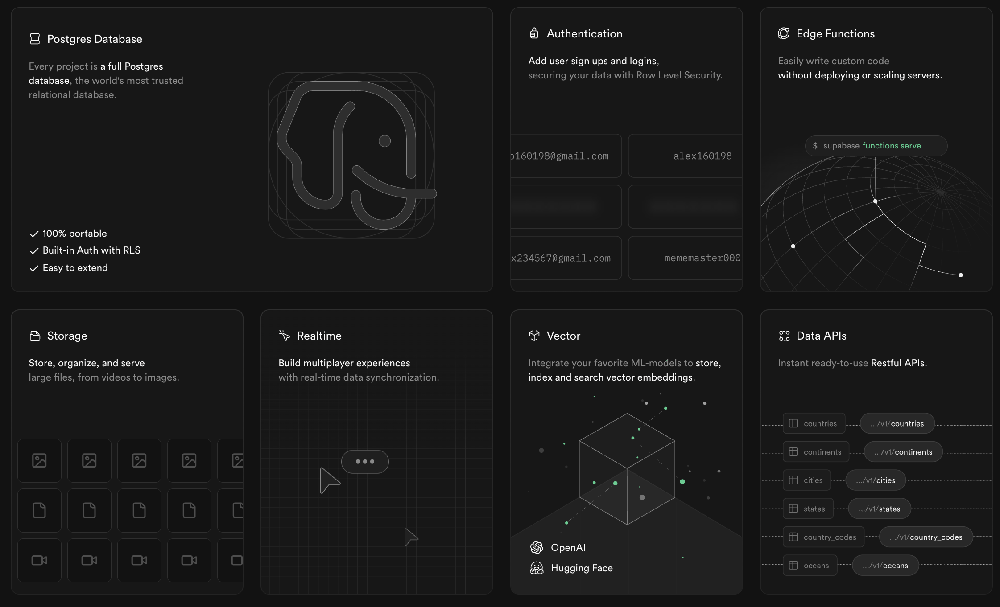
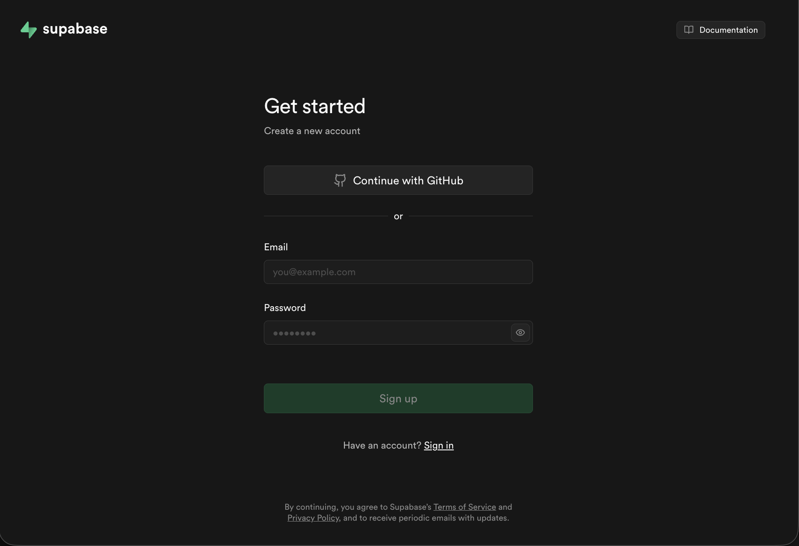
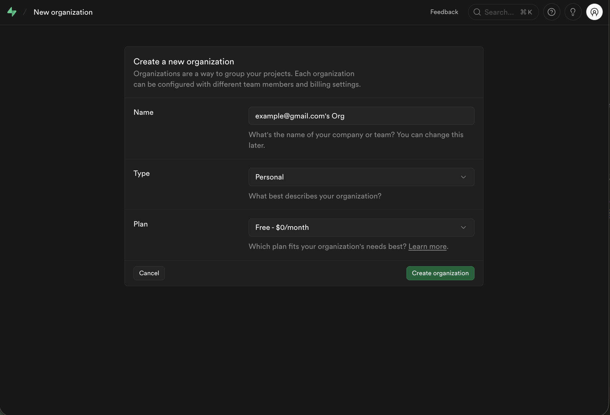
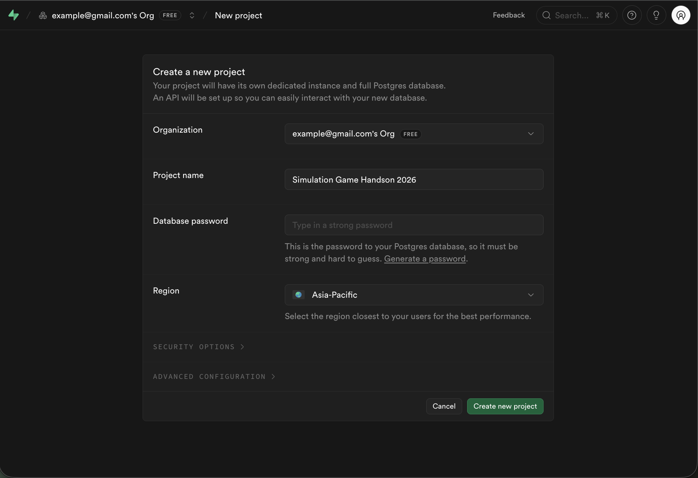
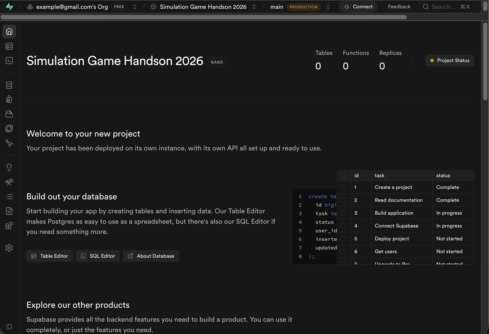
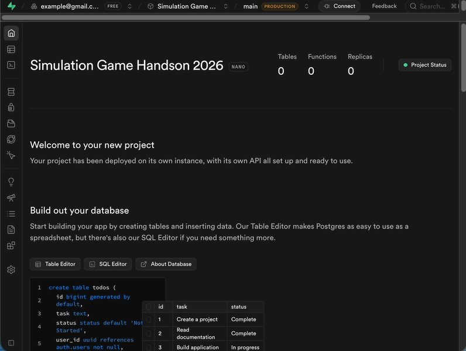
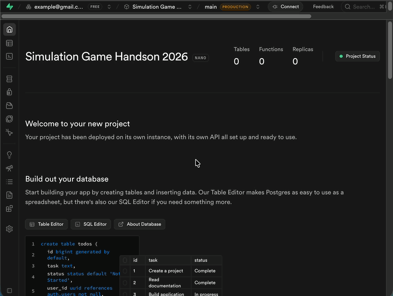
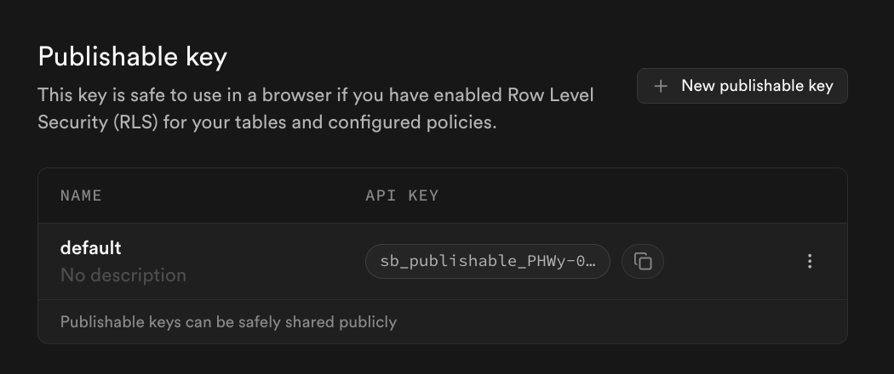
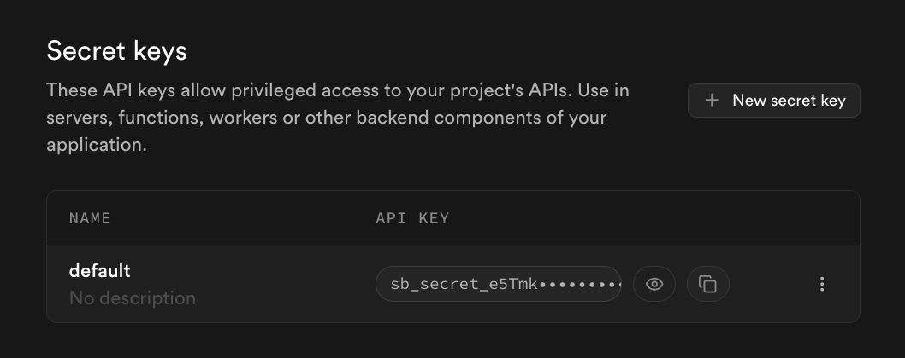

# Supabase　の用意

この節では Supabase の設定を行います。

# Supabase

Supabase はアプリケーションを開発するためのSaaS (Software as a Service) です。

その中でもデータベースや認証、ストレージなどの機能を提供している BaaS (Backend as a Service) としての役割を果たします。



## Supabaseの読み方

英語を正しくカタカナで表すことは難しいですが、「スパベース」「スーパベース」「スーパーベース」と読んでいる人が多いようです。

- [【調査】「Supabase」って、皆さんなんて発音してるの？ 名前の由来も調べてみました。](https://zenn.dev/y_ta/articles/900a1edafa7889)
- [「Supabase」みなさんはなんて発音してる🤔](https://x.com/blackcat_0506/status/1908778076894597200)
- [Supabase Dot Com](https://supabase.com/blog/supabase-dot-com)

# Supabaseのアカウント作成

Supabase を利用するためにはアカウントが必要です。

以下のURLからサインアップページにアクセスし、アカウントを作成してください。

https://supabase.com/dashboard/sign-up



# 組織の作成

アカウントの作成が完了した後に組織の作成を行います。

設定の内容はで初期値で問題ないです。



# プロジェクトの作成

組織の作成が完了した後にプロジェクトの作成を行います。

Project name は自身で管理しやすいものにしてください。

Database password は Generate password ボタンを押して自動生成されたものを利用することをお勧めします。
生成されたパスワードは Copy ボタンを押してコピーできます。

**今回は使わないです。** また、忘れてしまっても設定画面からリセットできます。



プロジェクトの作成が成功すると次のような画面が表示されます。



# Supabase SDK

SDK とは Software Development Kit の略で、ソフトウェア開発キットのことを指します。

Supabase をつかってアプリケーションを開発するためのライブラリが提供されています。

## Supabase JavaScript SDK

今回は JavaScript SDK を利用します。

プロジェクトに導入する方法については次の節で説明します。

## Supabase SDK を利用する準備

Supabase SDKを使うためには、プロジェクトURLとAPIキーが必要です。

プロジェクトURLはどのプロジェクトであるのかを特定するために必要な情報です。

APIキーはプロジェクトにアクセスするための認証情報です。

APIキーは Publishable key と Secret key の2種類があります。

SDKを用意するために次の情報を控えておいてください。

- プロジェクトURL
- Secret key（シークレットキー）

## プロジェクトURL

API Settings　の画面からプロジェクトURLを確認できます。



次のような形式になっています。
```
https://<your-project-ref>.supabase.co
```

## API Keys

APIキーを閲覧するためにはサイドバーの Project Settings > API Keys を選択します。



### Publishable key

**今回は Publishable key を利用しません。**

このキーはブラウザーで人に知られても問題ないです、そのかわりデータベース上で権限の設定を行う必要があります。

データベース上で適切な権限の設定をしていない場合は、悪意のあるユーザーにデータを読み取られたり、改ざんされたりする可能性があります。

> テーブルに対して行レベル セキュリティ (RLS) を有効にし、ポリシーを構成している場合は、このキーをブラウザーで安全に使用できます。

原文
> This key is safe to use in a browser if you have enabled Row Level Security (RLS) for your tables and configured policies.



### Secret key

**今回は Secret key を利用します。**

このキーはサーバー側でのみ使用することを目的としています。

Supabase のプロジェクトに対する完全なアクセス権を持っているため、慎重に取り扱う必要があります。

> これらのAPIキーは、プロジェクトのAPIへの特権アクセスを許可します。アプリケーションのサーバー、関数、ワーカー、その他のバックエンドコンポーネントで使用できます。

原文
> These API keys allow privileged access to your project's APIs. Use in servers, functions, workers or other backend components of your application.



---

# まとめ

この節では Supabase のアカウント作成、組織とプロジェクトの作成、Supabase SDK を利用するための準備を行いました。

最後にSDKを利用するためのプロジェクトURLとシークレットキーを確認しました。次の節で利用するので控えておいてください。

---

# 次の節

[データベース連携](../4-database/README.md)
