# データベース連携

ここまで作ってきたAPIに対してSupabase上のデータベースを連携する方法について説明します。

#　現状の確認

## アプリケーション

3章 APIの構築の 2節 APIの実装 で作ったアプリケーションがあることを確認してください。

```
├── api
│   ├── index.js
│   ├── templates.js
│   ├── word-categories.js
│   └── words.js
├── assets
│   ├── css
│   │   ├── avater.css
│   │   ├── menu.css
│   │   ├── speaker.css
│   │   └── style.css
│   ├── glb
│   │   ├── animals.glb
│   │   ├── fan.glb
│   │   └── room.glb
│   └── js
│       ├── avater.js
│       ├── aveterView
│       │   ├── config.js
│       │   ├── index.js
│       │   └── objects
│       │       ├── Animals.js
│       │       ├── factory.js
│       │       ├── Fan.js
│       │       └── Room.js
│       ├── inputWordDialog.js
│       ├── main.js
│       ├── menu.js
│       ├── selectWordCategoryDialog.js
│       ├── speaker.js
│       └── storage.js
└── index.html
```

## Supabaseプロジェクト

プロジェクトURLとシークレットキーがわかる状態にしてください。

# データベースの準備

今回使うデータベースである PostgreSQL は代表的なRDS(Relational Database Service)の一つです。RDSはデータを表形式で管理するデータベースで、複数のテーブルを組み合わせてデータを扱うことができます。

PostgreSQL はテーブルの操作に SQL (Structured Query Language) という言語を使います。SQLはデータベースを操作するための共通言語で、他のRDSでも同じように使うことができます。

テーブルの作成と最初のデータを作成するためのSQLを作成していきます。

## テーブル設計

ここまで扱ってきたデータ構造を確認しましょう。

### これまで作ったデータ構造

#### Word

Word(言葉)は以下のようなデータ構造でした。

```js
{
  id: 1,
  content: 'おざまーっす',
  wordCategoryId: 1
}
```

```ts
{
  id: number
  content: string
  wordCategoryId: number
}
```

#### WordCategory

WordCategory(言葉のカテゴリ)は以下のようなデータ構造でした。

```js
{
  id: 1,
  name: 'あいさつ'
}
```

```ts
{
  id: number
  name: string
}
```

#### Template

Template(会話テンプレート)は以下のようなデータ構造でした。

```js
{
  id: 1,
  content: "おはようからおやすみまで「{言葉}」でお送りしています",
  wordCategoryId: 1,
  motion: 'idle'
}
```

```ts
{
  id: number
  content: string
  wordCategoryId: number
  motion: string
}
```

### データの関係

これらのデータの関係は次のように表せます。

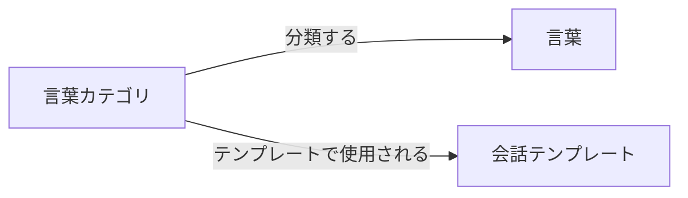

詳細なER図にすると次のとおりです

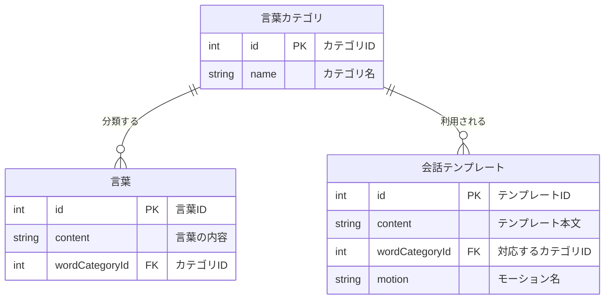

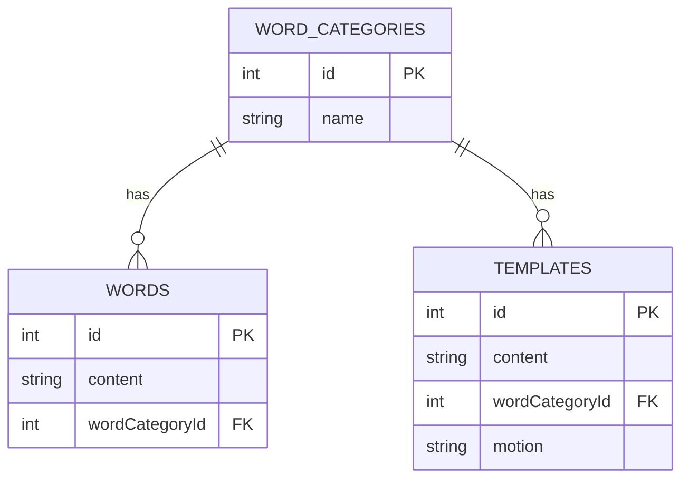

### PostgreSQLの慣例

PostgreSQLではケーススタイルはスネークケース(snake_case)が慣例となっています。

#### ケーススタイル

**PascalCase** は、
単語の先頭文字をすべて大文字にしてつなげる書き方です。
主に **クラス名・型名・コンポーネント名** などに使われます。

例:
`WordCategory`
`UserProfile`

**snake_case** は、
すべて小文字で書き、単語と単語を **アンダースコア（_）** で区切る書き方です。
主に **データベースのカラム名・設定値・内部データ表現** などで使われます。

例:
`word_category`
`user_id`

**kebab-case** は、
すべて小文字で書き、単語と単語を **ハイフン（-）** で区切る書き方です。
主に **URL・ファイル名・HTML/CSSのクラス名** などで使われます。

例:
`word-category`
`user-profile`

### 慣例を反映したテーブル設計

ケーススタイルが snake_case になっていることを確認してください。

また、テーブル名は複数形にする慣例もあるため、以下のようになります。

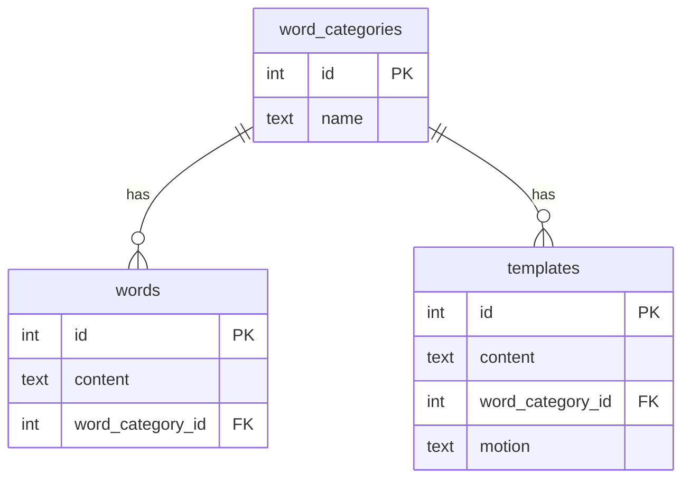

## SQLの作成

プロジェクトルートに `sql` ディレクトリを作成し、SQLファイルを格納する準備をします。

```
├── api
├── assets
├── index.html
└── sql
```

### テーブル作成のSQL

これらのER図を元にテーブルを作成するSQLを作成します。

`sql/definition.sql` ファイルを作成し、以下の内容を記述してください。

```sql
CREATE TABLE word_categories (
  id SERIAL PRIMARY KEY,
  name VARCHAR(255) NOT NULL
);

CREATE TABLE words (
  id SERIAL PRIMARY KEY,
  content VARCHAR(255) NOT NULL,
  word_category_id INTEGER NOT NULL REFERENCES word_categories(id)
);

CREATE TABLE templates (
  id SERIAL PRIMARY KEY,
  content TEXT NOT NULL,
  word_category_id INTEGER NOT NULL REFERENCES word_categories(id),
  motion VARCHAR(50) NOT NULL
);

```

- `NOT NULL` はそのカラムに必ず値が入ることを保証する制約です。
- `SERIAL` は自動的に連番を振るためのデータ型です。
- `REFERENCES` は外部キー制約を設定するためのキーワードです。

### データ作成のSQL

`sql/seed.sql` ファイルを作成し、以下の内容を記述してください。

```sql
INSERT INTO word_categories (id, name) VALUES
  (1, 'あいさつ'),
  (2, '食べ物'),
  (3, '必殺技'),
  (4, '場所');

INSERT INTO words (content, word_category_id) VALUES
  ('おざまーっす', 1),
  ('くわいの煮物', 2),
  ('ドラゴンブレイク', 3),
  ('秘密基地', 4);

INSERT INTO templates (id, content, word_category_id, motion) VALUES
  (1, 'おはようからおやすみまで「{言葉}」でお送りしています', 1, 'idle'),
  (2, '第一声が「{言葉}」?それもう様式美でしょ', 1, 'shifty'),
  (3, '今日も元気に「{言葉}」していこうな', 1, 'idle'),
  (4, 'とりあえず「{言葉}」って言っとけば場は持つ', 1, 'confused'),
  (5, '{言葉}味、想像したら負けなやつ', 2, 'confused'),
  (6, '公式がやりそうでやらない「{言葉}」味', 2, 'shifty'),
  (7, '見た目はアレだけど味は普通の「{言葉}」', 2, 'idle'),
  (8, 'SNSで炎上しそうな「{言葉}」フード', 2, 'damaged'),
  (9, '必殺技「{言葉}」発動!(なお効果は未確認)', 3, 'attack'),
  (10, '相手は「{言葉}」を理解できなかった', 3, 'confused'),
  (11, '伝説の技「{言葉}」※再現性なし', 3, 'rolling'),
  (12, '強そうに見えるだけの必殺技「{言葉}」', 3, 'shifty'),
  (13, 'だいたいみんな一度は通る「{言葉}」', 4, 'idle'),
  (14, '地図に載ってないけど有名な「{言葉}」', 4, 'shifty'),
  (15, '行くとだいたい迷う「{言葉}」', 4, 'confused'),
  (16, 'なぜか語られがちな場所「{言葉}」', 4, 'rolling');

```

## SQL の実行

### Supabase SQL Editor の起動

Supabase でプロジェクトを開いてサイドメニューから **SQL Editor** をクリックしてください。


### テーブルの作成

definition.sql の内容を SQL Editor にコピー&ペーストし、**Run** ボタンをクリックして実行してください。

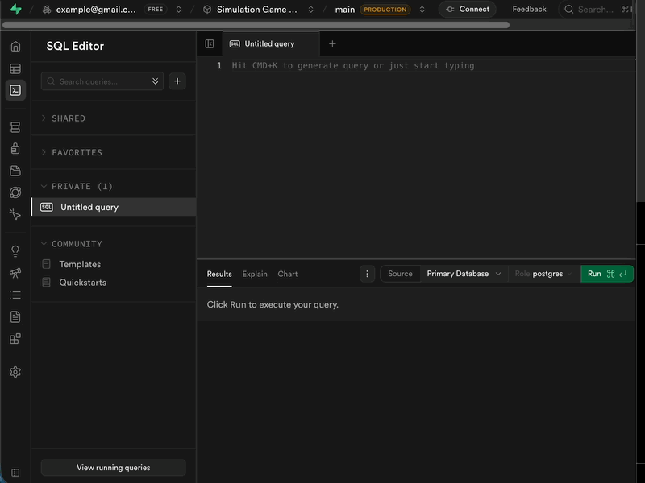

テーブルエディタからテーブルが作成されていることを確認できます。

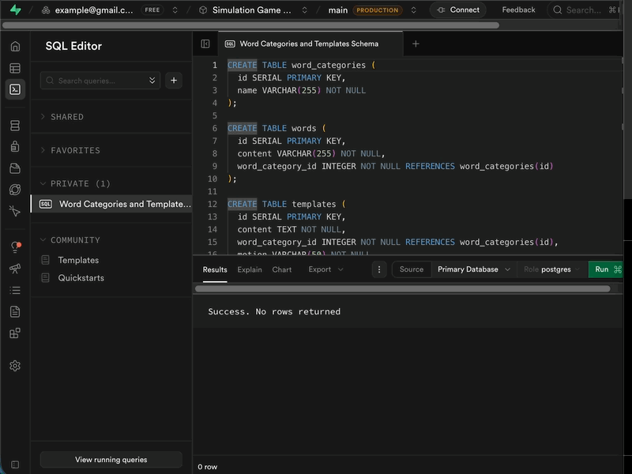

### データの作成

`seed.sql` の内容を SQL Editor にコピー&ペーストし、**Run** ボタンをクリックして実行してください。

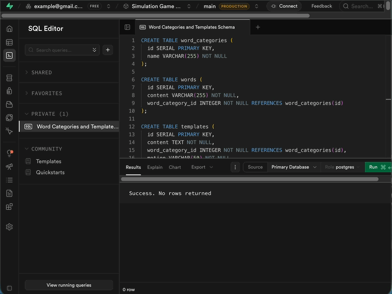

テーブルエディタからデータが登録されていることを確認できます。

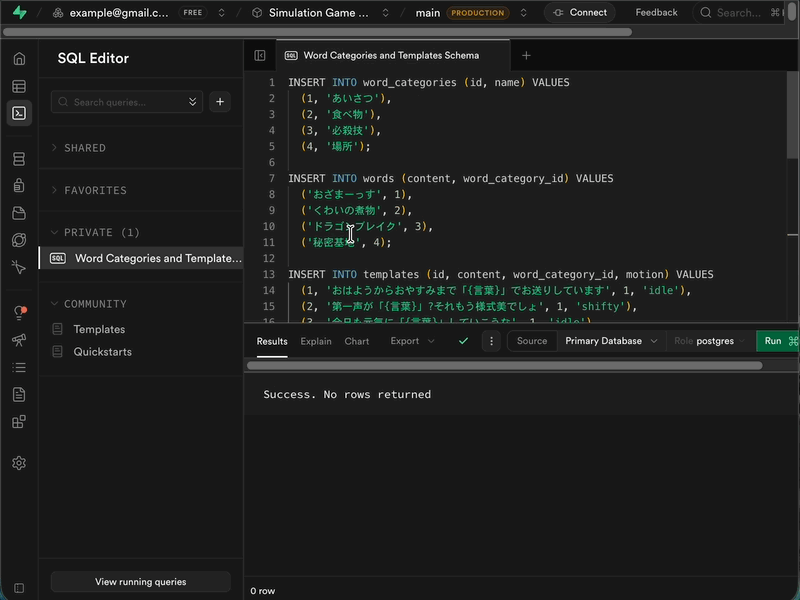

## Vercel ignore

SQLをプロジェクトの中に入れてしまうとVercelがWebに公開してしまいます。

今回のSQLがWeb上に公開されること自体は特に問題ありませんが、今回は公開しないようにしましょう。

`.vercelignore` ファイルをプロジェクトルートに作成し、以下の内容を記述してください。

```
*.sql

```

## この段階でのプロジェクトの状態

```
├── api
│   ├── index.js
│   ├── templates.js
│   ├── word-categories.js
│   └── words.js
├── assets
│   ├── css
│   │   ├── avater.css
│   │   ├── menu.css
│   │   ├── speaker.css
│   │   └── style.css
│   ├── glb
│   │   ├── animals.glb
│   │   ├── fan.glb
│   │   └── room.glb
│   └── js
│       ├── avater.js
│       ├── aveterView
│       │   ├── config.js
│       │   ├── index.js
│       │   └── objects
│       │       ├── Animals.js
│       │       ├── factory.js
│       │       ├── Fan.js
│       │       └── Room.js
│       ├── inputWordDialog.js
│       ├── main.js
│       ├── menu.js
│       ├── selectWordCategoryDialog.js
│       ├── speaker.js
│       └── storage.js
├── index.html
└── sql
    ├── definition.sql
    └── seed.sql

```

# Supabase SDK の導入

## npm

npm はNode.jsのパッケージマネージャーです。Node.jsをインストールすると自動的にインストールされます。

パッケージマネージャーは利用するライブラリのインストールやバージョン管理を行います。

## パッケージのインストール

ターミナルを起動します。

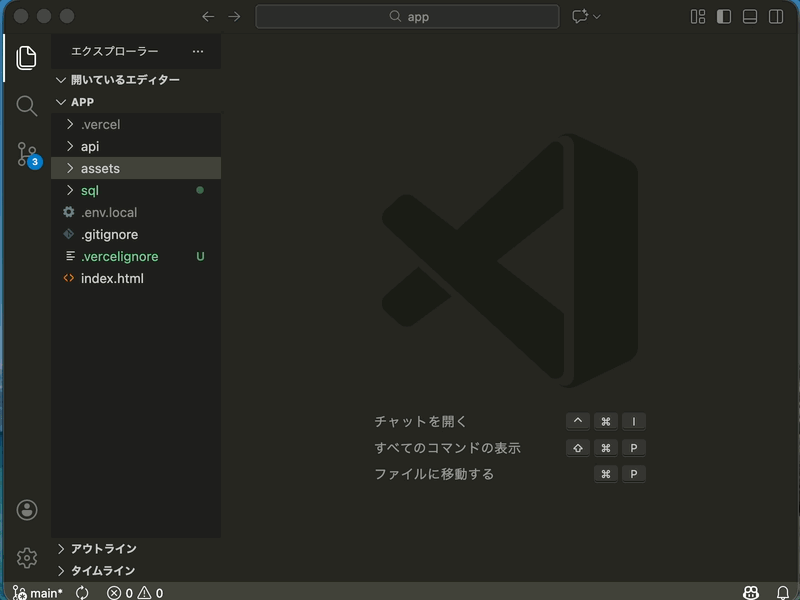

npm プロジェクトを初期化します

```sh
npm init -y
```

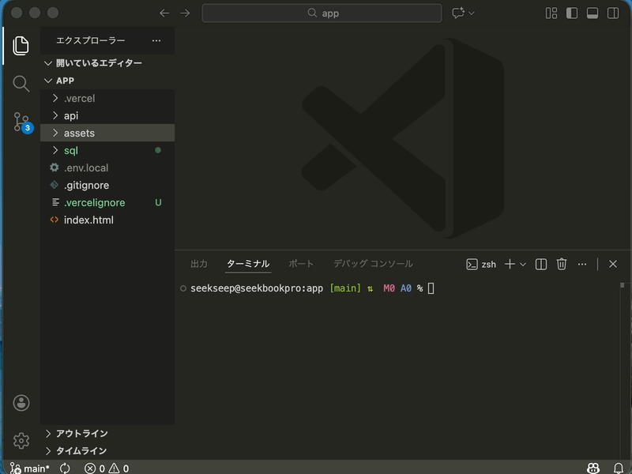

この時点で `package.json` ファイルがプロジェクトルートに作成されます。

## Supabase SDK のインストール

```sh
npm i @supabase/supabase-js
```

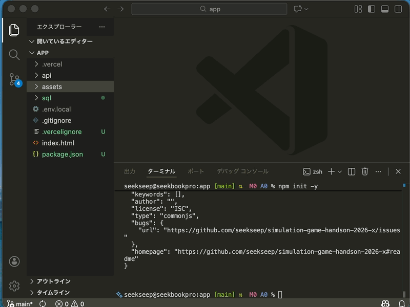

インストールが完了すると `node_modules` ディレクトリと `package-lock.json` ファイルがプロジェクトルートに作成されます。


### `.gitignore`

ルートにある `.gitignore` ファイルを開き、以下の行を追加してください。
`.gitignore` ファイルが存在しない場合は新規作成してください。

```
node_modules
```

## package.json の確認

ルートに作成されている `package.json` ファイルを確認してください。

`.dependencies` に `@supabase/supabase-js` が追加されていることを確認してください。

他にも値が設定されている場合がありますが問題ありません。

```json
{
  "dependencies": {
    "@supabase/supabase-js": "^2.90.1"
  }
}
```

ここまででSDKの導入が完了しました。

この時点でのプロジェクトの構成は次のようになっています。

```
├── api
│   ├── index.js
│   ├── templates.js
│   ├── word-categories.js
│   └── words.js
├── assets
│   ├── css
│   │   ├── avater.css
│   │   ├── menu.css
│   │   ├── speaker.css
│   │   └── style.css
│   ├── glb
│   │   ├── animals.glb
│   │   ├── fan.glb
│   │   └── room.glb
│   └── js
│       ├── avater.js
│       ├── aveterView
│       │   ├── config.js
│       │   ├── index.js
│       │   └── objects
│       │       ├── Animals.js
│       │       ├── Fan.js
│       │       ├── Room.js
│       │       └── factory.js
│       ├── inputWordDialog.js
│       ├── main.js
│       ├── menu.js
│       ├── selectWordCategoryDialog.js
│       ├── speaker.js
│       └── storage.js
├── index.html
├── node_modules
│   (省略)
├── package-lock.json
├── package.json
└── sql
    ├── definition.sql
    └── seed.sql
```

# 環境変数の設定

## 環境変数とは

環境変数とは、アプリケーションの設定情報を外部から注入するための仕組みです。APIキーやデータベースの接続情報など、 **コードに直接書き込みたくない情報** を管理するために使われます。

コードに直接書き込むと誤って公開してしまったり、環境ごとに設定を変えたい場合に対応が難しくなったりします。

今回ではシークレットキーは環境変数が特に公開されては行けない情報であるため、環境変数として管理する必要があります。

## `.env` ファイルの作成

プロジェクトルートに `.env` ファイルを作成し、以下の内容を記述してください。

次のような形式で記述します。
```
SUPABASE_URL=https://<your-project-ref>.supabase.co
SUPABASE_KEY=sb_secret_xxxxxxxxxxxxxxxxx_xx_xxxxxxxx
```

それぞれの値は自身のSupabaseプロジェクトの値を設定してください。

この時点でプロジェクトの構成は次のようになっています。

```
./
├── api
│   ├── index.js
│   ├── templates.js
│   ├── word-categories.js
│   └── words.js
├── assets
│   ├── css
│   │   ├── avater.css
│   │   ├── menu.css
│   │   ├── speaker.css
│   │   └── style.css
│   ├── glb
│   │   ├── animals.glb
│   │   ├── fan.glb
│   │   └── room.glb
│   └── js
│       ├── avater.js
│       ├── aveterView
│       │   ├── config.js
│       │   ├── index.js
│       │   └── objects
│       │       ├── Animals.js
│       │       ├── Fan.js
│       │       ├── Room.js
│       │       └── factory.js
│       ├── inputWordDialog.js
│       ├── main.js
│       ├── menu.js
│       ├── selectWordCategoryDialog.js
│       ├── speaker.js
│       └── storage.js
├── index.html
├── node_modules
│   (省略)
├── package-lock.json
├── package.json
├── sql
│   ├── definition.sql
│   └── seed.sql
└── tree.txt
```

# SDK を利用したAPIの実装

これでSDKを利用できる環境は用意できました。

それぞれのAPIの実装に反映しましょう。

## `api/word-categories.js` の修正

次の関数のデータを取得する処理をSDKを利用したものに書き換えます。
`async` キーワードを付与しています。
```js
export async function GET()
```

先程インストールしたSDKをインポートします。
```js
import { createClient } from '@supabase/supabase-js'
```

次に、Supabaseクライアントを作成します。
クライアントを作成するためには、プロジェクトURLとシークレットキーが必要です。
Node.jsの場合、環境変数は `process.env` 経由で取得できます。
```js
const supabaseUrl = process.env.SUPABASE_URL
const supabaseKey = process.env.SUPABASE_KEY
const supabase = createClient(supabaseUrl, supabaseKey)
```

SDKを使ってテーブルから値を取り出します。
データベースからデータを取り出す処理は非同期なので、`await` キーワードを使います。
```js
const { data } = await supabase
  .from('word_categories')
  .select('*')
  .order('id')
```

- `from()` はテーブル名を指定します。
- `select('*')` はすべてのカラムを取得することを指定します。
- `order('id')` は `id` カラムで昇順にソートすることを指定します。

最後に取り出したデータを返します。
```js
return new Response(JSON.stringify(data))
```

最終的に　`api/word-categories.js` ファイルは次のようになります。
```js
import { createClient } from '@supabase/supabase-js'

export async function GET() {
  // Supabaseクライアントを作成
  const supabaseUrl = process.env.SUPABASE_URL
  const supabaseKey = process.env.SUPABASE_KEY
  const supabase = createClient(supabaseUrl, supabaseKey)

  // word_categoriesテーブルからデータを取得
  const { data } = await supabase
    .from('word_categories')
    .select('*')
    .order('id')

  // データを返す
  return new Response(JSON.stringify(data))
}
```

## `api/templates.js` の修正

`api/templates.js` も同様に修正します。

```js
import { createClient } from '@supabase/supabase-js'

export async function GET() {
  // Supabaseクライアントを作成
  const supabaseUrl = process.env.SUPABASE_URL
  const supabaseKey = process.env.SUPABASE_KEY
  const supabase = createClient(supabaseUrl, supabaseKey)

  // templatesテーブルからデータを取得
  const { data } = await supabase
    .from('templates')
    .select('*')
    .order('id')

  // データを返す (キャメルケースに変換)
  const templates = data.map(row => ({
    id: row.id,
    content: row.content,
    wordCategoryId: row.word_category_id,
    motion: row.motion
  }))

  return new Response(JSON.stringify(templates))
}
```

## `api/words.js` の修正

`api/words.js` には言葉の取得と言葉の作成の機能があります。

### 言葉の取得

取得については同様に修正します。

```js
import { createClient } from '@supabase/supabase-js'

export async function GET() {
  // Supabaseクライアントを作成
  const supabaseUrl = process.env.SUPABASE_URL
  const supabaseKey = process.env.SUPABASE_KEY
  const supabase = createClient(supabaseUrl, supabaseKey)

  // wordsテーブルからデータを取得
  const { data } = await supabase
    .from('words')
    .select('*')
    .order('id')

  // データを返す (キャメルケースに変換)
  const words = data.map(row => ({
    id: row.id,
    content: row.content,
    wordCategoryId: row.word_category_id
  }))

  return new Response(JSON.stringify(words))
}
```

### 言葉の作成

データを作成する場合は `insert()` を利用します。

```js
export async function POST(request) {
  // Supabaseクライアントを作成
  const supabaseUrl = process.env.SUPABASE_URL
  const supabaseKey = process.env.SUPABASE_KEY
  const supabase = createClient(supabaseUrl, supabaseKey)

  // リクエストボディを取得
  const body = await request.json()
  console.log('新しい言葉を受け取りました:', body)

  // wordsテーブルにデータを挿入
  const { data } = await supabase
    .from('words')
    .insert([
      {
        content: body.content,
        word_category_id: body.wordCategoryId
      }
    ])
    .select()
    .single()

  // データを返す (キャメルケースに変換)
  const word = {
    content: data.content,
    wordCategoryId: data.word_category_id
  }

  return new Response(JSON.stringify(word))
}
```

- `from()` はテーブル名を指定します。
- `insert()` は挿入するデータを指定します。配列で渡すことで複数行の挿入も可能です。
- `select()` は挿入後のデータを取得するために必要です。
- `single()` は1行だけ取得する場合に使います。一行に対応するデータが `data` プロパティに格納されます。

## データの取得の動作確認

これでAPIの実装が完了しました。

`vercel dev` を使ってアプリケーションを起動し、動作確認を行いましょう。

次のURLにアクセスしてデータが表示されることを確認してください
- `http://localhost:3000/api/word-categories`
- `http://localhost:3000/api/templates`
- `http://localhost:3000/api/words`

次のような値が表示されていると成功です。

```json
[{"id":1,"name":"あいさつ"},{"id":2,"name":"食べ物"},{"id":3,"name":"必殺技"},{"id":4,"name":"場所"}]
```

```json
[{"id":1,"content":"おざまーっす","wordCategoryId":1},{"id":2,"content":"くわいの煮物","wordCategoryId":2},{"id":3,"content":"ドラゴンブレイク","wordCategoryId":3},{"id":4,"content":"秘密基地","wordCategoryId":4}]
```

```json
[{"id":1,"content":"おはようからおやすみまで「{言葉}」でお送りしています","wordCategoryId":1,"motion":"idle"},{"id":2,"content":"第一声が「{言葉}」?それもう様式美でしょ","wordCategoryId":1,"motion":"shifty"},{"id":3,"content":"今日も元気に「{言葉}」していこうな","wordCategoryId":1,"motion":"idle"},{"id":4,"content":"とりあえず「{言葉}」って言っとけば場は持つ","wordCategoryId":1,"motion":"confused"},{"id":5,"content":"{言葉}味、想像したら負けなやつ","wordCategoryId":2,"motion":"confused"},{"id":6,"content":"公式がやりそうでやらない「{言葉}」味","wordCategoryId":2,"motion":"shifty"},{"id":7,"content":"見た目はアレだけど味は普通の「{言葉}」","wordCategoryId":2,"motion":"idle"},{"id":8,"content":"SNSで炎上しそうな「{言葉}」フード","wordCategoryId":2,"motion":"damaged"},{"id":9,"content":"必殺技「{言葉}」発動!(なお効果は未確認)","wordCategoryId":3,"motion":"attack"},{"id":10,"content":"相手は「{言葉}」を理解できなかった","wordCategoryId":3,"motion":"confused"},{"id":11,"content":"伝説の技「{言葉}」※再現性なし","wordCategoryId":3,"motion":"rolling"},{"id":12,"content":"強そうに見えるだけの必殺技「{言葉}」","wordCategoryId":3,"motion":"shifty"},{"id":13,"content":"だいたいみんな一度は通る「{言葉}」","wordCategoryId":4,"motion":"idle"},{"id":14,"content":"地図に載ってないけど有名な「{言葉}」","wordCategoryId":4,"motion":"shifty"},{"id":15,"content":"行くとだいたい迷う「{言葉}」","wordCategoryId":4,"motion":"confused"},{"id":16,"content":"なぜか語られがちな場所「{言葉}」","wordCategoryId":4,"motion":"rolling"}]
```

##　UIからのデータの登録

言葉を教える機能から言葉が登録されるのを確認しましょう。

次の順番で確認しましょう。

1. 画面が問題なく操作される
2. Supabaseのテーブルエディタから登録されたデータが確認できる

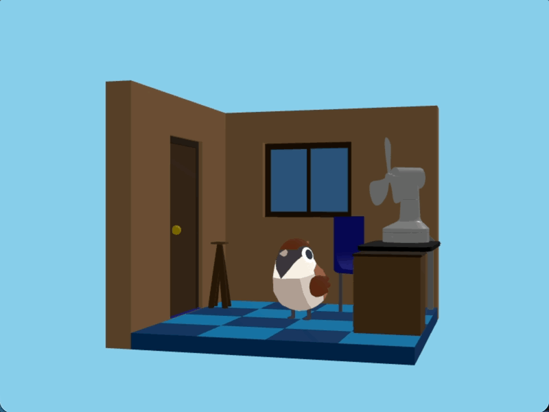

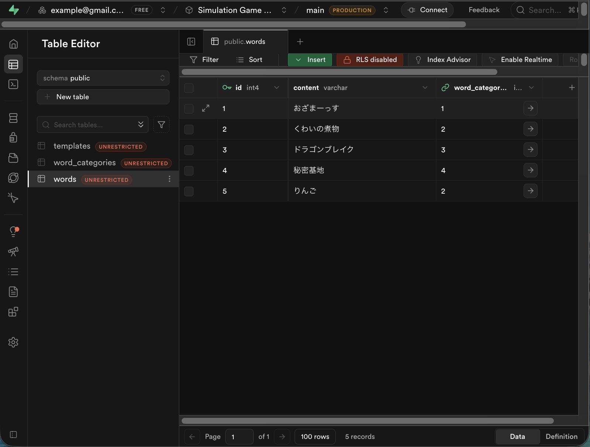

# APIの冗長なコードの整理

この時点でAPIのコードの中に次のコードが重複しています。

```js
// Supabaseクライアントを作成
const supabaseUrl = process.env.SUPABASE_URL
const supabaseKey = process.env.SUPABASE_KEY
const supabase = createClient(supabaseUrl, supabaseKey)
```

これを整理していきます。

## `api/supabase.js` の作成

`api/supabase.js` ファイルを作成し、次の内容を記述してください。

```js
import { createClient } from '@supabase/supabase-js'

let supabaseClient = null

export function getSupabaseClient() {
  // 既にクライアントが存在する場合は再利用
  if (supabaseClient) {
    return supabaseClient
  }

  // 新しいクライアントを作成
  const supabaseUrl = process.env.SUPABASE_URL
  const supabaseKey = process.env.SUPABASE_KEY
  supabaseClient = createClient(supabaseUrl, supabaseKey)

  return supabaseClient
}
```

## APIファイルの修正

次のファイルを `getSupabaseClient` を利用するように修正してください。

- `api/word-categories.js`
- `api/templates.js`
- `api/words.js`

### `api/word-categories.js`

```js
import { getSupabaseClient } from './supabase.js'

export async function GET() {
  // Supabaseクライアントを取得
  const supabase = getSupabaseClient()

  // templatesテーブルからデータを取得
  const { data } = await supabase
    .from('templates')
    .select('*')
    .order('id')

  // データを返す (キャメルケースに変換)
  const templates = data.map(row => ({
    id: row.id,
    content: row.content,
    wordCategoryId: row.word_category_id,
    motion: row.motion
  }))

  return new Response(JSON.stringify(templates))
}

```

### `api/templates.js`

```js
import { getSupabaseClient } from './supabase.js'

export async function GET() {
  // Supabaseクライアントを取得
  const supabase = getSupabaseClient()

  // templatesテーブルからデータを取得
  const { data } = await supabase
    .from('templates')
    .select('*')
    .order('id')

  // データを返す (キャメルケースに変換)
  const templates = data.map(row => ({
    id: row.id,
    content: row.content,
    wordCategoryId: row.word_category_id,
    motion: row.motion
  }))

  return new Response(JSON.stringify(templates))
}

```

### `api/words.js`

```js
import { getSupabaseClient } from './supabase.js'

export async function GET() {
  // Supabaseクライアントを取得
  const supabase = getSupabaseClient()

  // wordsテーブルからデータを取得
  const { data } = await supabase
    .from('words')
    .select('*')
    .order('id')

  // データを返す (キャメルケースに変換)
  const words = data.map(row => ({
    id: row.id,
    content: row.content,
    wordCategoryId: row.word_category_id
  }))

  return new Response(JSON.stringify(words))
}

export async function POST(request) {
  // Supabaseクライアントを取得
  const supabase = getSupabaseClient()

  // リクエストボディを取得
  const body = await request.json()
  console.log('新しい言葉を受け取りました:', body)

  // wordsテーブルにデータを挿入
  const { data } = await supabase
    .from('words')
    .insert([
      {
        content: body.content,
        word_category_id: body.wordCategoryId
      }
    ])
    .select()
    .single()

  // データを返す (キャメルケースに変換)
  const word = {
    id: data.id,
    content: data.content,
    wordCategoryId: data.word_category_id
  }

  return new Response(JSON.stringify(word))
}

```

## 動作確認

`vercel dev` を使ってアプリケーションを起動し、動作確認を行いましょう。

- 話す機能が問題なく動作する
- 教える機能が問題なく動作する

# UI のコードの修正

UIでは最初に　LocalStorage からデータを取得していました。そのためファイル名が `storage.js` となっていました。

現時点では完全にAPIを利用しているため、ファイル名を `api.js` に変更しましょう。

ファイル名の変更とインポートの修正をしてください。

## `api.js`

`assets/js/storage.js` ファイルを　`assets/js/api.js` ファイルに名前を変更してください。

## `main.js`

```js
import * as api from './api.js'
```

```js
const words = await api.getWords()
const wordCategories = await api.getWordCategories()
const templates = await api.getTemplates()
```

```js
await api.addWord(newWord)
```

最終的な `main.js` は次のようになっています。

```js
import * as avater from './avater.js'
import * as menu from './menu.js'
import * as inputWordDialog from './inputWordDialog.js'
import * as selectWordCategoryDialog from './selectWordCategoryDialog.js'
import * as speaker from './speaker.js'
import * as api from './api.js'

async function main () {
  const words = await api.getWords()
  const wordCategories = await api.getWordCategories()
  const templates = await api.getTemplates()

  avater.view.addEventListener('animal-click', () => {
    menu.open()
  })

  menu.talkButton.addEventListener('click', async () => {
    console.log('動物と話す')
    menu.close()

    const word = words[Math.floor(Math.random() * words.length)]
    const categoryTemplates = templates.filter(template => template.wordCategoryId == word.wordCategoryId)
    const template = categoryTemplates[Math.floor(Math.random() * categoryTemplates.length)]
    const message = template.content.replace('{言葉}', word.content)

    avater.view.changeAnimalMotion(template.motion)
    await speaker.start(message)
    avater.view.changeAnimalMotion('idle')
  })

  menu.teachButton.addEventListener('click', async () => {
    console.log('動物に教える')
    menu.close()

    const content = await inputWordDialog.open()
    if (!content) {
      await speaker.start('言葉の入力がキャンセルされました')
    }
    await speaker.start(`「${content}」を教えました`)

    const wordCategory = await selectWordCategoryDialog.open(wordCategories)

    await speaker.start(`「${wordCategory.name}」の分野を選びました`)

    const newWord = { word, wordCategoryId: wordCategory.id }
    await api.addWord(newWord)

    words.push(newWord)

    console.log({ words })
  })
}

main()
```

## 動作確認

`vercel dev` を使ってアプリケーションを起動し、動作確認を行いましょう。

---

# コミット

ここまでの実装をコミットしましょう。

プッシュは次の節の作業が終わってからにします。

---

# まとめ

今回でSupabaseを利用したデータベースの設計とAPIの実装が完了しました。

---

# 次の項

[環境変数の設定](../5-environment/README.md)
