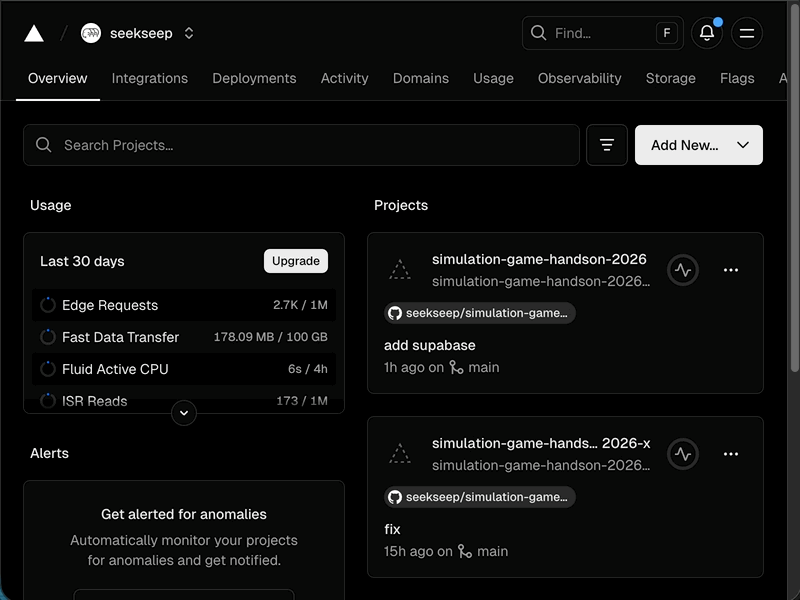
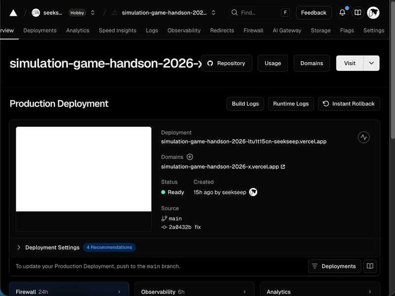

# 環境変数の設定

ここまでローカル環境で動作するAPIコードの実装とデータベースの構築を行いました。

次に、Vercel上でAPIが正しく動作するようにします。

# Vercel での環境変数の設定

Vercelのダッシュボートからプロジェクトを開きます。

環境変数を設定します。

.env の内容をコピーして１つ目のテキストフィールドに貼り付けるとすべて自動で反映されます。
設定が完了したら「Save」ボタンをクリックします。

# デプロイ

コミットしていない場合は現在の状態をコミットしてください。
その後プッシュすることで自動デプロイが行われます。

公開されているURLにアクセスして、APIと連携していることを確認しましょう。
