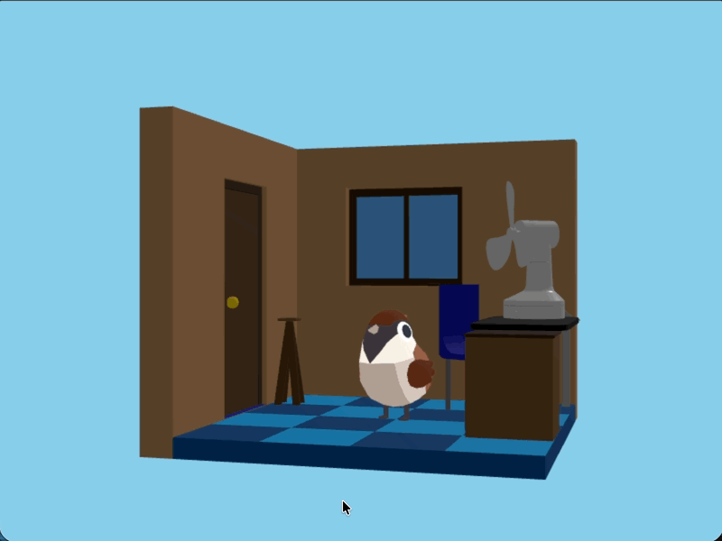

# セリフ生成の責任の移動

今までセリフはUI側=ブラウザ側で生成していました。
AI使ったセリフ生成を実装するにあたり、セリフ生成の責任をAPI側に移動します。

AIを使うための秘匿情報をブラウザ側で扱うのはセキュリティ上好ましくないためです。

## `api/templates.js` の削除

UI側でテンプレートの取得を行わないので、`api/templates.js` を削除します。

## `api/words.js` の修正

単語の一覧をUIが取得しないので、`api/words.js` を修正します。

次のコードを削除してください。
```js
export async function GET() {
  // Supabaseクライアントを取得
  const supabase = getSupabaseClient()

  // wordsテーブルからデータを取得
  const { data } = await supabase
    .from('words')
    .select('*')
    .order('id')

  // データを返す (キャメルケースに変換)
  const words = data.map(row => ({
    id: row.id,
    content: row.content,
    wordCategoryId: row.word_category_id
  }))

  return new Response(JSON.stringify(words))
}
```

最終的に、`api/words.js` は次のようになります。

```js
import { getSupabaseClient } from './supabase.js'

export async function POST(request) {
  // Supabaseクライアントを取得
  const supabase = getSupabaseClient()

  // リクエストボディを取得
  const body = await request.json()
  console.log('新しい言葉を受け取りました:', body)

  // wordsテーブルにデータを挿入
  const { data } = await supabase
    .from('words')
    .insert([
      {
        content: body.content,
        word_category_id: body.wordCategoryId
      }
    ])
    .select()
    .single()

  // データを返す (キャメルケースに変換)
  const word = {
    id: data.id,
    content: data.content,
    wordCategoryId: data.word_category_id
  }

  return new Response(JSON.stringify(word))
}
```

## `api/lines.js` の作成

セリフを生成するAPIエンドポイント `api/lines.js` を作成します。

この時点では、AIはまだ使いません。テンプレートと単語を組み合わせてセリフを生成するだけにします。

次のエンドポイントは次のようなデータ構造を返します。
```ts
{
  content: string,
  motion: string
}
```

```js
import { getSupabaseClient } from './supabase.js'

export async function POST() {
  // Supabaseクライアントを取得
  const supabase = getSupabaseClient()

  const { data: words } = await supabase.from('words').select('*').order('id')
  const { data: templates } = await supabase.from('templates').select('*').order('id')

  // ランダムに言葉を選択
  const word = words[Math.floor(Math.random() * words.length)]

  // 言葉のカテゴリに合致するテンプレートをフィルタ
  const categoryTemplates = templates.filter(
    template => template.word_category_id == word.word_category_id
  )

  // ランダムにテンプレートを選択
  const template = categoryTemplates[Math.floor(Math.random() * categoryTemplates.length)]

  // メッセージ生成
  const message = template.content.replace('{言葉}', word.content)

  // レスポンスを返す
  return new Response(JSON.stringify({
    message: message,
    motion: template.motion
  }))
}
```

## `assets/js/api` の修正

次のコードを削除します

```js
export async function getWords () {
  const response = await fetch('/api/words')
  const words = await response.json()
  return words
}
```

```js
export async function getTemplates () {
  const response = await fetch('/api/templates')
  const templates = await response.json()
  return templates
}
```

最終的に、`assets/js/api/index.js` は次のようになります。

```js
export async function addWord (word) {
  const response = await fetch('/api/words', {
    method: 'POST',
    headers: {
      'Content-Type': 'application/json'
    },
    body: JSON.stringify(word)
  })
  const newWord = await response.json()
  return newWord
}

export async function getWordCategories () {
  const response = await fetch('/api/word-categories')
  const wordCategories = await response.json()
  return wordCategories
}

export async function createLine () {
  const response = await fetch('/api/lines', {
    method: 'POST'
  })
  const line = await response.json()
  return line
}
```

## `assets/js/main.js` の修正


次の２つは使わないので削除します。
```js
const words = await api.getWords()
```

```js
const templates = await api.getTemplates()
```

セリフの生成のロジックも修正します。

現在は話すときにテンプレートと単語を組み合わせてセリフを生成していますが、これをAPIに任せます。
```js
menu.talkButton.addEventListener('click', async () => {
  console.log('動物と話す')
  menu.close()

  const word = words[Math.floor(Math.random() * words.length)]
  const categoryTemplates = templates.filter(template => template.wordCategoryId == word.wordCategoryId)
  const template = categoryTemplates[Math.floor(Math.random() * categoryTemplates.length)]
  const message = template.content.replace('{言葉}', word.content)

  avater.view.changeAnimalMotion(template.motion)
  await speaker.start(message)
  avater.view.changeAnimalMotion('idle')
})
```

次のように修正します。

```js
menu.talkButton.addEventListener('click', async () => {
  console.log('動物と話す')
  menu.close()

  const line = await api.createLine()

  avater.view.changeAnimalMotion(line.motion)
  await speaker.start(line.message)
  avater.view.changeAnimalMotion('idle')
})
```

## 動作確認

これで、セリフ生成の責任がAPI側に移動しました。
vercel dev でローカルサーバーを起動し、ブラウザで動作確認を行ってください。

これまで通り話す機能が動作していることを確認してください。

更に開発者ツールを開いてセリフがAPIから返されていることを確認します。


