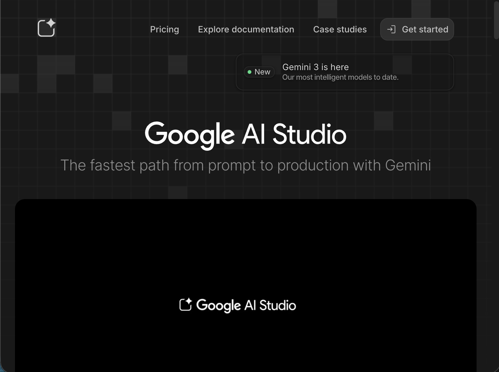
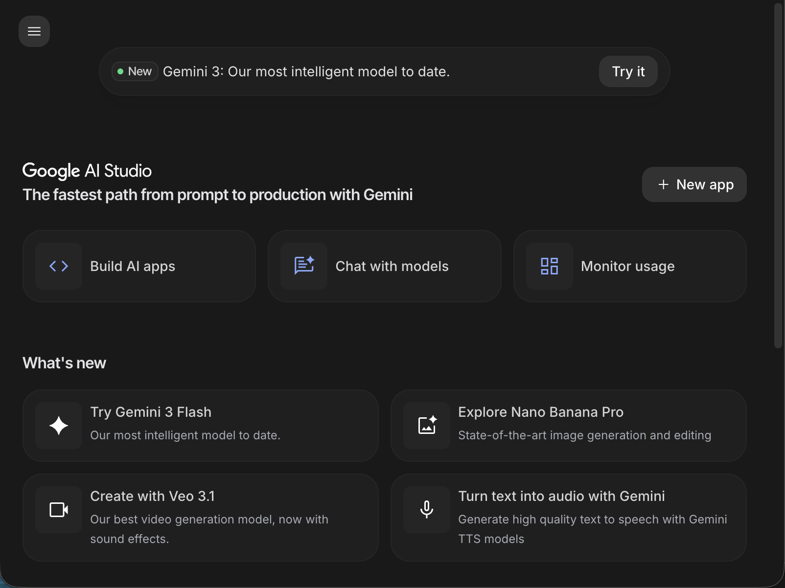

# AI 連携

今回は Gemni を使ってAI連携を行います。

# Google AI Studio

Google AI Studio は Gemini などの大規模言語モデルを利用できるプラットフォームです。
プログラムから利用するためのAPIも提供されています。また、無料枠もあるので手軽に試すことができます。

https://aistudio.google.com/welcome



# Google アカウント

利用するためにはGoogleアカウントが必要です。

# ダッシュボード

https://aistudio.google.com/　にアクセスし、ダッシュボードを開きます。
ログインされていない場合はログインが求められます。



# プロジェクトの作成

サイドメニューからダッシュボードに移動してください。
APIキーを作成ボタンから画面の指示に従ってAPIキーを作成してください。


# AI連携の実装

## Gemini SDKのインストール

次のコマンドで Gemini SDK をインストールします。

```bash
npm i @google/generative-ai
```

## 環境変数の設定

`.env`のすでにある内容に加えて `GEMINI_API_KEY` に先ほど取得したAPIキーを設定します。
```
GEMINI_API_KEY=your_gemini_api_key_here
```

## `api/gemini.js` の追加

Gemini の　APIを利用するためのクライアントを作成します。

`api/gemini.js` を作成し、次のコードを追加します。

```js
import { GoogleGenerativeAI } from '@google/generative-ai'

export function getGeminiClient() {
  const apiKey = process.env.GEMINI_API_KEY
  return new GoogleGenerativeAI(apiKey)
}
```

## `api/lines.js` の修正


client を生成する関数をインポート
```js
import { getGeminiClient } from './gemini.js'
```

client を生成
```js
const genAI = getGeminiClient()
```

モデルを指定する
```js
const model = genAI.getGenerativeModel({ model: 'gemini-2.5-flash' })
```

元になるメッセージの作成
```js
const baseMessage = template.content.replace('{言葉}', word.content)
```

`baseMessage` を元にメッセージを変換する処理を書きます。
ここでは明るい元気なキャラクターに言い換える例を示します。
```js
  const prompt = `
あなたは明るく元気で前向きなキャラクターです。
語尾に「!」や「♪」をつけることが多く、テンションが高くエネルギッシュな言葉遣いをします。
ポジティブな表現を好み、友達感覚でフレンドリーに話します。
例えば
「おはようからおやすみまで『おざまーっす』でお送りしています」を
「おはようからおやすみまで『おざまーっす』でお送りしてるよ〜♪みんな元気出していこうね!」
のように変換します。

以下のセリフを、この性格に合わせて言い換えてください。
元の意味やニュアンスは保ちつつ、性格の特徴を反映させてください。
セリフだけを返してください。説明や前置きは不要です。

元のセリフ: ${baseMessage}

性格に合わせたセリフ:`

// Gemini APIを呼び出し
const result = await model.generateContent(prompt)
const response = result.response
const transformedMessage = response.text().trim()
```

最終的な `api/lines.js` のコードは次のようになります。

```js
import { getSupabaseClient } from './supabase.js'
import { getGeminiClient } from './gemini.js'

export async function POST() {
  // Supabaseクライアントを取得
  const supabase = getSupabaseClient()

  // wordsとtemplatesを並列で取得
  const [wordsResult, templatesResult] = await Promise.all([
    supabase.from('words').select('*').order('id'),
    supabase.from('templates').select('*').order('id')
  ])

  const words = wordsResult.data
  const templates = templatesResult.data

  // ランダムにテンプレートを選択
  const template = templates[Math.floor(Math.random() * templates.length)]

  // テンプレートのカテゴリに合致する言葉をフィルタ
  const categoryWords = words.filter(
    word => word.word_category_id == template.word_category_id
  )

  // ランダムに言葉を選択
  const word = categoryWords[Math.floor(Math.random() * categoryWords.length)]

  // 基本メッセージ生成
  const baseMessage = template.content.replace('{言葉}', word.content)

  // Gemini APIで性格を反映した言い回しに変換
  const genAI = getGeminiClient()
  const model = genAI.getGenerativeModel({ model: 'gemini-2.5-flash' })

  const prompt = `
あなたは明るく元気で前向きなキャラクターです。
語尾に「!」や「♪」をつけることが多く、テンションが高くエネルギッシュな言葉遣いをします。
ポジティブな表現を好み、友達感覚でフレンドリーに話します。
例えば
「おはようからおやすみまで『おざまーっす』でお送りしています」を
「おはようからおやすみまで『おざまーっす』でお送りしてるよ〜♪みんな元気出していこうね!」
のように変換します。

以下のセリフを、この性格に合わせて言い換えてください。
元の意味やニュアンスは保ちつつ、性格の特徴を反映させてください。
セリフだけを返してください。説明や前置きは不要です。

元のセリフ: ${baseMessage}

性格に合わせたセリフ:`

  // Gemini APIを呼び出し
  const result = await model.generateContent(prompt)
  const response = result.response
  const transformedMessage = response.text().trim()

  // レスポンスを返す
  return new Response(JSON.stringify({
    message: transformedMessage,
    motion: template.motion
  }))
}
```

## 動作確認

vercel dev でローカルサーバーを起動し、話す機能の動作を確かめてください。
template テーブルの内容を下にセリフが生成されていることを確認してください。

# Vercel へのデプロイ

## 環境変数の設定

Vercel のダッシュボードで対象のプロジェクトを開き、Settings > Environment Variables に移動します。
`GEMINI_API_KEY` に先ほど取得したAPIキーを設定します。

## デプロイ

変更をコミットしてから、リモートリポジトリにプッシュしてください。

デプロイが終了したのをVercelのダッシュボードで確認し、公開されたURLにアクセスして動作を確認してください。

---

# まとめ

この節では、Google AI Studio の Gemini モデルを利用して、AI連携を行う方法を説明しました。
